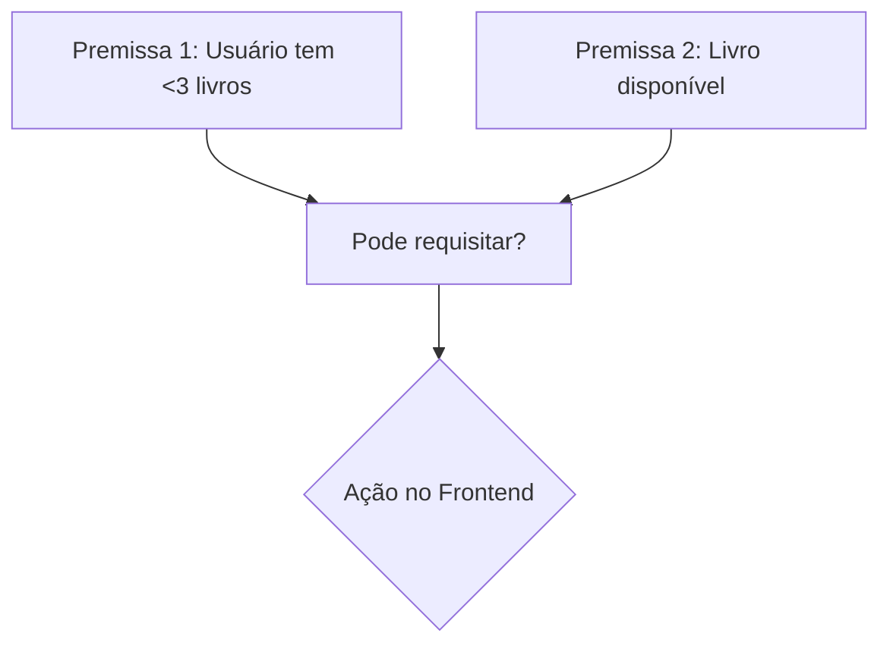

# Pensar Logicamente: Aplicação Prática em Arquitetura de Serviços

## Fundamentos da Lógica na Programação

### Conceitos-Chave

- **Proposições**: `temMenosDe3Livros` e `livroDisponivel` como valores booleanos
- **Operadores Lógicos**:

  ```csharp
  // Conjunção (AND)
  bool podeRequisitar = temMenosDe3Livros && livroDisponivel;

  // Disjunção (OR)
  bool acessoEspecial = ehAdmin || temAssinaturaPremium;
  ```

### Inferência em Sistemas



## Esquema de Resolução de Problemas

### 1. Identificação do Problema

```python
# Exemplo: Documentação estruturada
problema = {
    "sintoma": "Botão de requisição desabilitado",
    "esperado": "Botão habilitado quando condições satisfeitas",
    "logs": "API retornando false para livros disponíveis"
}
```

### 2. Formulação de Hipóteses

| Hipótese            | Prioridade | Método de Teste                 |
| ------------------- | ---------- | ------------------------------- |
| Bug na validação    | Alta       | Teste unitário `PodeRequisitar` |
| Cache desatualizada | Média      | Inspecionar headers HTTP        |

### 3. Teste Dedutivo

```csharp
// Teste unitário exemplar
[Fact]
public void PodeRequisitar_LivroDisponivelELimiteOk_RetornaTrue()
{
    // Arrange
    var mockRepo = new Mock<ILivroRepository>();
    mockRepo.Setup(x => x.EstaDisponivel(It.IsAny<int>())).Returns(true);

    // Act
    var resultado = _servico.PodeRequisitar(1, 1);

    // Assert
    Assert.True(resultado);
}
```

### 4. Implementação da Solução

**Padrão Estratégia para Regras Complexas:**

```csharp
public interface IRegraRequisicao
{
    bool Validar(int usuarioId, int livroId);
}

public class RegraLimiteLivros : IRegraRequisicao { ... }
public class RegraDisponibilidade : IRegraRequisicao { ... }
```

## Sistema de Biblioteca: Caso Prático

### Backend (.NET) - Lógica Proposicional

```csharp
public class RequisicaoValidator
{
    private readonly List<IRegraRequisicao> _regras;

    public bool ValidarRequisicao(int usuarioId, int livroId)
    {
        return _regras.All(r => r.Validar(usuarioId, livroId));
    }
}
```

### Frontend (Vue.js) - Reatividade Lógica

```javascript
computed: {
    botaoHabilitado() {
        return this.regras.every(regra => regra.valida);
    }
}
```

## Checklist de Validação Lógica

1. [ ] Todas as proposições estão bem definidas?
2. [ ] Operadores lógicos refletem corretamente os requisitos?
3. [ ] As inferências do sistema seguem as leis da lógica?
4. [ ] Existe tratamento para valores não-booleanos?

> "A lógica é o esqueleto invisível que sustenta a carne do software."
> _— Adaptado de Daniel Gehlen_

**Princípios para Arquitetura Lógica:**

1. Atomicidade das proposições
2. Composição de predicados complexos
3. Rastreabilidade das inferências
4. Isolamento das decisões booleanas

---

Este formato:

1. Combina conceitos teóricos com implementações práticas
2. Utiliza diagramas e tabelas para clareza
3. Oferece exemplos de código em múltiplas linguagens
4. Inclui checklists para aplicação prática
5. Mantém referências ao conteúdo original do PowerPoint
