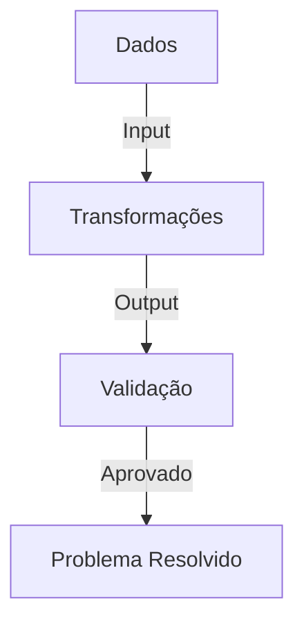

# Teoria dos Problemas: P = (I, B, C)

## Definição Estrutural de Problemas

A teoria dos problemas é formalizada pela equação **P = (I, B, C)**, onde:

- **P**: Problema a ser resolvido
- **B**: Conjunto de dados do problema (estado inicial + evolução)
- **I**: Operações/transformações possíveis (algoritmos, métodos)
- **C**: Condições para solução satisfatória

---

## Aplicação em Engenharia de Software

### 1. Identificação dos Dados (B)

**Elementos-chave:**

- Requisitos do cliente
- Entradas/Saídas do sistema
- Restrições técnicas (performance, segurança)
- Contexto do domínio

**Prática recomendada:**

```python
# Exemplo: Documentação de requisitos em formato estruturado
problema = {
    "requisitos": ["login seguro", "dashboard em tempo real"],
    "restricoes": ["latência < 2s", "SSL obrigatório"],
    "estado_inicial": "sistema legado sem autenticação"
}
```

### 2. Exploração de Soluções (I)

**Abordagens típicas:**

- Comparação de arquiteturas (monolito vs. microsserviços)
- Seleção de algoritmos (ex.: ordenação para listas grandes)
- Avaliação de tecnologias (frameworks, bancos de dados)

**Técnica de decisão:**
| Opção | Vantagens | Desvantagens |
|----------------|-------------------------|----------------------|
| Arquitetura A | Escalabilidade | Complexidade inicial |
| Arquitetura B | Simplicidade | Limitações futuras |

### 3. Definição de Critérios (C)

**Checklist de validação:**

- [ ] Atende 100% dos requisitos funcionais
- [ ] Passa em testes de carga (ex.: 1000 usuários concorrentes)
- [ ] Cumpre normas de segurança (OWASP Top 10)

---

## Fluxo de Resolução Estruturada

1. **Coletar B**
   - Entrevistas com stakeholders
   - Análise de sistemas existentes
2. **Gerar I**
   - Brainstorming de soluções
   - Prototipagem rápida (Proof of Concept)
3. **Validar C**
   - Testes automatizados
   - Aceitação do cliente

---

## Vantagens da Abordagem P = (I, B, C)

- **Rastreabilidade**: Documenta toda a evolução do problema
- **Objetividade**: Reduz ambiguidades na tomada de decisão
- **Eficiência**: Foca apenas em transformações relevantes (I) para os dados (B)

> _"A clareza na definição do problema economiza 50% do esforço de solução."_ > **— Daniel Gehlen**

---

## Caso Prático: Sistema de Pagamentos

**B**:

- Integração com 5 gateways diferentes
- Necessidade de conciliação diária

**I**:

- Opção 1: API unificada própria
- Opção 2: Adaptador para cada gateway

**C**:

- Suporte a 100 transações/segundo
- Reconciliação automática com ERP

**Solução escolhida**: Opção 2 (menor custo inicial, atende C)


