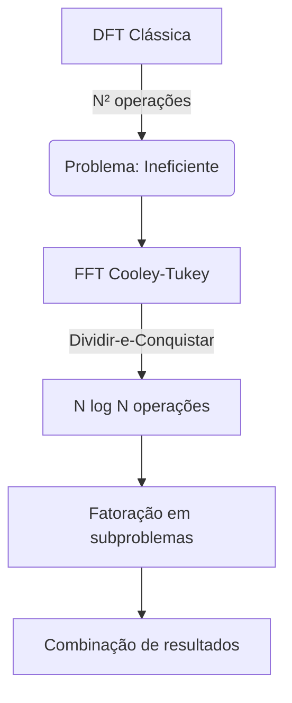

# Transformada Rápida de Fourier (FFT)

## Conceito Fundamental
Algoritmo otimizado para cálculo da Transformada Discreta de Fourier (DFT) que reduz a complexidade computacional de O(N²) para O(N log N)

## Princípio de Funcionamento


## Implementação Prática (Python)
```python
import numpy as np
import matplotlib.pyplot as plt

# Sinal exemplo (senoide + ruído)
fs = 1000  # Frequência de amostragem
t = np.linspace(0, 1, fs)
f1, f2 = 50, 120  # Frequências componentes
sinal = 0.7*np.sin(2*np.pi*f1*t) + np.sin(2*np.pi*f2*t)
sinal += 0.5*np.random.randn(len(t))  # Adiciona ruído

# Cálculo da FFT
N = len(sinal)
frequencias = np.fft.fftfreq(N, 1/fs)[:N//2]
valores_fft = np.abs(np.fft.fft(sinal)[:N//2])*2/N

# Visualização
plt.figure(figsize=(12,4))
plt.subplot(121)
plt.plot(t, sinal)
plt.title('Sinal no Domínio do Tempo')

plt.subplot(122)
plt.stem(frequencias, valores_fft)
plt.xlim(0, 200)
plt.title('Espectro de Frequência (FFT)')
plt.tight_layout()
plt.show()
```

## Comparativo DFT vs FFT
| Característica | DFT Clássica | FFT |
|---------------|-------------|-----|
| Complexidade | O(N²) | O(N log N) |
| Tempo (N=1024) | ~1ms | ~50μs |
| Memória | N² | N |
| Implementação | Direta | Recursiva |

## Aplicações Principais
1. **Análise Espectral**
   - Identificação de frequências dominantes
   - Detecção de padrões periódicos

2. **Processamento de Sinais**
   - Filtragem digital (projeto de filtros FIR)
   - Compressão de áudio (MP3/AAC)

3. **Processamento de Imagens**
   - Análise de texturas
   - Compressão JPEG (DCT ≈ FFT real)

4. **Comunicações Digitais**
   - OFDM (5G/WiFi)
   - Análise de canais

## Otimizações Chave
- **Algoritmo Base 2**: Funciona melhor com N = 2ⁿ
- **Memorização**: Reutilização de cálculos intermediários
- **Vetorização**: Uso de instruções SIMD (AVX/NEON)

**Exemplo de saída**: O código demonstra como a FFT identifica claramente as componentes de 50Hz e 120Hz mesmo com ruído adicionado, mostrando sua utilidade para análise espectral.

## Detalhes Técnicos Adicionais
1. **Tipos de FFT**:
   - Radix-2 (mais comum)
   - Radix-4 (para vetores maiores)
   - Bluestein (para tamanhos arbitrários)

2. **Implementações Otimizadas**:
   - FFTW (Biblioteca C)
   - cuFFT (NVIDIA GPU)
   - Accelerate (Framework Apple)

3. **Cuidados na Implementação**:
   - Efeito de vazamento espectral (usar janelamento)
   - Aliasing (respeitar teorema de Nyquist)
   - Normalização correta dos resultados

## Caso de Uso Avançado
```python
# Análise de áudio em tempo real
import sounddevice as sd

def callback_fft(indata, frames, time, status):
    fft_result = np.abs(np.fft.rfft(indata[:,0]))
    freqs = np.fft.rfftfreq(len(indata), 1/44100)
    # Processamento em tempo real aqui...

# Configura stream de áudio
stream = sd.InputStream(callback=callback_fft, channels=1)
stream.start()
```

## Referências Importantes
- Cooley, J. W.; Tukey, J. W. (1965). "An algorithm for the machine calculation of complex Fourier series"
- Numerical Recipes in C (Capítulo 12)
- IEEE Transactions on Signal Processing
