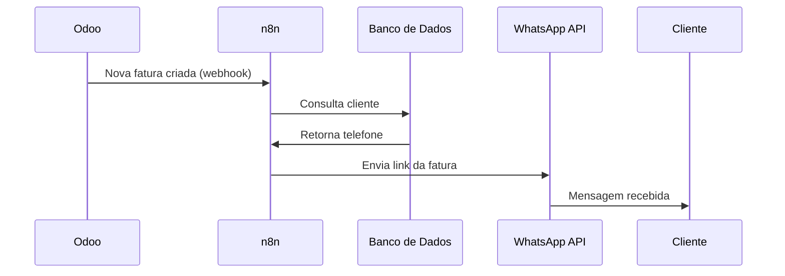
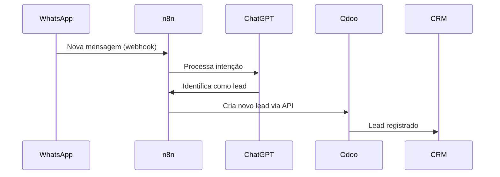

# Automação de Faturamento via WhatsApp

## 🔄 Fluxo Principal com n8n + Odoo

### 1. Notificação de Fatura



### 2. Cadastro de Lead



## 🛠️ Stack Tecnológica Recomendada

| Componente        | Tecnologia | Alternativas        |
| ----------------- | ---------- | ------------------- |
| Automação         | n8n        | Zapier, Make        |
| ERP/CRM           | Odoo       | HubSpot, Salesforce |
| WhatsApp          | Twilio API | WPPConnect          |
| Banco de Dados    | PostgreSQL | MySQL, MongoDB      |
| Processamento NLP | ChatGPT    | Dialogflow, Rasa    |

## 💡 Modelos de Implementação

### Opção 1: n8n (Open-Source)

```python
# Exemplo de webhook handler no n8n
def handleWebhook():
    invoice = request.json
    if invoice['status'] == 'sent':
        phone = db.query("SELECT phone FROM clients WHERE id = ?", invoice['client_id'])
        whatsapp.send(
            to=phone,
            body=f"Sua fatura {invoice['number']} está disponível: {invoice['link']}"
        )
```

### Opção 2: Python + Flask (Custom)

```python
@app.route('/whatsapp-webhook', methods=['POST'])
def whatsapp_webhook():
    data = request.json
    if is_new_lead(data['message']):
        odoo.create_lead(
            name=data['contact']['name'],
            phone=data['contact']['phone']
        )
    return jsonify({"status": "success"})
```

## ⚙️ Configuração Passo a Passo

1. **Preparar Ambiente n8n**

   ```bash
   docker run -d --name n8n -p 5678:5678 n8nio/n8n
   ```

2. **Conectar Odoo**

   - Habilitar API REST no Odoo
   - Criar usuário de serviço
   - Configurar webhooks para faturas

3. **Integrar WhatsApp**

   - Criar conta na Twilio
   - Obter SID e Token
   - Verificar número WhatsApp

4. **Fluxo de Notificação**
   - Criar trigger para "fatura enviada"
   - Adicionar ação de envio WhatsApp
   - Testar com sandbox

## 📊 Análise de Custos (Mensal)

| Recurso           | Plano Básico  | Uso Estimado  | Custo     |
| ----------------- | ------------- | ------------- | --------- |
| n8n (self-hosted) | Free          | -             | R$0       |
| Twilio WhatsApp   | Pay-as-you-go | 500 mensagens | R$15      |
| Odoo Cloud        | Basic         | 1 usuário     | R$120     |
| **Total**         |               |               | **R$135** |

## 🚀 Melhores Práticas

1. **Tratamento de Erros**

   - Configurar dead-letter queue para mensagens falhas
   - Implementar retry automático

2. **Segurança**

   - Validar assinatura webhook
   - Criptografar dados sensíveis
   - Usar variáveis de ambiente

3. **Monitoramento**
   - Logar todas as interações
   - Alertas para falhas de entrega
   - Dashboard de métricas

_Documentação Oficial: [n8n](https://docs.n8n.io) | [Twilio WhatsApp](https://www.twilio.com/whatsapp)_

-
