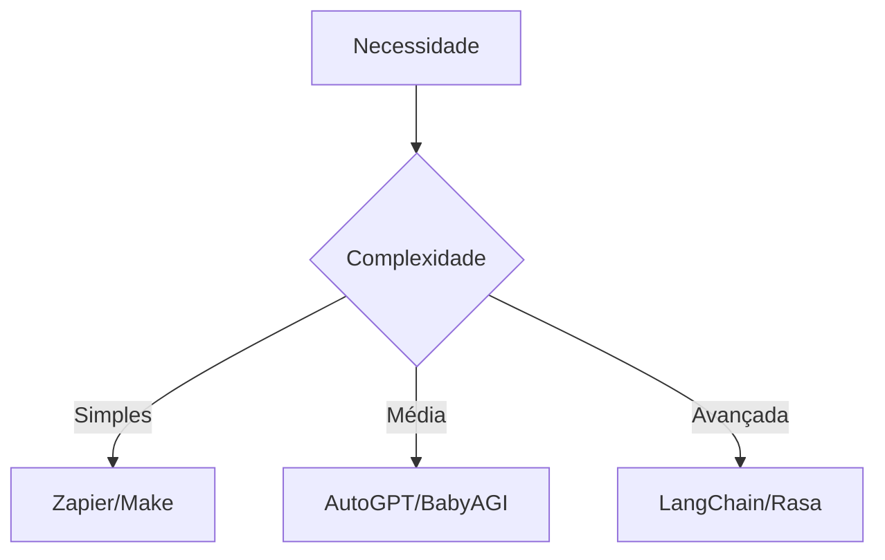

# Ferramentas Open-Source para Automação e Análise de Dados

## 🛠️ Ferramentas de Automação Inteligente

### AutoGPT
- **Função**: Agente autônomo baseado em GPT-4 para tarefas complexas
- **Tipo**: Open-Source (Python)
- **Casos de uso**:
  - Web scraping automatizado
  - Geração de relatórios dinâmicos
  - Execução de scripts personalizados
- [Repositório GitHub](https://github.com/Significant-Gravitas/AutoGPT)

### BabyAGI
- **Função**: Sistema de gerenciamento de tarefas autônomas
- **Diferencial**: Cria cadeias de tarefas inteligentes
- **Integração**: Compatível com APIs OpenAI
- [Repositório GitHub](https://github.com/yoheinakajima/babyagi)

## 📊 Plataformas de Análise de Dados

### Jupyter Notebooks
- **Stack**: Python/R/Julia
- **Vantagens**:
  - Ambiente interativo para análise
  - Suporte a visualização de dados
  - Integração com bibliotecas ML (TensorFlow, PyTorch)
- [Site Oficial](https://jupyter.org)

### Streamlit
- **Destaque**: Transforma scripts Python em apps web
- **Exemplo de uso**:
  ```python
  import streamlit as st
  st.title('Analytics Dashboard')
  st.line_chart(data)
  ```
- [Documentação](https://streamlit.io)

## 🤖 Frameworks para Desenvolvimento com IA

### LangChain
- **Funcionalidade**: Construção de pipelines de IA
- **Componentes chave**:
  - Modelos de linguagem
  - Memória de contexto
  - Agentes autônomos
- [Guia de Implementação](https://langchain.readthedocs.io)

### Rasa
- **Foco**: Chatbots inteligentes
- **Fluxo típico**:
  1. Treinamento de modelo NLU
  2. Definição de diálogos
  3. Integração com APIs
- [Tutorial Rasa](https://rasa.com/docs)

## 🔗 Ferramentas Web para Automação

| Ferramenta       | Melhor Para              | Integração Notável      |
|------------------|--------------------------|-------------------------|
| Zapier           | Workflows entre apps     | +2.000 conectores       |
| Make (Integromat)| Automações complexas     | Interface visual        |
| Hugging Face     | Modelos pré-treinados    | Transformers library    |

## 📌 Comparativo Técnico



## 💡 Dicas de Implementação

1. **Para iniciantes**:
   - Comece com Jupyter + Pandas para análise
   - Experimente Streamlit para dashboards simples

2. **Para times técnicos**:
   - Implemente LangChain para fluxos complexos
   - Considere Rasa para chatbots corporativos

3. **Para automação geral**:
   - Zapier para integração entre SaaS
   - AutoGPT para tarefas cognitivas

*Documentação completa e tutoriais disponíveis nos links mencionados.*
