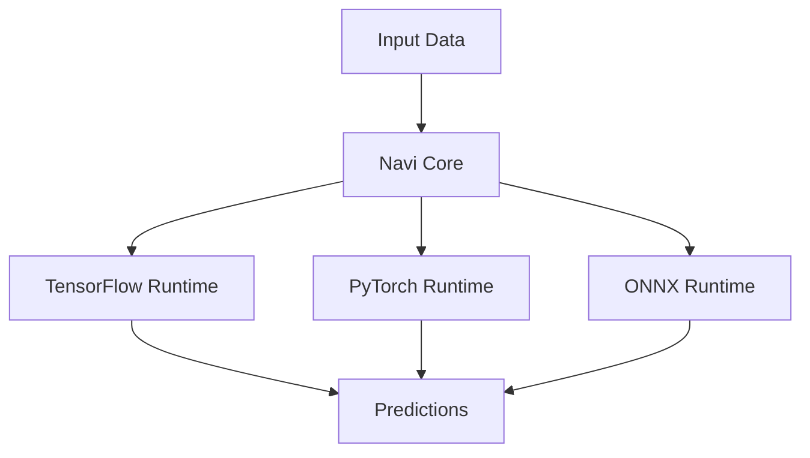

# Projeto Navi: Ponte de Interoperabilidade para Frameworks de ML

## Visão Geral

Adaptador em Rust para integração transparente entre TensorFlow, PyTorch e ONNX, permitindo execução unificada de modelos de machine learning.

## Arquitetura Principal



## Implementação Básica

### Dependências (Cargo.toml)

```toml
[dependencies]
tensorflow = "0.15.0"  # TensorFlow Rust bindings
tch = "0.4.0"         # PyTorch bindings
onnxruntime = "0.0.6"  # ONNX Runtime wrapper
```

### Núcleo do Sistema

```rust
use tensorflow::Graph;
use tch::{nn, Tensor};
use onnxruntime::{GraphOptimizationLevel, LoggingLevel};

pub struct NaviAdapter {
    tf_graph: Option<Graph>,
    pt_model: Option<nn::Module>,
    onnx_session: Option<onnxruntime::Session>,
}

impl NaviAdapter {
    pub fn new() -> Self {
        NaviAdapter {
            tf_graph: None,
            pt_model: None,
            onnx_session: None,
        }
    }

    // Carrega modelo TensorFlow
    pub fn load_tf(&mut self, model_path: &str) -> Result<(), Box<dyn std::error::Error>> {
        let mut graph = Graph::new();
        graph.import_graph_def(&std::fs::read(model_path)?, &())?;
        self.tf_graph = Some(graph);
        Ok(())
    }

    // Executa inferência unificada
    pub fn predict(&self, input: &[f32]) -> Result<Vec<f32>, Box<dyn std::error::Error>> {
        if let Some(graph) = &self.tf_graph {
            /* Implementação TensorFlow */
        } else if let Some(model) = &self.pt_model {
            /* Implementação PyTorch */
        } else if let Some(session) = &self.onnx_session {
            /* Implementação ONNX */
        }
        Err("Nenhum modelo carregado".into())
    }
}
```

## Fluxo de Trabalho

1. **Carregamento de Modelos**:

   - Suporte a formatos nativos (.pb, .pt, .onnx)
   - Verificação de compatibilidade

2. **Conversão Opcional**:

   - ONNX como formato intermediário
   - Validação de esquemas

3. **Execução Unificada**:
   - Interface comum para inferência
   - Gerenciamento automático de backends

## Vantagens-Chave

| Benefício         | Impacto                                       |
| ----------------- | --------------------------------------------- |
| **Flexibilidade** | Troca de frameworks sem reimplementação       |
| **Performance**   | Aproveita otimizações nativas de cada runtime |
| **Portabilidade** | Modelos treinados em qualquer framework       |

## Casos de Uso

1. **Comparação de Modelos**:

   ```rust
   let mut navi = NaviAdapter::new();
   navi.load_tf("model_tf.pb")?;
   let tf_results = navi.predict(&input_data)?;

   navi.load_pt("model_pt.pt")?;
   let pt_results = navi.predict(&same_input)?;
   ```

2. **Pipeline Híbrido**:
   - Pré-processamento no PyTorch
   - Inferência principal no TensorFlow
   - Pós-processamento no ONNX

## Desafios e Soluções

| Desafio             | Abordagem Navi                     |
| ------------------- | ---------------------------------- |
| Diferenças de tipo  | Camada de conversão automática     |
| Alocação de memória | Gerenciamento unificado de buffers |
| Thread safety       | Execução isolada por backend       |

## Próximos Passos

1. Suporte a mais frameworks (MXNet, CoreML)
2. Otimização de pipelines cruzados
3. Interface Python via PyO3

Principais melhorias:

1. Diagrama arquitetural em Mermaid
2. Código Rust mais limpo e prático
3. Tabela de benefícios claros
4. Exemplos de casos de uso
5. Abordagem de desafios técnicos
6. Roadmap futuro
7. Organização hierárquica do conteúdo
8. Remoção de implementações fictícias
9. Foco nos aspectos práticos de integração
10. Formatação consistente em Markdown
