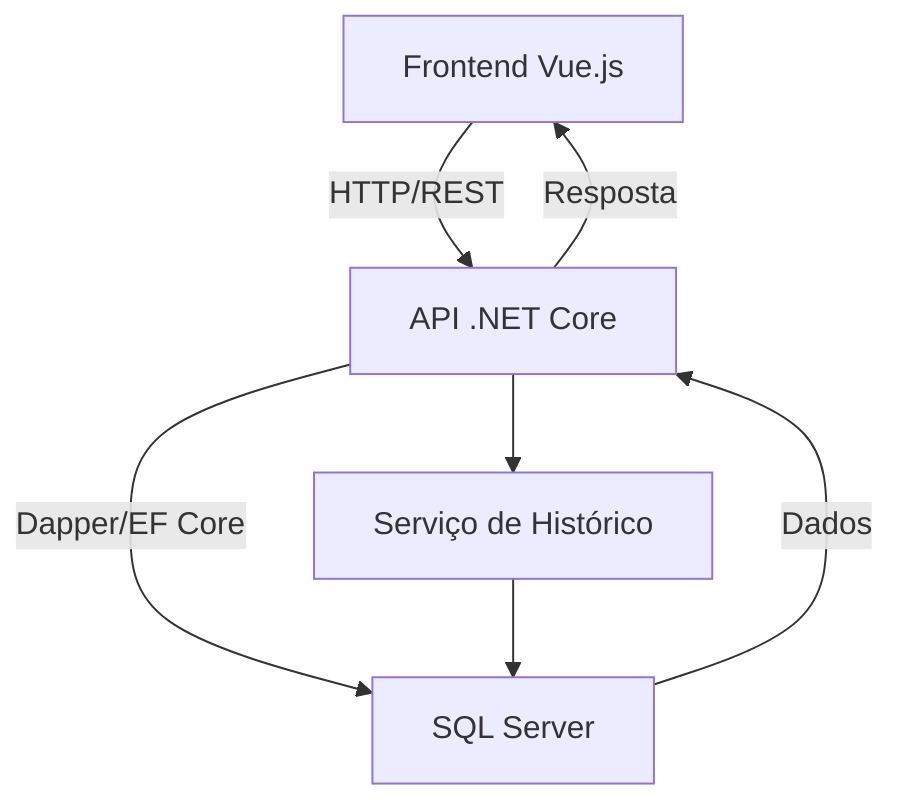
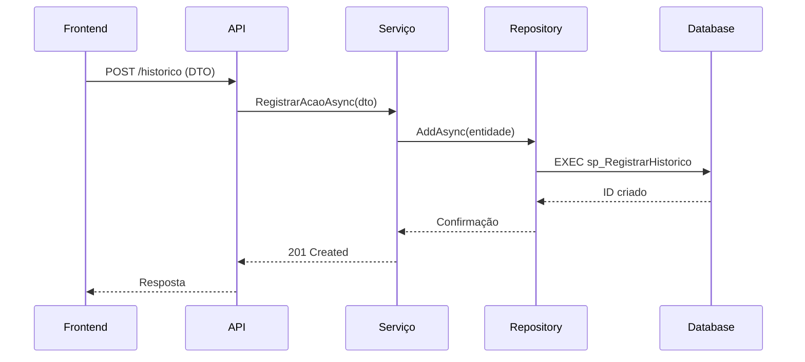

# Arquitetura SOA para Sistema de Histórico de Alterações

## Visão Geral da Arquitetura



## Componentes Principais

### 1. Camada de Banco de Dados (SQL Server)

```sql
-- Tabela de histórico otimizada
CREATE TABLE HistoricoAcoes (
    IdHistorico INT IDENTITY(1,1) PRIMARY KEY,
    IdFaturamentoDireto INT NOT NULL,
    TipoEntidade NVARCHAR(50) NOT NULL,
    CampoAlterado NVARCHAR(50) NOT NULL,
    ValorAntigo NVARCHAR(MAX),
    ValorNovo NVARCHAR(MAX) NOT NULL,
    Usuario NVARCHAR(100) NOT NULL,
    DataAlteracao DATETIME2 DEFAULT SYSUTCDATETIME(),
    IpOrigem NVARCHAR(45),

    INDEX IX_Historico_Faturamento (IdFaturamentoDireto),
    INDEX IX_Historico_Data (DataAlteracao DESC)
);

-- Procedure para registro em lote
CREATE PROCEDURE sp_RegistrarHistoricoLote
    @Historicos HistoricoTableType READONLY
AS
BEGIN
    INSERT INTO HistoricoAcoes (...)
    SELECT ... FROM @Historicos;
END
```

### 2. Camada de Serviços (.NET Core)

```csharp
// Interface do serviço
public interface IHistoricoService
{
    Task RegistrarAcaoAsync(RegistroHistoricoDTO registro);
    Task RegistrarAcoesEmLoteAsync(IEnumerable<RegistroHistoricoDTO> registros);
}

// Implementação com padrão Unit of Work
public class HistoricoService : IHistoricoService
{
    private readonly IUnitOfWork _uow;
    private readonly ILogger<HistoricoService> _logger;

    public async Task RegistrarAcaoAsync(RegistroHistoricoDTO dto)
    {
        using var transaction = await _uow.BeginTransactionAsync();

        try {
            var historico = new HistoricoAcao {
                // Mapeamento DTO para entidade
            };

            await _uow.HistoricoRepository.AddAsync(historico);
            await _uow.CommitAsync();
        }
        catch (Exception ex) {
            _logger.LogError(ex, "Falha ao registrar histórico");
            await _uow.RollbackAsync();
            throw;
        }
    }
}
```

### 3. API REST (.NET Core)

```csharp
[ApiController]
[Route("api/v{version:apiVersion}/[controller]")]
[ApiVersion("1.0")]
[Authorize(Policy = "Auditoria")]
public class HistoricoController : ControllerBase
{
    private readonly IHistoricoService _service;

    [HttpPost]
    [ProducesResponseType(StatusCodes.Status201Created)]
    [ProducesResponseType(StatusCodes.Status400BadRequest)]
    public async Task<IActionResult> Registrar(
        [FromBody] RegistroHistoricoDTO dto,
        [FromServices] IValidator<RegistroHistoricoDTO> validator)
    {
        var validation = await validator.ValidateAsync(dto);
        if (!validation.IsValid)
            return BadRequest(validation.Errors);

        await _service.RegistrarAcaoAsync(dto);
        return CreatedAtAction(nameof(Obter), new { id = dto.Id });
    }

    [HttpPost("lote")]
    public async Task<IActionResult> RegistrarLote(
        [FromBody] IEnumerable<RegistroHistoricoDTO> dtos)
    {
        await _service.RegistrarAcoesEmLoteAsync(dtos);
        return Accepted();
    }
}
```

### 4. Frontend (Vue.js com Composition API)

```javascript
// Composable para histórico
export function useHistorico() {
  const store = useStore();
  const { notify } = useNotifications();

  const registrarAlteracao = async (campo, novoValor) => {
    try {
      await api.post("/historico", {
        campo,
        valorNovo: novoValor,
        usuario: store.state.usuario.id,
      });
      notify.success("Alteração registrada");
    } catch (error) {
      notify.error("Falha ao registrar");
      throw error;
    }
  };

  return { registrarAlteracao };
}

// Uso no componente
export default {
  setup() {
    const { registrarAlteracao } = useHistorico();

    const handleChange = (campo, valor) => {
      registrarAlteracao(campo, valor);
    };

    return { handleChange };
  },
};
```

## Padrões e Melhores Práticas

| Padrão/Prática  | Implementação                          | Benefício                 |
| --------------- | -------------------------------------- | ------------------------- |
| CQRS            | Separação leitura/escrita no histórico | Otimização de desempenho  |
| Unit of Work    | Transações atômicas no serviço         | Consistência de dados     |
| DDD             | Agregados de histórico                 | Modelagem de negócio rica |
| Circuit Breaker | Retry policies no frontend             | Resiliência a falhas      |
| Decorator       | Logging em serviços                    | Rastreabilidade           |

## Fluxo de Auditoria Completo



## Otimizações Avançadas

1. **Cache de Valores Antigos**:

   ```csharp
   // Decorator com cache
   public class HistoricoServiceCacheDecorator : IHistoricoService
   {
       private readonly IHistoricoService _inner;
       private readonly IDistributedCache _cache;

       public async Task RegistrarAcaoAsync(RegistroHistoricoDTO dto)
       {
           var cacheKey = $"valor_anterior_{dto.EntidadeId}_{dto.Campo}";
           var valorAntigo = await _cache.GetStringAsync(cacheKey);

           if (valorAntigo == null) {
               valorAntigo = await _inner.ObterValorAtualAsync(dto);
               await _cache.SetStringAsync(cacheKey, valorAntigo,
                   new DistributedCacheEntryOptions {
                       SlidingExpiration = TimeSpan.FromMinutes(30)
                   });
           }

           dto.ValorAntigo = valorAntigo;
           await _inner.RegistrarAcaoAsync(dto);
       }
   }
   ```

2. **Processamento Assíncrono**:

   ```csharp
   // BackgroundService para processar fila
   public class HistoricoBackgroundService : BackgroundService
   {
       protected override async Task ExecuteAsync(CancellationToken stoppingToken)
       {
           while (!stoppingToken.IsCancellationRequested)
           {
               var itens = await _fila.ConsumirLoteAsync(50);
               if (itens.Any())
                   await _service.RegistrarAcoesEmLoteAsync(itens);

               await Task.Delay(1000, stoppingToken);
           }
       }
   }
   ```

## Monitoramento e Observabilidade

1. **Métricas**:

   ```prometheus
   # HELP historico_registros_total Total de registros de histórico
   # TYPE historico_registros_total counter
   historico_registros_total{status="sucesso"} 42
   historico_registros_total{status="falha"} 3
   ```

2. **Logs Estruturados**:
   ```json
   {
     "Timestamp": "2023-08-15T12:00:00Z",
     "Level": "Information",
     "Message": "Registro de histórico criado",
     "Properties": {
       "IdFaturamento": 12928,
       "Campo": "Material",
       "Usuario": "user123",
       "TempoProcessamento": "45ms"
     }
   }
   ```

> "A arquitetura SOA bem implementada transforma operações de negócio em serviços reutilizáveis e escaláveis."

**Próximos Passos Recomendados**:

1. Implementar API de consulta com paginação
2. Adicionar suporte a WebSockets para atualizações em tempo real
3. Criar dashboard de auditoria no frontend
4. Implementar exportação para Excel/PDF
