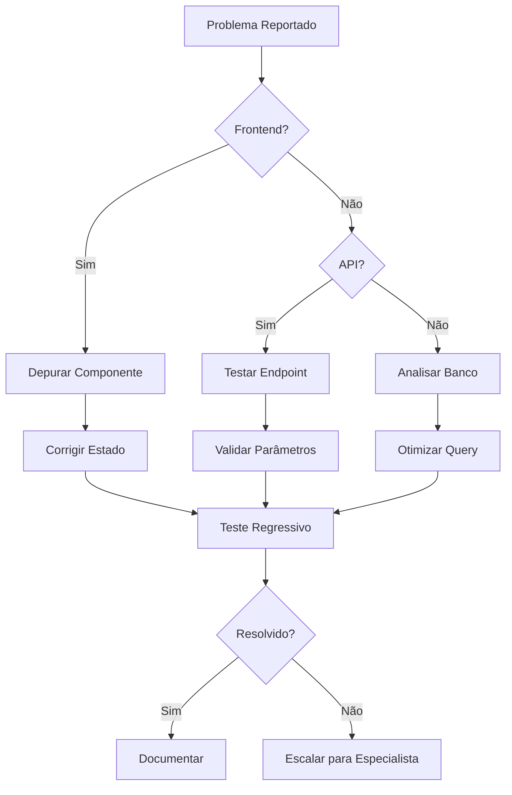

# Passos para Analisar e Implementar Requisitos

## Fluxo de Análise Técnica

### 1. Compreensão do Problema

```python
# Template de documentação inicial
problema = {
    "descricao": "Botão de cotação não atualiza histórico",
    "ambiente": "Produção v3.2",
    "reproducao": "Passos no vídeo tutorial (link)",
    "user_test": "user_qa_2023@empresa.com"
}
```

### 2. Investigação Frontend (Vue.js/React)

```javascript
// Pesquisa de componentes
// 1. Localizar componente pelo nome da funcionalidade
const componentFiles = searchFiles(/HistoricoCotacao/i);

// 2. Analisar métodos relevantes
methods: {
    async atualizarHistorico() {
        // Chamada API suspeita
        const response = await api.get('/cotacoes');
        this.historico = response.data; // Dados não atualizando?
    }
}
```

### 3. Verificação de APIs (Node.js/.NET)

```csharp
// Exemplo de endpoint API
[HttpGet("cotacoes")]
public IActionResult GetCotacoes([FromQuery] string usuarioId)
{
    // Verificar parâmetros
    if (string.IsNullOrEmpty(usuarioId))
        return BadRequest();

    // Validar cache
    var cacheKey = $"cotacoes_{usuarioId}";
    if (_cache.TryGetValue(cacheKey, out var cachedData))
        return Ok(cachedData);

    // Consulta ao banco
    var data = _repo.ObterHistorico(usuarioId);
    _cache.Set(cacheKey, data, TimeSpan.FromMinutes(5));
    return Ok(data);
}
```

### 4. Análise de Banco de Dados (SQL)

```sql
-- Verificar procedure de histórico
CREATE PROCEDURE sp_ObterHistoricoCotacao
    @UsuarioID INT
AS
BEGIN
    SELECT * FROM Cotacoes
    WHERE UsuarioID = @UsuarioID
    ORDER BY DataCriacao DESC
    -- Problema: Filtro por data faltando?
END
```

## Checklist de Validação

1. [ ] Fluxo UI corresponde ao vídeo de referência
2. [ ] Chamadas API retornam status 200 com payload correto
3. [ ] Parâmetros de consulta estão sendo passados corretamente
4. [ ] Procedures do banco retornam datasets completos
5. [ ] Cache não está servindo dados desatualizados

## Técnicas de Depuração

| Camada   | Ferramentas                  | Comando Exemplo               |
| -------- | ---------------------------- | ----------------------------- |
| Frontend | Vue DevTools, React Profiler | `debugger;` no método crítico |
| Backend  | Postman, Swagger             | `logger.debug(params);`       |
| Banco    | Query Store, Profiler        | `EXEC sp_WhoIsActive`         |

## Fluxograma de Solução



## Documentação de Mudanças

```markdown
# Registro de Alteração - HIST-2023-08

**Data**: 15/08/2023
**Responsável**: Dev Frontend
**Área Afetada**: Componente HistoricoCotacao.vue

## Mudanças:

1. Adicionado watch na propriedade `cotacaoAtual`
2. Implementado polling a cada 30s (setInterval)
3. Corrigido parâmetro `usuarioId` na chamada API

## Testes Realizados:

- [x] Teste manual no ambiente staging
- [x] Validação de payload com QA
- [x] Verificação de performance (Lighthouse)

**Rollback Plan**:
Reverter commit a123f5 e reativar cache anterior

> "Um requisito bem analisado é meio caminho andado para uma implementação robusta."

**Dica Pro**: Use `console.table()` para inspecionar objetos complexos no navegador durante a depuração frontend.
```
