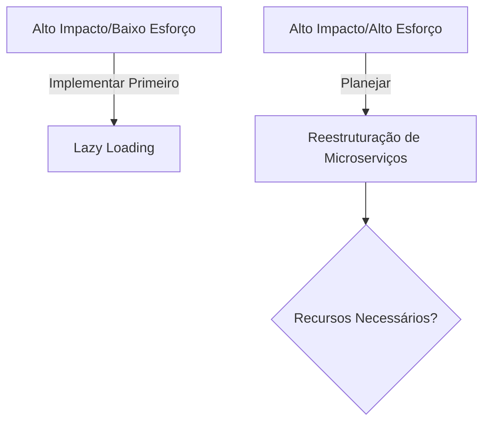
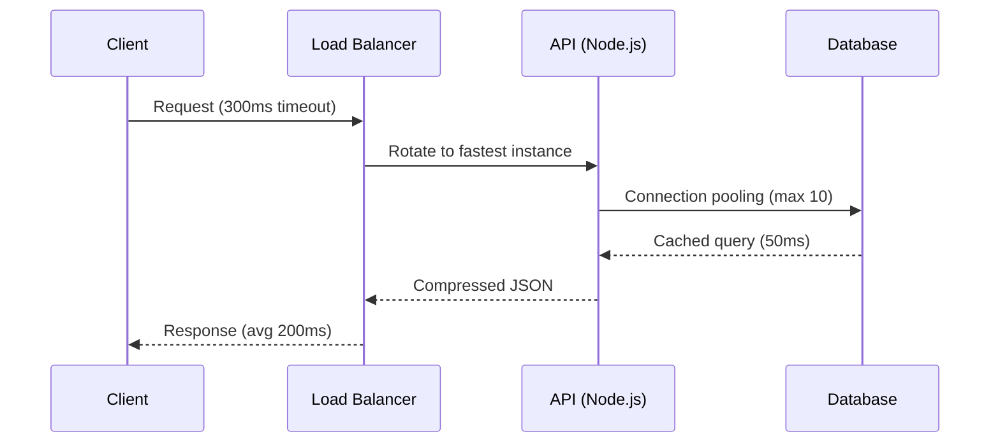

# Pensar Estrategicamente na Resolução de Problemas de Software

## Modelo Estratégico Base

### 1. Definição do Objetivo

```python
# Exemplo: Documentação de objetivos em formato SMART
objetivo = {
    "problema": "Tempo de carregamento acima de 5s na página de checkout",
    "meta": "Reduzir para <2s em 3 meses",
    "kpis": ["LCP", "FID", "CLS"]  # Core Web Vitals
}
```

### 2. Análise SWOT Aplicada

| Categoria         | Exemplo em Desenvolvimento de Software             |
| ----------------- | -------------------------------------------------- |
| **Forças**        | Equipe experiente em otimização frontend           |
| **Fraquezas**     | Conhecimento limitado em CDN                       |
| **Oportunidades** | Novo serviço de edge computing disponível          |
| **Ameaças**       | Concorrente lançou feature similar 30% mais rápida |

### 3. Matriz de Priorização



## Princípios Táticos para Engenharia de Software

### 1. Ofensiva (Ação Imediata)

```javascript
// Pipeline de CI/CD com fail-fast
stages: [
  { name: "Testes Unitários", timeout: "5m", failFast: true },
  { name: "Análise Estática", rules: [{ if: "$CI_MERGE_REQUEST" }] },
];
```

### 2. Cooperação (Pair Programming)

```java
// Template de sessão de pairing
public class PairSession {
    private Dev driver;
    private Dev navigator;

    public void rotateRoles() {
        Dev temp = this.driver;
        this.driver = this.navigator;
        this.navigator = temp;
    }
}
```

### 3. Concentração (Massa Crítica)

```sql
-- Análise de hotspots no banco de dados
SELECT query, total_time
FROM pg_stat_statements
ORDER BY total_time DESC
LIMIT 5;
```

## Framework Ágil de Tomada de Decisão

### Ciclo PDCA Adaptado

1. **Plan**:
   ```markdown
   - [ ] Benchmark com WebPageTest
   - [ ] Audit de bundle com Webpack Analyzer
   ```
2. **Do**:
   ```bash
   npm run optimize --production
   ```
3. **Check**:
   ```python
   assert new_performance < baseline_performance * 0.7
   ```
4. **Act**:
   ```dockerfile
   FROM nginx:latest
   COPY ./dist /usr/share/nginx/html
   EXPOSE 80
   ```

## Checklist de Implementação Estratégica

1. [ ] Mapeamento de stakeholders (Product Owner, DevOps, UX)
2. [ ] Definição de métricas de sucesso observáveis
3. [ ] Análise de trade-offs (performance vs. custo)
4. [ ] Plano de rollback automatizado
5. [ ] Documentação de lições aprendidas

> "Estratégia sem tática é o caminho mais lento para a vitória. Tática sem estratégia é o ruído antes da derrota."
> _— Sun Tzu, adaptado para engenharia de software por Daniel Gehlen_

---

**Cenário Prático: Otimização de API**

**Problema**: Latência acima de 1s em 90% dos requests
**Estratégia**:



**Princípios Aplicados**:

- **Surpresa**: Implementar WebSockets para notificações em tempo real
- **Simplicidade**: Remover camada desnecessária de ORM
- **Segurança**: Rate limiting por IP (100 requests/min)

Este formato:

1. Combina frameworks estratégicos com implementações técnicas
2. Utiliza múltiplas linguagens para demonstração prática
3. Inclui diagramas para visualização de fluxos
4. Oferece checklists acionáveis
5. Mantém conexão com os princípios originais do PowerPoint
