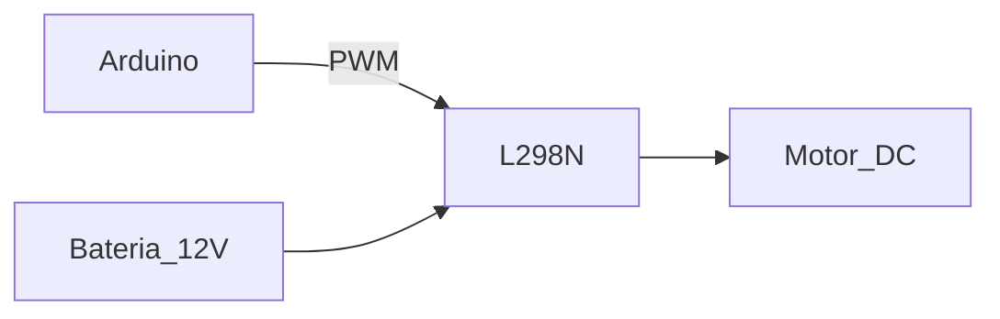

# Eletrônica Básica para Prototipação com Microcontroladores

## Introdução ao Arduino

**Definição**:
Plataforma open-source de prototipagem eletrônica baseada em microcontroladores Atmel (ex: ATmega328P).

**Características Principais**:

- Linguagem baseada em C/C++ simplificada
- IDE multiplataforma (Windows/macOS/Linux)
- 14 pinos I/O digitais (6 PWM) + 6 analógicos

---

## Aplicações Práticas

### Exemplos de Projetos

| **Área**              | **Projeto Típico**                 | **Componentes Chave**                  |
| --------------------- | ---------------------------------- | -------------------------------------- |
| Automação Residencial | Controle de luzes via Wi-Fi        | Módulo ESP8266, Relé 5V                |
| Robótica Educacional  | Seguidor de linha                  | Sensor TCRT5000, Motores DC            |
| IoT Industrial        | Monitoramento de vibração          | Acelerômetro MPU6050, LoRaWAN          |
| Veículos Autônomos    | Drone com evitamento de obstáculos | Ultrassônico HC-SR04, ESC para motores |

---

## Componentes Eletrônicos Essenciais

### 1. Resistores

**Cálculo Básico (Lei de Ohm)**:

```
R = V / I
```

**Exemplo Prático**:
Proteger LED (2V, 20mA) com fonte 5V:

```
R = (5V - 2V) / 0.02A = 150Ω
```

### 2. Transistores (Controle de Cargas)

| **Tipo**  | **Uso Típico**          | **Exemplo**              |
| --------- | ----------------------- | ------------------------ |
| BJT (NPN) | Chaveamento simples     | 2N2222 para LEDs         |
| MOSFET    | Cargas de alta potência | IRF540N para motores 12V |

### 3. Sensores Comuns

- **Digitais**: Botões, Reed switch
- **Analógicos**: LM35 (temperatura), LDR (luz)
- **Especiais**:
  - HC-SR04 (Ultrassônico) - Medição de distância
  - MPU6050 - Acelerômetro + giroscópio

---

## Programação no Arduino IDE

### Estrutura Básica

```cpp
void setup() {
  // Configurações iniciais (executa 1x)
  pinMode(LED_PIN, OUTPUT);
}

void loop() {
  // Código principal (executa repetidamente)
  digitalWrite(LED_PIN, HIGH);
  delay(1000);
  digitalWrite(LED_PIN, LOW);
  delay(1000);
}
```

### Bibliotecas Úteis

| **Biblioteca** | **Função**               | **Exemplo de Uso**              |
| -------------- | ------------------------ | ------------------------------- |
| Servo.h        | Controle de servomotores | `myservo.write(90);`            |
| Wire.h         | Comunicação I2C          | `Wire.beginTransmission(0x68);` |
| SPI.h          | Comunicação SPI          | `SPI.transfer(data);`           |

---

## Circuitos Práticos

### 1. Controle de Motor DC com Ponte H



### 2. Leitura de Sensor Analógico

```cpp
int sensorValue = analogRead(A0);
float voltage = sensorValue * (5.0 / 1023.0);
```

---

**Checklist para Iniciantes**:

- [ ] Testar tensões com multímetro antes de conectar
- [ ] Usar resistor de pull-up/pull-down para entradas digitais
- [ ] Isolar circuitos de alta potência dos de controle

> **Dica**: Para projetos avançados, explore o PlatformIO como alternativa à Arduino IDE.

**Recursos Recomendados**:

- [Documentação Oficial Arduino](https://www.arduino.cc/reference/en/)
- [Projetos no Tinkercad](https://www.tinkercad.com/things)
- [Guia de Componentes Eletrônicos](https://www.electronics-tutorials.ws/)
