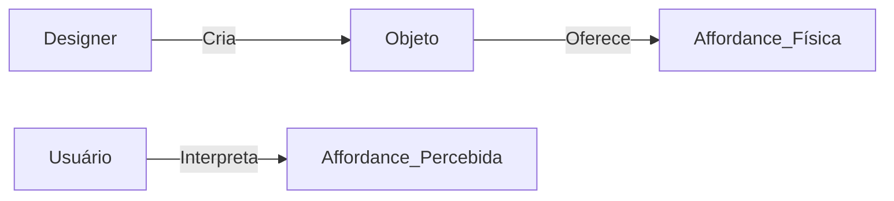

# Interação Humano-Computador (IHC) e Humano-Máquina (IHM)

## Fundamentos Conceituais

### Níveis de Interação

| **Nível**     | **Descrição**                                                    | **Exemplo Prático**                      |
| ------------- | ---------------------------------------------------------------- | ---------------------------------------- |
| **Léxico**    | Símbolos e elementos visuais (ícones, tipografia, cores)         | Ícone de "lixeira" para deletar arquivos |
| **Sintático** | Regras de manipulação dos elementos (sequência de ações válidas) | Duplo-clique para abrir arquivos         |
| **Semântico** | Significado atribuído às ações e símbolos                        | Carrinho = Finalizar compra              |

### Perspectivas de Kammersgaard (1988)

- **Feedback**:
  - Visual: Barra de progresso
  - Auditivo: "Beep" ao erro
  - Háptico: Vibração em touchscreens

---

## Disciplinas Relacionadas

### Contribuições Multidisciplinares

| **Área**             | **Aplicação em IHC**                                                            |
| -------------------- | ------------------------------------------------------------------------------- |
| Psicologia Cognitiva | Estudo de modelos mentais (ex: expectativa do usuário ao ver um botão "Voltar") |
| Design Industrial    | Ergonomia de dispositivos físicos (ex: ângulo ideal para telas touch)           |
| IA                   | Chatbots com NLP para interação natural                                         |

### Engenharia de Requisitos para IHC

**Requisitos Válidos**:

- "Interface deve seguir diretrizes de acessibilidade WCAG 2.1"
- "Tempo de aprendizado < 15 minutos para usuários iniciantes"

**Anti-Exemplos**:

- ❌ "O estagiário vai cuidar da interface"
- ❌ "Impedir hackers" (requer especificação técnica)

---

## Affordances: Teoria e Prática

### Tipos de Affordance

| **Tipo**      | **Definição**                      | **Exemplo Bem-Sucedido**       | **Exemplo Problemático**       |
| ------------- | ---------------------------------- | ------------------------------ | ------------------------------ |
| **Real**      | Funcionalidade objetiva do objeto  | Maçaneta giratória             | -                              |
| **Percebida** | Interpretação subjetiva do usuário | Botão 3D em UI (sugere clique) | Botão plano não-clicável       |
| **Falsa**     | Sugere ação inexistente            | "Botão" pintado em parede      | Ícone inativo sem sinal visual |

### Debate Física vs. Percebida

**Posições**:

- **Física (Norman)**: Propriedades intrínsecas do objeto
- **Percebida (Gibson)**: Relação usuário-ambiente

**Solução Híbrida**:

---

## Casos Práticos

### UI Modernas (Mobile First)

- **Padrões Ocultos**:
  - Swipe right = Arquivar (Gmail)
  - Pull-to-refresh (Twitter)
- **Testes A/B**:
  - 32% ↑ engajamento ao substituir ícone "Menu" por "Perfil"

### Sistemas Críticos (Aviação)

- **Princípios**:
  - Feedback imediato em painéis de controle
  - Affordances físicas distintas para emergências (alavancas vermelhas)

---

**Checklist para Design de Interfaces**:

- [ ] Mapear jornada do usuário
- [ ] Validar affordances com testes de usabilidade
- [ ] Implementar feedback multimodal (visual + háptico)
- [ ] Documentar padrões de interação no Design System

> **Dica**: Utilize ferramentas como **Figma** para prototipagem rápida e **Hotjar** para análise de calor de cliques.

**Referências**:

- [Norman, D. - "The Design of Everyday Things"](https://mitpress.mit.edu/books/design-everyday-things)
- [WCAG 2.1 Guidelines](https://www.w3.org/TR/WCAG21/)
- [Nielsen Norman Group](https://www.nngroup.com/)
