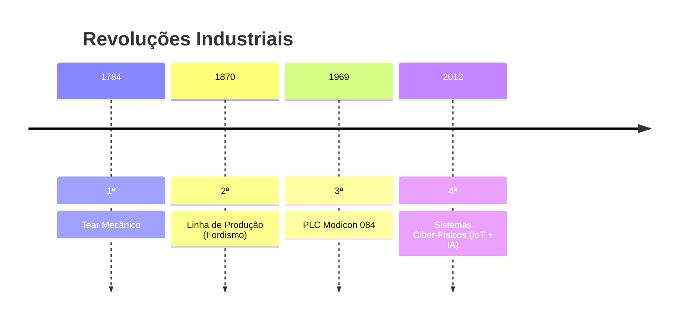

# Internet das Coisas (IoT)

## Definição e Conceitos Fundamentais

**O que é IoT?**
Rede de objetos físicos com sensores, software e conectividade para troca de dados via internet, desde dispositivos domésticos até sistemas industriais complexos.

### Técnicas Essenciais

| **Técnica**             | **Componentes**                     | **Exemplo de Aplicação**              |
| ----------------------- | ----------------------------------- | ------------------------------------- |
| Sensores                | Termistores, acelerômetros, LDRs    | Monitoramento ambiental em tempo real |
| Atuadores               | Relés, servomotores, válvulas       | Controle automático de irrigação      |
| Redes de Comunicação    | LoRaWAN, Zigbee, 5G                 | Conectividade em cidades inteligentes |
| Sistemas Autônomos      | Algoritmos de decisão em edge       | Veículos autônomos                    |
| Inteligência Artificial | Redes neurais para análise de dados | Manutenção preditiva industrial       |

---

## Pilares Tecnológicos da IoT

### 1. Integração de Sistemas

- **Protocolos**: MQTT, CoAP, OPC UA
- **Middleware**: Node-RED, AWS IoT Core

### 2. Comunicação Robusta

**Tecnologias Emergentes**:

- **LPWAN**: Sigfox (1km urbano), NB-IoT (latência <10s)
- **Mesh Networks**: Thread (padrão Matter para smart home)

### 3. Indústria 4.0

**Componentes Chave**:

- Digital Twins (gemelos digitais)
- Cobots (robôs colaborativos) com sensores de força

---

## Linha do Tempo das Revoluções Industriales

## Aplicações Avançadas

### 🏥 Medicina Conectada

- **Dispositivos**:
  - Wearables ECG (Ex: Apple Watch)
  - Pílulas inteligentes com sensores ingeríveis
- **Desafios**:
  - Compliance HIPAA/GDPR
  - Latência crítica (<100ms para telecirurgia)

### 🏭 Indústria 4.0

**Caso Prático**:

- **Predictive Maintenance**:
  - Vibração + temperatura → Modelos LSTM
  - Redução de 40% em downtime

### 🤖 Transhumanismo

**Pesquisas em Destaque**:

- **BCI (Interface Cérebro-Computador)**:
  - Neuropróteses controladas por EEG (Pesquisas de Miguel Nicolelis)
  - Exoesqueletos para reabilitação

---

## Desafios Críticos

### Problemas Atuais

1. **Segurança**:

   - Ataques DDoS via botnets IoT (Ex: Mirai)
   - Solução: Hardware Secure Elements (ex: ESP32-WROOM com AES-256)

2. **Interoperabilidade**:

   - Conflito entre padrões (Zigbee vs Z-Wave)
   - Iniciativas como **Project CHIP** (Matter)

3. **Gestão de Energia**:
   - Otimização para baterias de 10+ anos (Ex: protocolo IEEE 802.11ah)

---

**Tendências Futuras**:

- **6G**: Comunicação terahertz (2025+)
- **IoT Quântica**: Sensores quânticos para medições ultra-precisas

**Recursos Recomendados**:

- [IoT Analytics Market Report](https://iot-analytics.com/)
- [LoRa Alliance Certification](https://lora-alliance.org/)
- [IEEE IoT Journal](https://ieee-iotj.org/)

> **Nota**: Para implementações empresariais, considere frameworks como **Azure Sphere** para segurança end-to-end.
