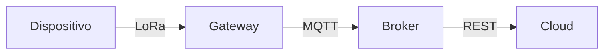

# Protocolos IoT na Camada Física

## Definição de Protocolos IoT

**Características Essenciais**:

- Leves e otimizados para redes instáveis
- Modelo **Publisher-Subscriber** (via broker)
- Baixo consumo de energia e largura de banda

---

## Protocolos Emergentes

| **Protocolo** | **Base** | **Modelo**       | **Melhor Caso de Uso**            |
| ------------- | -------- | ---------------- | --------------------------------- |
| **MQTT**      | TCP      | Pub/Sub          | Dispositivos com bateria limitada |
| **REST**      | HTTP     | Request/Response | Integração com APIs web           |

**Critérios de Escolha**:

1. Frequência de envio de dados
2. Requisitos de segurança (ex: TLS/DTLS)
3. Impacto na bateria
4. Confiabilidade na entrega (QoS)

---

## Protocolos na Camada Física

### 1. Ethernet (IEEE 802.3)

- **Tipo**: Com fio
- **Vantagens**:
  - Alta velocidade (até 10 Gbps)
  - Baixa latência
- **Limitações**:
  - Infraestrutura cabeada
- **Aplicações**:
  - Indústria 4.0 (PLC, sensores industriais)

### 2. Wi-Fi (IEEE 802.11)

- **Frequências**:
  - 2.4 GHz (maior alcance)
  - 5 GHz (maior velocidade)
- **Desafios**:
  - Interferência em ambientes densos
- **IoT-Otimizado**:
  - Wi-Fi HaLow (802.11ah) para baixo consumo

### 3. LPWA (Low Power Wide Area)

| **Tecnologia** | **Alcance** | **Taxa de Dados** | **Aplicação Típica**    |
| -------------- | ----------- | ----------------- | ----------------------- |
| **LoRaWAN**    | Até 15 km   | 0.3-50 kbps       | Agricultura inteligente |
| **Sigfox**     | Até 40 km   | 100 bps           | Monitoramento remoto    |
| **NB-IoT**     | 10-15 km    | 250 kbps          | Cidades inteligentes    |

**Comparativo LPWA**:

- **LoRaWAN**: Open-source, ideal para soluções customizadas
- **NB-IoT**: Operado por carriers, melhor para mobilidade

---

## Modelo OSI e IoT

**Camadas Relevantes para IoT**:

1. **Física** (Ex: LoRa, BLE)
2. **Enlace** (Ex: MAC address em Zigbee)
3. **Rede** (Ex: 6LoWPAN para IPv6 em IoT)
4. **Transporte** (Ex: UDP para sensores)
5. **Aplicação** (Ex: MQTT, CoAP)

**Fluxo de Dados**:

---

## Guia Prático de Seleção

1. **Ambiente Industrial**:
   - Ethernet + MQTT-SN (para sensores)
2. **Casa Inteligente**:
   - Wi-Fi 6 + Thread (baixa latência)
3. **Monitoramento Remoto**:
   - LoRaWAN + CoAP (baixo consumo)

**Checklist de Implantação**:

- [ ] Suporte a criptografia de hardware
- [ ] Compatibilidade com gateway existente
- [ ] Consumo energético alinhado à vida útil da bateria

> **Nota**: Para ambientes críticos, considere redundância com múltiplos protocolos (ex: BLE + LoRa).

**Referências**:

- [LoRa Alliance](https://lora-alliance.org/)
- [IEEE 802.11ah (Wi-Fi HaLow)](https://www.ieee.org/)
