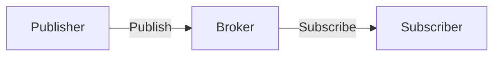

# Protocolos IoT na Camada de Aplicação

## Visão Geral do Modelo OSI

**Camada de Aplicação (7)**:

- Interface entre dispositivos IoT e usuários/aplicações
- Gerencia formatos de dados e comunicação de alto nível
- Opera sobre protocolos de transporte (TCP/UDP)

---

## Comparativo dos Principais Protocolos

| **Protocolo** | **Base** | **Segurança** | **Modelo**       | **Payload Máx.**   | **IoT Ideal Para**                |
| ------------- | -------- | ------------- | ---------------- | ------------------ | --------------------------------- |
| **MQTT**      | TCP      | SSL/TLS       | Pub/Sub          | 256 MB\*           | Dispositivos com bateria limitada |
| **CoAP**      | UDP      | DTLS          | Request/Response | 1152 bytes         | Microcontroladores (ex: ESP32)    |
| **AMQP**      | TCP      | TLS           | Filas/Pub/Sub    | Sem limite teórico | Sistemas empresariais             |
| **DDS**       | TCP/UDP  | TLS/DTLS      | P2P              | 2 GB               | Sistemas em tempo real            |
| **HTTP**      | TCP      | TLS           | Client/Server    | Sem limite         | Integração com APIs web           |

> \*Teórico - na prática limitado pelo broker (ex: Mosquitto padrão: 268 MB)

---

## Detalhes Técnicos por Protocolo

### 1. MQTT (Message Queuing Telemetry Transport)

**Arquitetura**:



**QoS Levels**:

- 0: Fire-and-forget
- 1: At least once
- 2: Exactly once

**Exemplo de Tópico**:
`casa/sala/temperatura`

### 2. CoAP (Constrained Application Protocol)

**Métodos RESTful**:

- GET, POST, PUT, DELETE
- Códigos de resposta similares ao HTTP (ex: `2.05 Content`)

**Observação de Recursos**:

```coap
GET coap://sensor01/temp?observe
```

### 3. AMQP 1.0 vs 0.9.1

| **Feature**     | **AMQP 0.9.1** | **AMQP 1.0**      |
| --------------- | -------------- | ----------------- |
| Segurança       | Via extensões  | TLS nativo        |
| Modelo          | Exchange/Queue | Container/Node    |
| Compatibilidade | RabbitMQ       | Azure Service Bus |

### 4. DDS (Data Distribution Service)

**DomainParticipant**:

```cpp
DomainParticipant participant(domain_id);
Publisher pub = participant.create_publisher();
Topic<SensorData> topic = participant.create_topic("SensorTopic");
```

---

## Guia de Seleção por Caso de Uso

### 🏡 Smart Home

- **Protocolo**: MQTT + TLS
- **Por quê?**:
  - Baixo overhead
  - Suporte a QoS para alarmes

### 🏥 Saúde Digital

- **Protocolo**: DDS over UDP
- **Por quê?**:
  - Comunicação P2P para monitoramento em tempo real

### 🌾 Agricultura de Precisão

- **Protocolo**: CoAP + DTLS
- **Por quê?**:
  - Eficiência em redes LPWAN (ex: LoRaWAN)

### 🏭 Indústria 4.0

- **Protocolo**: AMQP 1.0
- **Por quê?**:
  - Integração com sistemas ERP/MES

---

## Tabela de Overhead Comparativo

| **Protocolo** | **Tamanho Cabeçalho** | **Exemplo Mensagem**            |
| ------------- | --------------------- | ------------------------------- |
| HTTP/1.1      | ~200 bytes            | `GET /temp HTTP/1.1\r\nHost...` |
| MQTT          | ~10 bytes             | `0x30 0x0C 0x00 0x04 0x74...`   |
| CoAP          | ~4 bytes              | `0x40 0x01 0x30 0x39 0xFF...`   |

> **Dica**: Para dispositivos com **≤32KB RAM**, prefira CoAP.

---

**Referências**:

- [MQTT 5.0 Spec](https://docs.oasis-open.org/mqtt/mqtt/v5.0/mqtt-v5.0.html)
- [CoAP RFC 7252](https://tools.ietf.org/html/rfc7252)
- [DDS Security](https://www.omg.org/spec/DDS-SECURITY/)

**Ferramentas**:

- **Testes**: Wireshark com filtros `coap || mqtt`
- **Brokers**: EMQX (MQTT), ActiveMQ (AMQP)
