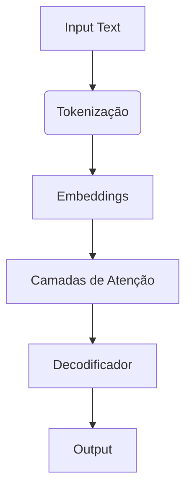

# Azure IA Generativa e OpenAI

## Conceitos Básicos de IA Generativa

### O que é IA Generativa?

**Definição**:
Tecnologia que cria conteúdo original (texto, imagens, código) a partir de inputs em linguagem natural

**Aplicações Práticas**:

- Chatbots inteligentes
- Geração de conteúdo automatizado
- Assistência em desenvolvimento de código

### Modelos de Linguagem (LLMs)

**Capacidades**:

- Análise de sentimentos
- Sumarização de textos
- Comparação semântica
- Geração de linguagem natural

**Arquitetura Transformer**:

### Copilotos Inteligentes

**Exemplos Microsoft**:

- Edge (navegação assistida)
- Bing (busca generativa)
- GitHub Copilot (assistência em código)

---

## Engenharia de Prompt

### Técnicas Eficazes

1. **Linguagem Direta**
   "Gere 5 títulos para artigo sobre IoT"

2. **Contextualização**
   "Como especialista em segurança, explique XSS"

3. **Exemplos Few-Shot**
   "Ex1: Python → JS. Ex2: Java → C#. Converta: [input]"

4. **Sistema de Mensagens**
   "Você é um assistente técnico com foco em Azure"

---

## Serviço OpenAI no Azure

### Componentes Principais

- **Modelos Pré-treinados**: GPT-4, GPT-3.5
- **Segurança**: RBAC + redes privadas
- **Ferramentas**: Detecção de conteúdo prejudicial

### Modelos Suportados

| Modelo     | Aplicação               |
| ---------- | ----------------------- |
| GPT-4      | Texto e código avançado |
| Embeddings | Análise semântica       |
| DALL-E     | Geração de imagens      |

### Fluxo de Uso

1. **Azure OpenAI Studio** → Criar/Personalizar modelos
2. **Playgrounds** → Testes sem código
3. **APIs** → Integração em aplicações

---

## IA Generativa Responsável

### Framework de Implementação

1. **Planejamento**
   - Definição de casos de uso éticos
2. **Identificação**
   - Riscos como viés algorítmico
3. **Métricas**
   - Acurácia e justiça (Fairlearn)
4. **Mitigação**
   - Filtros de conteúdo
5. **Monitoramento**
   - Logs de interações

---

## Recursos Recomendados

- [Documentação Oficial](https://azure.microsoft.com/pt-br/products/openai)
- [GitHub Copilot](https://github.com/features/copilot)
- [Ferramentas de Governança](https://aka.ms/responsibleai)

> "A ética na IA não é um recurso, é um requisito fundamental." - Adaptado de Satya Nadella
