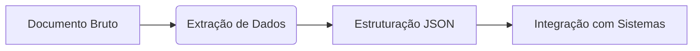

# Inteligência de Documentos e Mineração de Conhecimento no Azure

## Visão Geral dos Serviços

### Azure AI Document Intelligence

**Objetivo Principal**:
Transformar documentos não estruturados em dados estruturados para análise

**Componentes Chave**:

- **Modelos Pré-construídos** (Faturas, recibos, IDs)
- **Modelos Personalizáveis** (Treinamento com 5+ amostras)
- **Análise Semântica Avançada** (Além do OCR básico)

**Fluxo de Trabalho**:



### Azure Cognitive Search

**Casos de Uso**:

- Processamento de grandes volumes de documentos
- Descoberta de insights em conteúdo não estruturado
- Busca inteligente em múltiplos formatos

---

## Funcionalidades Técnicas

### Document Intelligence Studio

**Recursos**:

- Interface low-code/no-code
- Pré-visualização de resultados em tempo real
- Suporte para formatos complexos (PDF, imagens, manuscritos)

**Modelos Disponíveis**:
| Tipo | Aplicação |
|---------------|---------------------------|
| Faturas | Extração de campos chave |
| Recibos | Detecção de valores |
| IDs | Reconhecimento de dados pessoais |

### Mineração de Conhecimento

**Pipeline de Processamento**:

1. **Ingestão**: Blob Storage, Data Lake
2. **Enriquecimento**:
   - NLP (entidades, sentimentos)
   - Computer Vision
3. **Indexação**: Criação de repositório pesquisável

**Técnicas de Enriquecimento**:

- Tradução automática
- Reconhecimento de entidades nomeadas
- Análise de sentimentos

---

## Implementação Prática

### Passos Iniciais

1. Criar recurso no Azure Portal
2. Acessar Document Intelligence Studio
3. Selecionar modelo (pré-treinado ou customizado)
4. Testar com documentos de exemplo

### Integração Avançada

```python
# Exemplo de chamada à API (Python)
from azure.core.credentials import AzureKeyCredential
from azure.ai.formrecognizer import DocumentAnalysisClient

endpoint = "SEU_ENDPOINT"
key = "SUA_CHAVE"

document_analysis_client = DocumentAnalysisClient(
    endpoint=endpoint, credential=AzureKeyCredential(key)
```

---

## Recursos e Referências

- [Documentação Oficial](https://learn.microsoft.com/pt-br/azure/applied-ai-services/)
- [Laboratórios Práticos](https://microsoftlearning.github.io/)
- [Exemplos de Código](https://github.com/Azure-Samples)

> **Nota**: Todos os serviços incluem camadas gratuitas para experimentação. Para projetos enterprise, considere os limites de escala e requisitos de conformidade.
