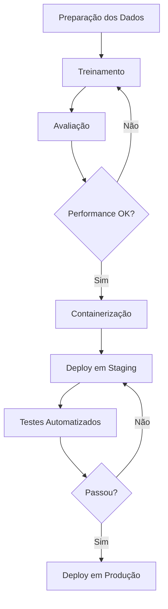

# Guia Completo para Criar e Implantar Modelos Transformers

## 1. Preparação dos Dados

### Coleta e Processamento Inicial

- **Fontes recomendadas**:
  - Textos literários (ex: "Crepúsculo dos Ídolos" de Nietzsche)
  - Artigos acadêmicos
  - Dados estruturados de redes sociais
  - Conversas de suporte ao cliente

### Tokenização Avançada

```python
from transformers import AutoTokenizer

tokenizer = AutoTokenizer.from_pretrained('neuralmind/bert-base-portuguese-cased')

texto = "Transformers revolucionaram o NLP"
tokens = tokenizer(
    texto,
    padding='max_length',
    max_length=128,
    truncation=True,
    return_tensors="pt"
)

print(tokens.input_ids)  # IDs numéricos
print(tokens.attention_mask)  # Máscara de atenção
```

## 2. Configuração do Modelo

### Arquiteturas Recomendadas

| Modelo     | Melhor Para                     | Recursos Necessários |
| ---------- | ------------------------------- | -------------------- |
| BERT       | Classificação                   | 8GB+ GPU             |
| GPT-3      | Geração de Texto                | 16GB+ GPU            |
| RoBERTa    | MLM                             | 8GB+ GPU             |
| DistilBERT | Casos com limitação de recursos | 4GB+ GPU             |

### Configuração Customizada

```python
from transformers import BertConfig, BertForMaskedLM

config = BertConfig(
    vocab_size=30000,
    hidden_size=768,
    num_hidden_layers=6,  # Reduzido para treinamento mais rápido
    num_attention_heads=12,
    intermediate_size=3072,
    max_position_embeddings=512
)

model = BertForMaskedLM(config)
print(f"Número de parâmetros: {model.num_parameters():,}")
```

## 3. Treinamento Eficiente

### Otimização do Processo

- **Hardware recomendado**:

  - GPU NVIDIA com pelo menos 8GB VRAM
  - TPUs para grandes conjuntos de dados

- **Configuração de treinamento**:

```python
from transformers import TrainingArguments

training_args = TrainingArguments(
    output_dir="./results",
    num_train_epochs=5,
    per_device_train_batch_size=8,
    gradient_accumulation_steps=2,  # Para simular batch maior
    learning_rate=5e-5,
    weight_decay=0.01,
    logging_dir='./logs',
    logging_steps=100,
    save_steps=5000,
    fp16=True,  # Ativar para GPUs modernas
    evaluation_strategy="steps",
    eval_steps=1000
)
```

## 4. Avaliação e Fine-Tuning

### Métricas Essenciais

```python
from transformers import Trainer

trainer = Trainer(
    model=model,
    args=training_args,
    train_dataset=train_dataset,
    eval_dataset=test_dataset,
    compute_metrics=compute_metrics  # Função customizada
)

metrics = trainer.evaluate()
print(f"""
Perda: {metrics['eval_loss']:.4f}
Acurácia: {metrics['eval_accuracy']:.2f}%
Precisão: {metrics['eval_precision']:.2f}%
Recall: {metrics['eval_recall']:.2f}%
""")
```

## 5. Implantação Profissional

### API de Produção com FastAPI

```python
from fastapi import FastAPI
from pydantic import BaseModel
import torch

app = FastAPI()

class TextRequest(BaseModel):
    text: str

@app.post("/predict")
async def predict(request: TextRequest):
    inputs = tokenizer(request.text, return_tensors="pt")
    with torch.no_grad():
        outputs = model(**inputs)

    return {
        "logits": outputs.logits.tolist(),
        "hidden_states": outputs.hidden_states[-1].tolist()
    }
```

### Deploy em Nuvem (AWS/GCP)

1. **Containerização**:

```dockerfile
FROM python:3.9-slim
WORKDIR /app
COPY requirements.txt .
RUN pip install -r requirements.txt
COPY . .
CMD ["uvicorn", "main:app", "--host", "0.0.0.0", "--port", "80"]
```

2. **Serviços recomendados**:
   - AWS SageMaker
   - Google Vertex AI
   - Hugging Face Inference API

## Fluxo Completo CI/CD



## Boas Práticas

1. **Versionamento**:

   - Modelos (Hugging Face Hub)
   - Dados (DVC)
   - Código (Git)

2. **Monitoramento**:

   - Latência das requisições
   - Uso de memória
   - Drift de dados

3. **Otimizações**:
   - Quantização (TorchScript)
   - Pruning
   - Distillation

**Tempo estimado**: 4-8 horas para fluxo completo (dependendo do dataset)
