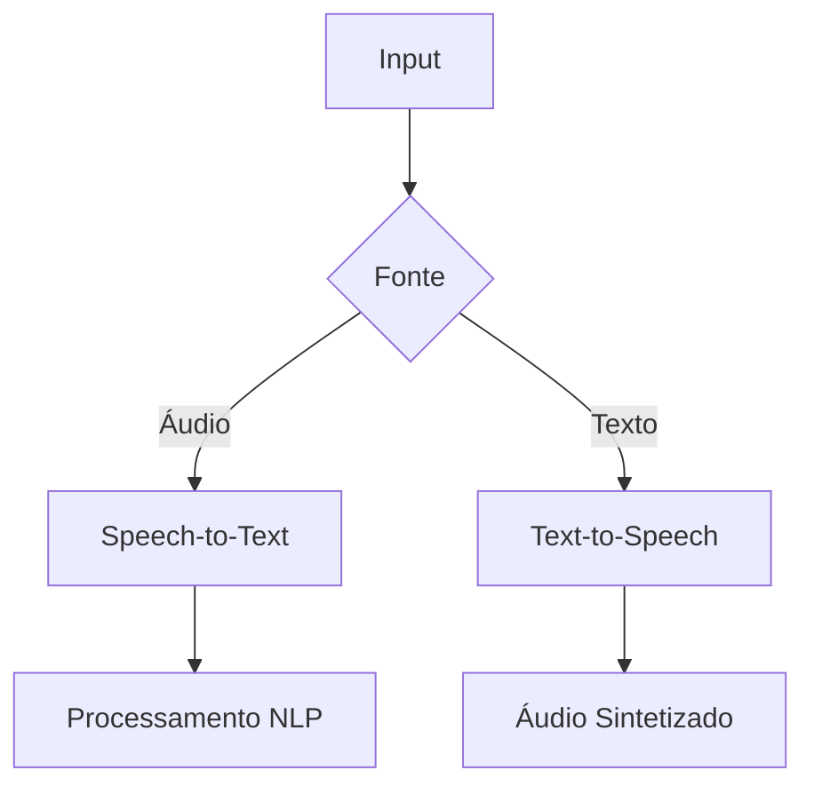

# Processamento de Linguagem Natural no Azure

## Conceitos Fundamentais

**Definição**:
Tecnologia que permite a interação entre computadores e linguagem humana, compreendendo e gerando texto de forma contextualizada.

**Serviços Azure Relacionados**:

- Azure AI Language
- Azure Bot Service
- Azure Speech Services

---

## Principais Capacidades

### Análise de Texto Avançada

| Funcionalidade                    | Descrição                                | Exemplo de Saída                                 |
| --------------------------------- | ---------------------------------------- | ------------------------------------------------ |
| Reconhecimento de Entidades (NER) | Identifica pessoas, organizações, locais | ["Microsoft", "Satya Nadella", "Redmond"]        |
| Detecção de PII/PHI               | Localiza dados sensíveis                 | CPF: **\*.567.890-**                             |
| Análise de Sentimentos            | Classifica polaridade (0-1)              | 0.92 (Positivo)                                  |
| Extração de Frases-chave          | Identifica conceitos principais          | ["transformação digital", "computação em nuvem"] |

### Serviços de Fala



### Tradução Automatizada

- **Tradução Padrão**: Suporte a 100+ idiomas
- **Customização**: Adaptação para domínios específicos (jurídico, médico)
- **Documentos**: Preservação de formatação em PDF/DOCX

---

## Implementação Prática

### Azure Bot Service

**Fluxo de Desenvolvimento**:

1. Criar bot no Azure Portal
2. Integrar:
   - QnA Maker para base de conhecimento
   - LUIS para compreensão linguística
3. Publicar em canais (Teams, Web, etc.)

**Exemplo de Código (Python)**:

```python
from azure.ai.textanalytics import TextAnalyticsClient
from azure.core.credentials import AzureKeyCredential

credential = AzureKeyCredential("<api-key>")
endpoint = "<endpoint>"

client = TextAnalyticsClient(endpoint, credential)
documents = ["Adorei o serviço! Atendimento excelente."]
response = client.analyze_sentiment(documents=documents)
```

---

## Casos de Uso Empresariais

1. **Atendimento ao Cliente**:

   - Chatbots com compreensão contextual
   - Análise de sentimentos em avaliações

2. **Processamento de Documentos**:

   - Extração automática de contratos
   - Detecção de cláusulas críticas

3. **Acessibilidade**:
   - Legendagem automática em tempo real
   - Sintetização de conteúdo para deficientes visuais

---

## Recursos de Aprofundamento

- [Documentação Oficial](https://learn.microsoft.com/pt-br/azure/cognitive-services/)
- [Laboratórios Hands-on](https://microsoft.github.io/ai/)
- [Repositório de Exemplos](https://github.com/Azure-Samples/cognitive-services-python-sdk-samples)

> **Dica para Implementação**: Comece com a camada gratuita dos serviços cognitivos para validar POCs antes de escalar para produção. Utilize Azure Logic Apps para orquestrar fluxos complexos de NLP.
