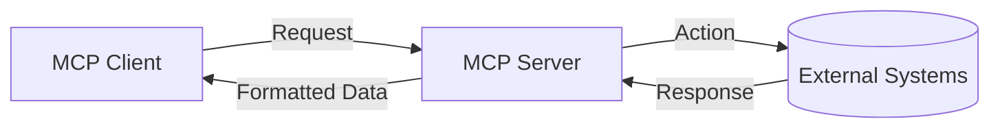

# MCP (Model Context Protocol) - Visão Técnica

## Arquitetura Básica



## Componentes Principais

### 1. MCP Client

- **Aplicações que implementam**:
  - Cursor Editor
  - GitHub Copilot
  - VS Code (via extensões)
- **Função**:
  - Inicia requisições quando a IA detecta necessidade de dados/ações externas

### 2. MCP Server

| **Tipo**      | **Vantagens**        | **Cenários Típicos**       |
| ------------- | -------------------- | -------------------------- |
| Local (STDIO) | Baixa latência       | Desenvolvimento individual |
| Remoto (SSE)  | Acesso compartilhado | Times distribuídos         |

## Ferramentas (Tools) - Ações Executáveis

```python
# Exemplo de Tool para Docker
def list_containers():
    return subprocess.run(['docker', 'ps'], capture_output=True)

# Registro no MCP Server
mcp_server.register_tool(
    name="docker_ps",
    description="List running containers",
    function=list_containers
)
```

## Recursos (Resources) - Fluxo de Dados

1. Cliente detecta necessidade de contexto externo
2. Busca no resource configurado (ex: `products_db`)
3. Formata dados para o modelo

```json
// Exemplo: Resource de produtos
{
  "product_id": "123",
  "price": 29.99,
  "in_stock": true
}
```

## Implementação Prática

### Caso 1: Banco de Dados PostgreSQL

**Prompt**:
_"Mostre os 5 clientes mais recentes"_

**Processamento**:

1. IA identifica necessidade de query
2. MCP Server executa:
   ```sql
   SELECT * FROM customers ORDER BY created_at DESC LIMIT 5
   ```
3. Retorno formatado para o cliente

### Caso 2: Automação com Docker

**Prompt**:
_"Inicie um serviço Redis na porta 6379"_

**Ação**:

```bash
docker run -p 6379:6379 redis
```

## Segurança - Checklist Crítico

- [ ] Validar certificados TLS em conexões remotas
- [ ] Implementar RBAC para ferramentas sensíveis
- [ ] Isolar recursos em containers/sandboxes
- [ ] Auditar logs de acesso periodicamente

## Ecossistema de Servidores Disponíveis

| **Serviço** | **Repositório**              | **Casos de Uso**          |
| ----------- | ---------------------------- | ------------------------- |
| PostgreSQL  | github.com/mcp-db/postgresql | Consultas SQL dinâmicas   |
| Slack Bot   | github.com/mcp-comms/slack   | Notificações em canais    |
| AWS S3      | github.com/mcp-storage/aws   | Gerenciamento de arquivos |

**por Daniel Gehlen**

> 🚀 **Próximos Passos**:
>
> 1. Experimente o [MCP Quickstart](https://github.com/mcp-base/quickstart)
> 2. Implemente um resource customizado para seu sistema interno
> 3. Monitore com `mcp-analytics` para otimizar chamadas

```bash
# Instalação básica (Docker example)
pip install mcp-core
mcp-server --tools docker,postgresql
```
