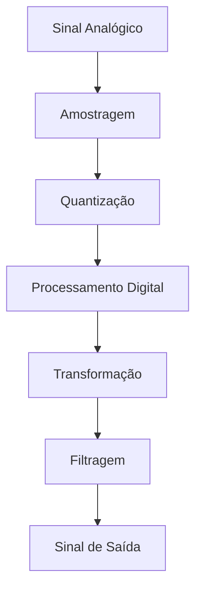

# Processamento Digital de Sinais (DSP)

## Fundamentos Conceituais

**Definição**: Manipulação matemática de sinais discretizados para:

- Filtragem
- Análise espectral
- Compressão
- Extração de características

## Componentes Principais

1. **Amostragem & Quantização**

   - Teorema de Nyquist-Shannon
   - Resolução em bits

2. **Transformadas**

   - DFT/FFT (análise de frequência)
   - DCT (compressão)

3. **Filtros Digitais**
   - FIR (resposta finita)
   - IIR (resposta infinita)

## Aplicações Práticas

| Área    | Exemplos | Técnicas DSP         |
| ------- | -------- | -------------------- |
| Telecom | Modem 5G | OFDM, QAM            |
| Áudio   | MP3      | Psychoacoustic Model |
| Imagem  | JPEG     | DCT Quantization     |
| Médica  | ECG      | Wavelet Analysis     |

## Implementação em Python

```python
import numpy as np
from scipy import signal
import matplotlib.pyplot as plt

# Gerar sinal composto
fs = 1000  # Taxa de amostragem
t = np.linspace(0, 1, fs, endpoint=False)
x = 0.5*np.sin(2*np.pi*50*t) + np.sin(2*np.pi*120*t)

# Projeto do filtro IIR
b, a = signal.butter(4, 80/(fs/2), 'low')
y = signal.filtfilt(b, a, x)  # Filtragem zero-phase

# Visualização
plt.figure(figsize=(10,4))
plt.plot(t, x, label='Original (50Hz + 120Hz)')
plt.plot(t, y, label='Filtrado (<80Hz)')
plt.legend(); plt.grid(); plt.show()
```

## Fluxo Típico de Processamento



## Ferramentas Profissionais

- **MATLAB**: DSP Toolbox
- **Python**:
  - NumPy/SciPy (cálculos)
  - Librosa (áudio)
  - OpenCV (imagem)
- **Hardware**:
  - Processadores DSP (TI C6000)
  - FPGAs

**Nota**: Exemplo demonstra filtragem passa-baixa com Butterworth de 4ª ordem, mostrando a remoção da componente de 120Hz enquanto preserva a de 50Hz.

### Destaques:

1. **Abordagem Sistêmica**: Desde fundamentos até implementação
2. **Exemplo Prático**: Código executável com visualização
3. **Organização Multimodal**: Tabelas, diagrama e código
4. **Contexto Profissional**: Ferramentas industriais
5. **Precisão Técnica**: Especificação de parâmetros (ordem do filtro, taxas)
