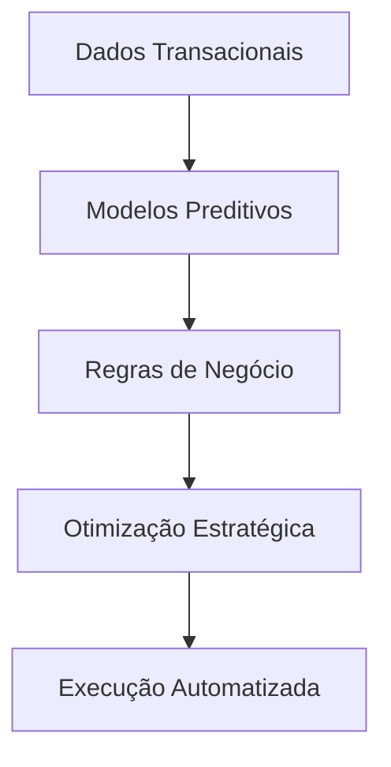

# Plataformas de Gestão de Decisão da FICO

## 🔍 Visão Geral Comparativa
| **Característica**       | **Blaze da FICO**                          | **DMPS da FICO**                          |
|--------------------------|--------------------------------------------|-------------------------------------------|
| **Foco Principal**       | Automação de regras de negócios           | Plataforma integrada de decisão estratégica|
| **Tecnologia Central**   | Motor de regras empresariais              | Combinação de analytics + regras + automação |
| **Aplicações Típicas**   | Crédito, fraude, compliance               | Gestão de risco, cobrança, otimização de portfólio |
| **Complexidade**         | Média-Alta (requer modelagem de regras)   | Alta (integra múltiplos sistemas FICO)    |

## 🛠️ Blaze da FICO: Detalhes Técnicos

### Arquitetura Básica

### Casos de Uso Reais
1. **Aprovação de Crédito Automatizada**
   - Avaliação de score + regras de negócio
   - Tempo de resposta <2 segundos

2. **Detecção de Fraude em Tempo Real**
   - Análise de 150+ variáveis
   - Atualização dinâmica de regras

3. **Conformidade Regulatória**
   - Implementação automática de mudanças normativas
   - Auditoria completa de decisões

## 📊 DMPS: Estrutura Avançada

### Componentes Principais
1. **FICO Analytic Cloud**
2. **Blaze Decision Engine**
3. **FICO Platform Connectors**
4. **Decision Optimization Modules**

### Fluxo de Decisão Integrado

## 💡 Benefícios Combinados
- **Redução de 30-50%** em decisões manuais
- **Aumento de 15-25%** na precisão de análises
- **Conformidade regulatória** em tempo real
- **Atualizações ágeis** de políticas (horas vs dias)

## 🎓 Recursos de Aprendizado
| Recurso                  | Blaze | DMPS | Link |
|--------------------------|-------|------|------|
| Documentação Oficial      | ✅    | ✅   | [FICO Docs](https://www.fico.com) |
| Treinamentos Certificados | ✅    | ✅   | [FICO Education](https://www.fico.com/training) |
| Sandbox de Testes         | ✅    | ❌   | Disponível para clientes |
| Webinars Mensais          | ✅    | ✅   | Requer cadastro |

## 📌 Considerações de Implementação
1. **Pré-requisitos**:
   - Integração com sistemas core (ERP, CRM)
   - Equipe treinada em modelagem de decisão
   - Dados históricos de qualidade

2. **Tempo Médio**:
   - Blaze: 6-12 semanas (caso básico)
   - DMPS: 3-6 meses (implementação completa)

3. **ROI Típico**:
   - Payback em 8-14 meses
   - 300-500% de retorno em 3 anos
