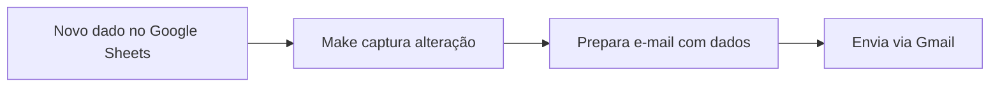
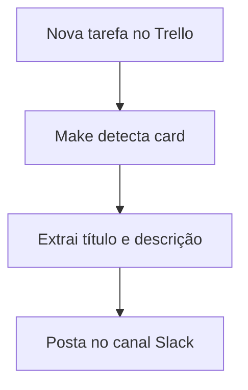

# Automação com Make (ex-Integromat) - Plano Free

## 🚀 Ciclos Completos de Automação no Plano Gratuito

### 📧 Exemplo 1: Automação de E-mails

### 🔄 Exemplo 2: Sincronização Trello-Slack

## 💡 6 Casos Práticos Imediatos

1. **Formulário → Planilha**
   Google Forms → Processamento → Google Sheets
   _(Ideal para pesquisas e inscrições)_

2. **Monitoramento YouTube**
   Novo vídeo → Extrai metadados → Notifica no Telegram
   _(Para criadores de conteúdo)_

3. **Backup Cross-Cloud**
   Google Drive → Verifica novos arquivos → Copia para Dropbox
   _(Proteção simples de dados)_

4. **Relatório Automático**
   Planilha atualizada → Gera resumo → Envia por e-mail
   _(Atualizações semanais automáticas)_

5. **Social Media Mirror**
   Novo post no Instagram → Cria rascunho no Twitter
   _(Sincronização básica de redes)_

6. **CRM Simples**
   Lead no Typeform → Adiciona ao Airtable → Dispara welcome email
   _(Pipeline de vendas básico)_

## ⚠️ Limitações do Plano Free

| Recurso     | Limitação              | Impacto                 |
| ----------- | ---------------------- | ----------------------- |
| Operações   | 1.000/mês              | Pequenos volumes apenas |
| Agendamento | Mínimo 15 minutos      | Não para tempo real     |
| Execução    | Máx. 5 minutos/cenário | Processamentos curtos   |
| Logs        | 7 dias de retenção     | Auditoria limitada      |

## 🔄 Fluxo de Configuração Básico

1. **Conectar Apps** (OAuth)
2. **Definir Trigger** (Evento inicial)
3. **Adicionar Módulos** (Ações intermediárias)
4. **Configurar Saída** (Resultado final)
5. **Testar Cenário** (Simulação)

## 📈 Quando Atualizar para Pago?

- Necessidade de +1.000 operções/mês
- Intervalos menores que 15 minutos
- Processos com +5 minutos de execução
- Histórico completo de logs

_Dica: Use o plano Free como sandbox antes de migrar para soluções empresariais._

_[Documentação Oficial](https://www.make.com/en/help)_
_[Galeria de Templates](https://www.make.com/en/templates)_
