# Guia Completo para Encerrar Conta AWS via CLI

## 🔄 Fluxo de Encerramento

```mermaid
graph TD
    A[Instalar AWS CLI] --> B[Listar Recursos Ativos]
    B --> C[Encerrar Recursos]
    C --> D[Verificar Custos]
    D --> E[Remover Método Pagamento]
    E --> F[Encerrar Conta via Console]
```



## 💻 Comandos Essenciais AWS CLI

### 1. Listagem de Recursos

```bash
# EC2 Instances
aws ec2 describe-instances --query 'Reservations[*].Instances[*].[InstanceId,State.Name]' --output table

# S3 Buckets
aws s3 ls

# RDS Databases
aws rds describe-db-instances --query 'DBInstances[*].[DBInstanceIdentifier,DBInstanceStatus]' --output table

# Lambda Functions
aws lambda list-functions --query 'Functions[*].[FunctionName,Runtime]' --output table
```

### 2. Exclusão de Recursos

```bash
# Terminar EC2
aws ec2 terminate-instances --instance-ids i-1234567890abcdef0

# Deletar S3 Bucket (cuidado!)
aws s3 rb s3://meu-bucket --force

# Remover RDS (sem snapshot)
aws rds delete-db-instance \
    --db-instance-identifier meu-banco \
    --skip-final-snapshot
```

## ⚠️ Serviços que Geram Custos Ocultos

| Serviço         | Comando de Verificação          | Risco |
| --------------- | ------------------------------- | ----- |
| Elastic IPs     | `aws ec2 describe-addresses`    | $$$   |
| EBS Snapshots   | `aws ec2 describe-snapshots`    | $$    |
| CloudWatch Logs | `aws logs describe-log-groups`  | $     |
| NAT Gateways    | `aws ec2 describe-nat-gateways` | $$$$  |

## 📊 Verificação de Custos

```bash
# Custo mensal (últimos 30 dias)
aws ce get-cost-and-usage \
    --time-period Start=$(date -d "-30 days" +%Y-%m-%d),End=$(date +%Y-%m-%d) \
    --granularity MONTHLY \
    --metrics "UnblendedCost" \
    --query 'ResultsByTime[*].Total.UnblendedCost.[Amount]' \
    --output text
```

## 🧹 Limpeza Final

1. **Remover credenciais CLI**

   ```bash
   aws configure set aws_access_key_id ""
   aws configure set aws_secret_access_key ""
   rm -rf ~/.aws/
   ```

2. **Passos manuais obrigatórios**
   - Remover método de pagamento via Console
   - Desvincular IAM Roles
   - Cancelar assinaturas Marketplace

## 🔗 Links Úteis

- [AWS Account Closure](https://aws.amazon.com/account/)
- [AWS CLI Documentation](https://aws.amazon.com/cli/)
- [AWS Cost Explorer](https://aws.amazon.com/aws-cost-management/aws-cost-explorer/)

> **Atenção**: A exclusão da conta AWS é irreversível. Certifique-se de ter backups de todos os dados importantes antes de prosseguir.
