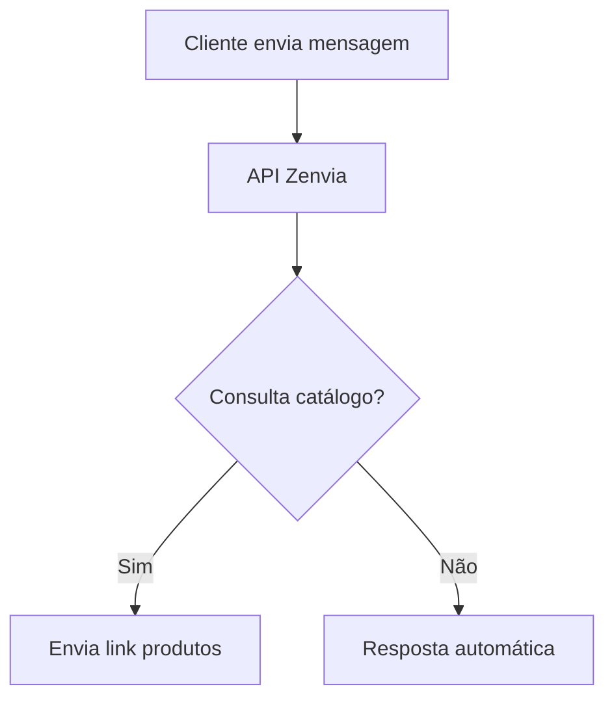

# API do WhatsApp para Automatizar Atendimento: Zenvia em 2025

## Visão Geral da Solução

**Plataforma**: Zenvia - Solução integrada de comunicação empresarial
**Destaque**: Integração nativa com API oficial do WhatsApp Business

## Benefícios Chave

### Para Administradores

| Vantagem                 | Impacto                        | Exemplo Prático                       |
| ------------------------ | ------------------------------ | ------------------------------------- |
| Atendimento Automatizado | Redução de custos operacionais | Robô responde 24/7                    |
| Aumento de Receita       | Upselling de planos            | Plano básico R$49,90 → R$79,90 (+API) |
| Fidelização              | Maior retenção de clientes     | Taxa de renovação +30%                |

### Para Clientes Finais

- Publicidade instantânea via catálogo digital
- Respostas automáticas para FAQs
- Campanhas personalizadas por segmento:
  ```python
  if cliente in ['pizzaria','hamburgueria']:
      enviar_promocao_fim_de_semana()
  ```

## Modelo de Negócios

### Estrutura de Custos

- **Custo API**: R$15/loja/mês
- **Margem**: 433% (venda a R$79,90)
- **Modelo**: SaaS com planos escalonáveis

### Estratégia Comercial

1. **Teste Grátis**: 7 dias de demonstração
2. **Parcerias**: Integração com entregadores locais
3. **Upsell**: Inclusão em planos premium

## Implementação Técnica

### Requisitos

- **Infraestrutura**: VPS dedicada
- **Manutenção**: Atualizações periódicas conforme mudanças na API

### Fluxo de Trabalho



## Casos de Uso por Segmento

### Varejo

- Notificações de pedidos
- Promoções relâmpago

### Saúde

- Agendamento de consultas
- Lembretes de medicamentos

### Comparativo Comercial

| Feature     | Zenvia          | Concorrentes      |
| ----------- | --------------- | ----------------- |
| Preço Base  | R$49,90         | A partir R$100    |
| Suporte     | 24/7            | Horário comercial |
| Integrações | CRM, Pagamentos | Básicas           |

## Conclusão

**Vantagem Competitiva**:
"A Zenvia reduz custos operacionais em até 40% enquanto aumenta o ticket médio em 60% através da automação inteligente" - Daniel Gehlen

**Próximos Passos**:

1. Configurar conta demo
2. Treinar equipe comercial
3. Desenvolver materiais de apoio
