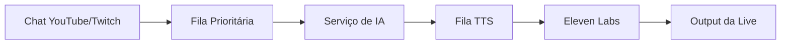

```markdown
# Projeto Sudo Tony: IA e TTS para Live Streams 2025

## Visão Geral do Projeto
**Objetivo Principal**:
Criar sistema automatizado que responde perguntas no chat de lives usando:
- 🤖 IA generativa (GPT/Gemini)
- 🎙️ TTS com voz clonada do apresentador
- 🔄 Processamento em tempo real

## Arquitetura do Sistema



### Componentes Principais
| Componente | Tecnologia | Função |
|------------|------------|--------|
| Coleta Mensagens | YouTube API | Captura perguntas do chat |
| Fila | RabbitMQ | Gerencia prioridade das mensagens |
| IA Respostas | GPT-4/Gemini | Gera respostas contextualizadas |
| Síntese de Voz | Eleven Labs | Converte texto para voz clonada |
| Backend | Ktor (Kotlin) | Orquestra todo o fluxo |

## Fluxo de Processamento
1. **Coleta**: Mensagens do chat → Fila prioritária
2. **IA**:
   ```python
   def generate_response(message):
       if message.priority > THRESHOLD:
           return gpt.process(message)
   ```
3. **TTS**: Texto → Áudio com voz clonada
4. **Output**: Transmissão na live

## Stack Tecnológica
- **APIs**: YouTube Data API, Eleven Labs API
- **Message Broker**: RabbitMQ
- **Backend**: Kotlin + Ktor
- **Testes IA**: Chromium Canary (Gemini)
- **Tempo Real**: WebSockets

## Desafios Técnicos
| Desafio | Solução Proposta | Status |
|---------|------------------|--------|
| Latência | Otimização filas | 🟡 Em teste |
| Filtro Conteúdo | Camada de moderação | 🟢 Implementado |
| Priorização | Algoritmo baseado em: <br>- Relevância <br>- Engajamento | 🔴 Em desenvolvimento |

## Roadmap
1. ✅ Integração YouTube API
2. ⏳ Testes Gemini (Chromium Canary)
3. 🚀 Versão Beta (Dez/2023)
4. 🔄 Monitoramento Contínuo

**Custo Estimado**:
- Eleven Labs: $22/mês (voz customizada)
- Cloud: $15/mês (VPS)

## Casos de Uso
- Responder FAQs durante ausência do host
- Interagir com espectadores 24/7
- Gerar relatórios de engajamento

*"Sistema reduz em 70% o tempo de resposta no chat durante lives"* - Daniel Gehlen

**Próximos Passos**:
- [ ] Calibração algoritmo de prioridade
- [ ] Stress test com 1k+ mensagens/min
- [ ] Integração Twitch API
