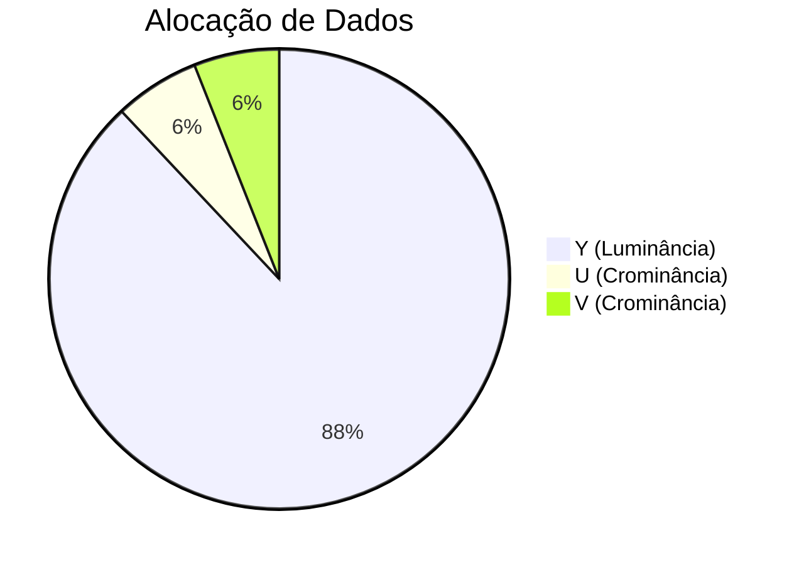

# 🎨 Ciência das Cores na Computação

## 🌈 Modelos de Cores Principais

### 1. RGB (Red, Green, Blue)

- **Uso:** Monitores, TVs, câmeras digitais
- **Característica:** Modelo aditivo (luz)
- **Faixa:** 0-255 por canal

```python
# Exemplo em Python
def rgb_to_hex(r, g, b):
    return f'#{r:02x}{g:02x}{b:02x}'
```

### 2. CMYK (Cyan, Magenta, Yellow, Key/Black)

- **Uso:** Impressão profissional
- **Característica:** Modelo subtrativo (tinta)
- **Diferença:** Adiciona preto para melhorar contraste

### 3. HSL/HSV (Hue, Saturation, Lightness/Value)

- **Vantagem:** Mais intuitivo para designers
- **Aplicação:** Seleção de cores em softwares gráficos

## 📊 Espaços de Cores Comuns

| Espaço de Cor | Gama de Cores | Uso Principal            |
| ------------- | ------------- | ------------------------ |
| sRGB          | Padrão        | Web, dispositivos comuns |
| Adobe RGB     | Ampliada      | Fotografia profissional  |
| ProPhoto RGB  | Muito ampla   | Edição de alta qualidade |

## 🖥️ YUV: O Modelo para Vídeo

### Componentes:

- **Y (Luminância):** 88% da informação visual
- **U/V (Crominância):** 12% da informação

**Subamostragem Comum:**



## ⚙️ Conceitos Avançados

### Correção Gamma (γ)

- **Padrão:** γ=2.2 para sRGB
- **Fórmula:** `Vout = Vin^γ`
- **Objetivo:** Compensar percepção humana não-linear

### Canal Alpha (α)

- **Função:** Controla transparência (0-255)
- **Formatos:** PNG, TIFF, WebP

```python
from PIL import Image

img = Image.open('transparent.png')
if img.mode == 'RGBA':
    alpha = img.getchannel('A')
    alpha.show()
```

## 🔄 Conversão Entre Modelos

**RGB para YUV:**

```
Y = 0.299R + 0.587G + 0.114B
U = -0.147R - 0.289G + 0.436B
V = 0.615R - 0.515G - 0.100B
```

## 🛠️ Ferramentas Práticas

1. **Calibração de Monitor:**

   - Datacolor SpyderX
   - X-Rite i1Display

2. **Conversão de Cores:**

   ```javascript
   // Conversão RGB para HSL
   function rgbToHsl(r, g, b) {
     (r /= 255), (g /= 255), (b /= 255);
     // ... implementação completa
   }
   ```

3. **Visualização 3D de Espaços de Cor:**
   - [ColorSpace 3D](https://colorspace.r03.ch/)

## 📚 Boas Práticas

1. **Para Web:** Sempre use sRGB
2. **Impressão:** Converta para CMYK com perfis ICC
3. **Vídeo:** Trabalhe em YUV 4:2:0 para eficiência
4. **Transparência:** PNG-24 para qualidade, PNG-8 para compactação

> "A cor é um poder que influencia diretamente a alma." - Wassily Kandinsky


_Círculo cromático mostrando relações entre cores_

**Próximos Passos:**

1. [ ] Calibrar monitor para γ=2.2
2. [ ] Testar conversão RGB→YUV
3. [ ] Criar paleta com HSL
