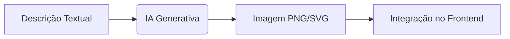

# 🖼️ Criando Frontend com Imagens 2D/3D

## 🎨 Tecnologias para Imagens 2D

### 1. HTML5 Canvas

```html
<canvas id="gameCanvas" width="800" height="600"></canvas>
<script>
  const ctx = document.getElementById("gameCanvas").getContext("2d");
  ctx.fillStyle = "blue";
  ctx.fillRect(100, 100, 150, 100); // Retângulo azul
</script>
```

**Vantagens:**

- Controle pixel a pixel
- Ideal para jogos e animações

### 2. SVG (Gráficos Vetoriais)

```html
<svg width="200" height="200">
  <circle cx="100" cy="100" r="80" fill="red" />
</svg>
```

**Melhor para:**

- Ícones e ilustrações escaláveis
- Animações CSS-friendly

### 3. Bibliotecas Úteis

| Biblioteca | Uso Principal         |
| ---------- | --------------------- |
| p5.js      | Arte generativa       |
| D3.js      | Visualização de dados |
| Konva.js   | Manipulação complexa  |

## 🧊 Tecnologias para Imagens 3D

### 1. Three.js (WebGL simplificado)

```javascript
// Cena básica com cubo giratório
const scene = new THREE.Scene();
const cube = new THREE.Mesh(
  new THREE.BoxGeometry(),
  new THREE.MeshBasicMaterial({ color: 0x00ff00 })
);
scene.add(cube);
```

### 2. Babylon.js (Para jogos)

```javascript
// Esfera 3D com iluminação
const sphere = BABYLON.MeshBuilder.CreateSphere("sphere", {}, scene);
const light = new BABYLON.HemisphericLight(
  "light",
  new BABYLON.Vector3(1, 1, 0)
);
```

### Comparação 3D:

| Framework  | Complexidade | Casos de Uso      |
| ---------- | ------------ | ----------------- |
| Three.js   | Médio        | Visualizações Web |
| Babylon.js | Alto         | Jogos complexos   |
| WebGL Puro | Expert       | Controle total    |

## 🤖 Ferramentas com IA Integrada

### Geradores de Imagem:

1. **DALL-E** - Imagens a partir de texto
2. **RunwayML** - Edição com machine learning
3. **MidJourney** - Arte conceitual

**Exemplo de Fluxo:**



## 💡 Dicas de Performance

1. **Otimize assets**:

   - Use WebP para fotos
   - SVG para ícones e logos
   - Compressão texture para 3D

2. **Lazy Loading**:

```html

```

3. **Spritesheets** para animações 2D

## 🎮 Exemplo Prático: Jogo 2D com Canvas

```javascript
// Game loop básico
function update() {
  ctx.clearRect(0, 0, canvas.width, canvas.height);
  player.draw();
  requestAnimationFrame(update);
}
update();
```

## 📱 Responsividade em Gráficos

```css
canvas,
svg {
  max-width: 100%;
  height: auto;
}
```

> **Nota:** Para 3D, ajuste o aspect ratio da câmera no resize:
>
> ```javascript
> window.addEventListener("resize", () => {
>   camera.aspect = window.innerWidth / window.innerHeight;
>   camera.updateProjectionMatrix();
>   renderer.setSize(window.innerWidth, window.innerHeight);
> });
> ```

## 🚀 Recursos Avançados

- **Shaders** (GLSL) para efeitos visuais
- **WebGPU** (sucessor do WebGL)
- **TensorFlow.js** para visão computacional

---

**Próximos Passos:**

1. [ ] Experimentar Three.js
2. [ ] Otimizar assets com Squoosh
3. [ ] Implementar lazy loading
