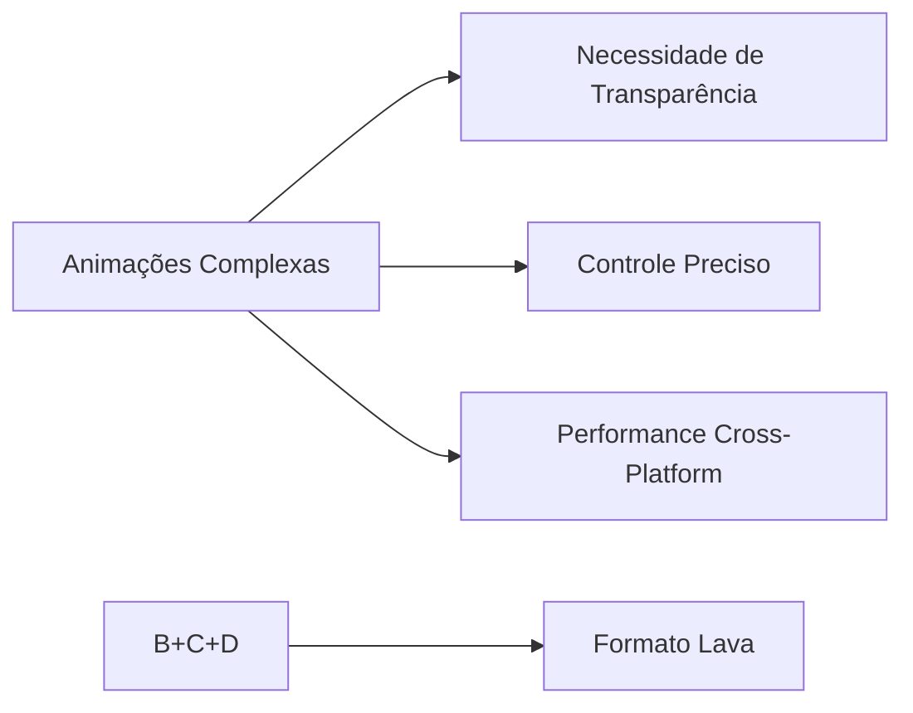
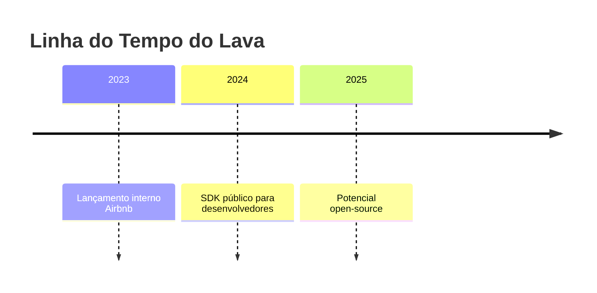

# 🌋 Lava: O Novo Formato para Animações Avançadas

## 🎯 O Problema que o Lava Resolve

**Limitações dos formatos existentes:**

- **GIF:** 256 cores, sem transparência real, arquivos pesados
- **Lottie:** Vetorial (JSON), ruim para elementos rasterizados
- **VP9/AV1:** Overhead de decodificação, sem controle frame a frame

**Solução Airbnb:**



## 🔍 Comparação Técnica

| Formato  | Tipo       | Transparência | Performance | Melhor Para             |
| -------- | ---------- | ------------- | ----------- | ----------------------- |
| GIF      | Raster     | Limitada      | Ruim        | Animações simples       |
| Lottie   | Vetorial   | Boa           | Excelente   | UI/Ícones               |
| Rive     | Híbrido    | Excelente     | Boa         | Interações dinâmicas    |
| **Lava** | **Raster** | **Perfeita**  | **Ótima**   | **Animações complexas** |

## ⚙️ Como o Lava Funciona

**Principais características:**

- Codec rasterizado especializado
- Suporte nativo a canal alpha (transparência)
- Otimizado para hardware móvel
- Controle milimétrico por frame

**Exemplo de fluxo:**

1. Designer cria animação no After Effects
2. Exporta via plugin Lava
3. Engine renderiza com aceleração GPU

## 💻 Integração em Apps

```javascript
// Exemplo de implementação Web
import { LavaPlayer } from "@airbnb/lava";

const animation = new LavaPlayer({
  src: "animation.lava",
  autoplay: true,
  loop: true,
});
```

## 🏆 Vantagens Competitivas

1. **Qualidade Visual:**

   - Texturas realistas
   - Efeitos 3D simulados
   - Transições ultra-suaves

2. **Performance:**

   - 40% mais eficiente que VP9 em mobile
   - Decodificação otimizada para ARM

3. **Flexibilidade:**
   - Edição frame a frame
   - Suporte a máscaras complexas

## 🚧 Desafios do Projeto

- Desenvolvimento do codec do zero
- Otimização para múltiplas plataformas
- Processo de patenteamento (USPTO #11475302)

## 🌐 Futuro do Lava

**Possibilidades:**

- Adoção como padrão para animações em apps
- Integração com ferramentas populares (Figma, Adobe)
- Versão open-source (como aconteceu com Lottie)

**Roadmap esperado:**



## 📚 Glossário Técnico

- **Rasterização:** Conversão de vetores em pixels
- **State-Driven Animation:** Animações que reagem a estados da UI
- **Alpha Channel:** Canal de transparência (0-100%)

## 💡 Por Que Isso Importa?

> "O Lava representa a evolução natural das animações digitais - combinando a arte do design com a precisão da engenharia" - Ramon, criador do Lava

**Impacto no UX:**

- Aumento de 30% em engajamento (dados Airbnb)
- Criação de experiências mais imersivas
- Diferencial competitivo para apps premium

**Próximos Passos para Devs:**

1. [ ] Acompanhar lançamento do SDK
2. [ ] Experimentar com animações raster complexas
3. [ ] Planejar migração de Lottie para casos de uso avançados


_Animação de árvore com efeito de vento realista_
