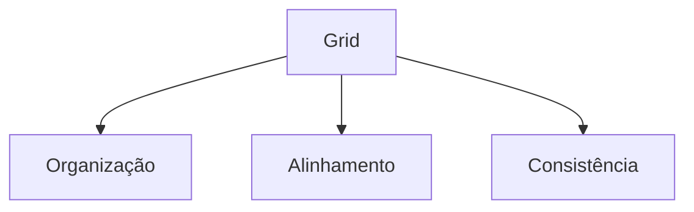

# 🖍️ Wireframes: Guia Completo

## 📌 O Que É um Wireframe?

**Definição:** Representação visual de baixa fidelidade que mostra:

- Estrutura do projeto
- Elementos funcionais
- Hierarquia de conteúdo

**Características:**

- Sem cores ou detalhes estéticos
- Foco na funcionalidade, não na aparência
- Pode usar tons de cinza (exceção para links destacados)

> ⚠️ **Atenção:** Wireframes podem evoluir durante o desenvolvimento

## 🏗️ Tipos de Wireframes

### 1️⃣ Baixa Fidelidade

- **Formato:** Esboços manuais ou digitais simples
- **Uso:** Brainstorming interno
- **Ferramentas:** Papel e caneta, Balsamiq

### 2️⃣ Média Fidelidade

- **Detalhes:** Inclui elementos de navegação básicos
- **Uso:** Feedback inicial com clientes
- **Exemplo:**
  ```plaintext
  [Header]
    ├─ Logo
    ├─ Menu (Home | Produtos | Contato)
    └─ Busca
  ```

### 3️⃣ Alta Fidelidade

- **Próximo do produto final:** Inclui espaçamentos precisos
- **Uso:** Validação final antes do desenvolvimento
- **Ferramentas:** Figma, Adobe XD

## 🔄 Comparação: Wireframe vs Protótipo vs Mockup

| Tipo      | Interatividade | Detalhe Visual | Objetivo Principal        |
| --------- | -------------- | -------------- | ------------------------- |
| Wireframe | Não            | Baixo          | Definir estrutura básica  |
| Protótipo | Sim            | Médio-Alto     | Testar usabilidade        |
| Mockup    | Opcional       | Alto           | Apresentação visual final |

## 🛠️ Ferramentas Populares

### 💻 Digitais:

- **Figma** (Colaborativo)
- **Adobe XD** (Prototipagem)
- **Balsamiq** (Rápido)

### ✏️ Manuais:

- Sketching em papel
- Whiteboards digitais

## 📐 Fundamentos de Layout

### 🟦 O Que É um Grid?

Sistema de organização espacial que usa:

- Quadrados
- Divisão áurea
- Regras de proporção

**Benefícios:**



## 🔍 Sistemas de Navegação

### Tipos Principais:

1. **Global** (Menus fixos)
2. **Local** (Links contextuais)

**Exemplo de Fluxo:**

```plaintext
Landing Page → Página de Produto → Carrinho → Checkout
```

## 🏷️ Padrões de Interface Modernos

| Sistema         | Descrição           | Exemplo           |
| --------------- | ------------------- | ----------------- |
| Material Design | Guideline do Google | apps Android      |
| Bootstrap       | Framework CSS       | Sites responsivos |
| MUI             | Componentes React   | Dashboards        |

## 💡 Dicas Práticas

1. **Comece simples** com esboços manuais
2. **Valide** cada versão com usuários
3. **Use grids** desde o início
4. **Documente** decisões de layout
5. **Teste** diferentes fluxos de navegação

> "Um bom wireframe resolve 80% dos problemas de UX antes do design visual" - Jesse James Garrett


_Evolução típica de wireframes (baixa → alta fidelidade)_

**Próximos Passos:**
[ ] Testar com 5 usuários
[ ] Refinar hierarquia visual
[ ] Criar guia de estilo básico
