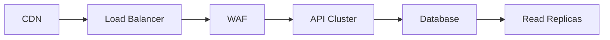

# Ataque DDoS (Distributed Denial of Service): Guia de Sobrevivência

## **Cenário Real: Anatomia de um Ataque**

_"Recebemos 10x mais tráfego que o normal em 3 minutos - nosso WAF bloqueou apenas 10% inicialmente"_ - Relato de um SRE

### 📊 **Dados do Ataque**

- **Volume**: 2.5M requests/min (normal: 250K)
- **Duração**: 4h23min
- **Origem**: Botnet com 15K IPs de 37 países
- **Alvo**: API de pagamentos

---

## **Plano de Ação em 5 Fases**

### 1. 🚨 **Identificação Imediata**

```bash
# Comando para detectar tráfego anormal
netstat -ntu | awk '{print $5}' | cut -d: -f1 | sort | uniq -c | sort -n
```

- Monitorar métricas:
  - Latência (>500ms)
  - Erros 5xx (>2%)
  - Conexões TCP incompletas

### 2. 🔒 **Ativação de Proteções**

- **WAF Rules**:
  ```json
  {
    "Name": "BlockSuspiciousUA",
    "Priority": 1,
    "Action": "BLOCK",
    "Conditions": [
      {
        "Field": "HEADER",
        "Value": "X-Malicious-Bot"
      }
    ]
  }
  ```
- **Cloudflare Emergency Mode**
- **Rate Limiting**: 100 reqs/IP/min

### 3. 🕵️ **Análise Forense**

- Padrões identificados:
  - User-Agents específicos
  - Requests para `/wp-admin` (não existente)
  - Picos de 3 países não-alvo

### 4. ⚔️ **Contra-Ataque Tático**

- **Blacklist Geográfica**: Bloqueio temporário de 12 ASNs
- **CAPTCHA Challenge**: Para rotas críticas
- **Scale Up**: Aumento para 8 instâncias c5.4xlarge

### 5. 🛡️ **Proteção Pós-Ataque**

- Implementação permanente:
  - Anycast Network
  - Machine Learning (AWS Shield Advanced)
  - DNS Flood Protection

---

## **Ferramentas Essenciais**

| **Categoria**     | **Ferramentas**                    | **Eficácia** |
| ----------------- | ---------------------------------- | ------------ |
| **Mitigação**     | Cloudflare Pro, AWS Shield, Akamai | ⭐⭐⭐⭐⭐   |
| **Monitoramento** | Datadog, New Relic, Grafana        | ⭐⭐⭐⭐     |
| **Análise**       | Wireshark, Zeek, ELK Stack         | ⭐⭐⭐⭐     |
| **Automação**     | Terraform, Ansible Playbooks       | ⭐⭐⭐       |

---

## **Estratégias Proativas**

### 📝 **Checklist Pré-Incidente**

1. Configurar autoscaling para picos de 300%
2. Pré-aprovar orçamento para emergency scaling
3. Documentar plano de resposta (RACI Matrix)
4. Testar regularmente com simuladores (Mazerunner)

### 🌐 **Arquitetura Resiliente**



---

## **Estatísticas Alarmantes**

- 83% das empresas sofrem ≥1 ataque/ano
- Custo médio: $120K-$2M por incidente
- Ataques >1Tbps já registrados (Cloudflare)

---

## **Lições Aprendidas**

1. Ter **playbooks atualizados** economiza 74% do tempo de resposta
2. **Treinar equipe** em simulacros reduz erros em 63%
3. **Monitoramento em tempo real** é não-negociável
4. Parceria com **provedores especializados** vale o investimento

> **Ação Imediata:** Configure alertas para:
> `requests > 3x baseline` > `error_rate > 5%` > `origin_country != allowed_list`
