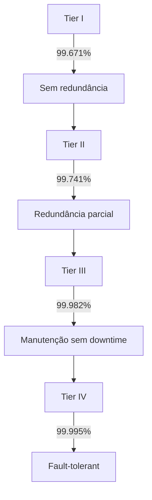

# Data Centers: A Espinha Dorsal da Infraestrutura Digital

## **Visão Arquitetural**

 _(Ilustração conceitual)_

### **Componentes Essenciais**

| **Elemento**      | **Função**                                        | **Exemplos**                    |
| ----------------- | ------------------------------------------------- | ------------------------------- |
| **Servidores**    | Hospedagem de aplicações e processamento de dados | Dell PowerEdge, HPE ProLiant    |
| **Armazenamento** | Sistemas de persistência de dados                 | SAN (EMC), NAS (NetApp)         |
| **Redes**         | Conectividade interna e externa                   | Cisco Nexus, Juniper MX         |
| **Energia**       | Fornecimento contínuo                             | UPS (APC), Geradores (Cummins)  |
| **Resfriamento**  | Controle térmico                                  | CRAC (Liebert), Imersão líquida |

---

## **Tipologia de Data Centers**

### 🏢 **Corporativos**

- Operados por grandes empresas (Bancos, Varejo)
- Exemplo: Data Center do Itaú (SP) com 5.000m²

### 🤝 **Colocation**

- Espaço compartilhado para múltiplos clientes
- **Vantagem:** Redução CAPEX em ~60%
- Líderes: Equinix, Digital Realty

### ☁️ **Cloud Providers**

- Infraestrutura como serviço (IaaS)
- **Big Three:** AWS (33% mercado), Azure (21%), GCP (10%)

---

## **Métricas de Desempenho**

```python
# Cálculo de Eficiência (PUE)
def calculate_pue(total_energy, it_energy):
    return total_energy / it_energy
# Data center ideal: PUE ≤ 1.2
```

**KPIs Chave:**

- **PUE (Power Usage Effectiveness)**: 1.0 (ideal) a 2.5 (ineficiente)
- **Density**: 5-20kW/rack (tradicional) vs 50kW+/rack (HPC)
- **Uptime**: Tier IV → 99.995% disponibilidade (~26min downtime/ano)

---

## **Tendências Revolucionárias**

### ❄️ **Resfriamento Avançado**

- Imersão líquida (Submer, LiquidStack)
- Free-cooling em climas frios (Facebook na Suécia)

### ♻️ **Sustentabilidade**

- Energia renovável (Google 100% solar)
- Reciclagem de calor (Aquecimento urbano)

### 🤖 **Automação DCIM**

- Ferramentas: Nlyte, Sunbird DCIM
- IA para prever falhas (Google DeepMind)

---

## **Desafios Críticos**

| **Desafio**          | **Solução Emergente**          |
| -------------------- | ------------------------------ |
| **Custo Energético** | GPU accelerators + ASICs       |
| **Latência**         | Edge Computing (5G)            |
| **Segurança**        | Zero Trust Architecture        |
| **Escalabilidade**   | Modular PODs (Microsoft Azure) |

---

## **Hierarquia de Tier (Uptime Institute)**



---

## **Futuro: Data Centers do Amanhã**

- **Quantum-Secure**: Resistente a ataques quânticos
- **Orbital**: Projeto Azure Space (satélites)
- **Biomiméticos**: Inspirados em termiteiras (auto-resfriamento)

> **Dica para Startups:** Considerar edge micro-DCs para baixa latência
