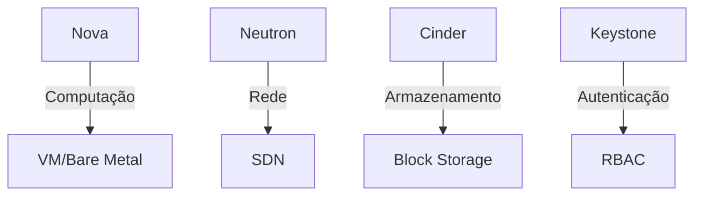

# Tecnologias de Virtualização e Contêineres: Guia Completo

## **IaaS (Infraestrutura como Serviço)**

### Conceito Básico

- Modelo de nuvem que fornece recursos computacionais fundamentais sob demanda
- Provedor gerencia infraestrutura física (servidores, armazenamento, rede)
- Usuário controla SO, armazenamento e aplicações

### Principais Provedores

| Provedor | Serviço Principal | Diferencial          |
| -------- | ----------------- | -------------------- |
| AWS      | EC2               | Maior mercado (33%)  |
| Azure    | Virtual Machines  | Integração Microsoft |
| GCP      | Compute Engine    | Machine Learning     |

### Casos de Uso

- Migração de datacenters
- Ambientes de desenvolvimento/teste
- Hospedagem de aplicações empresariais

---

## **OpenStack (Plataforma IaaS Open Source)**

### Arquitetura Modular



### Vantagens

✅ Flexibilidade em ambientes híbridos
✅ Evita vendor lock-in
✅ 85% das telecomunicações usam OpenStack

---

## **PaaS (Plataforma como Serviço)**

### Comparativo das Principais Plataformas

| Plataforma    | Linguagens | Diferencial      | Uso Corporativo |
| ------------- | ---------- | ---------------- | --------------- |
| Heroku        | 9+         | Simplicidade     | 72% startups    |
| OpenShift     | 6+         | Enterprise-grade | 58% Fortune 500 |
| Cloud Foundry | 7+         | Multi-cloud      | 34% bancos      |

---

## **Tecnologias de Contêineres**

### Evolução Histórica

1. **2004:** CGroups (Google)
2. **2008:** LXC (Linux Containers)
3. **2013:** Docker
4. **2015:** Kubernetes
5. **2020:** Serverless Containers

### Comparativo de Isolamento

| Tecnologia | Nível Isolamento | Overhead | Exemplo      |
| ---------- | ---------------- | -------- | ------------ |
| VMs        | Hardware         | Alto     | VMware       |
| Containers | SO               | Baixo    | Docker       |
| gVisor     | Syscall          | Médio    | Google Cloud |
| Kata       | VM               | Moderado | Intel        |

---

## **Kubernetes em Detalhe**

### Componentes Principais

- **Control Plane:** kube-apiserver, etcd, scheduler
- **Nodes:** kubelet, kube-proxy, container runtime
- **Add-ons:** DNS, Dashboard, CNI

### Comandos Essenciais

```bash
# Cluster info
kubectl cluster-info

# Deploy application
kubectl create deploy nginx --image=nginx

# Expose service
kubectl expose deploy nginx --port=80

# Auto-scaling
kubectl autoscale deploy nginx --min=2 --max=5
```

---

## **Tendências Emergentes**

### 1. Service Mesh

- Istio (Google/IBM)
- Linkerd (CNCF)
- Consul Connect (HashiCorp)

### 2. GitOps

- FluxCD
- ArgoCD
- Tekton Pipelines

### 3. Edge Computing

- K3s (Lightweight Kubernetes)
- MicroK8s
- OpenYurt

---

## **Checklist para Escolha Tecnológica**

1. **Requisitos de Segurança:**

   - [ ] Isolamento nível VM (Kata)
   - [ ] Compliance setorial

2. **Portabilidade:**

   - [ ] Multi-cloud
   - [ ] Hybrid cloud

3. **Ecosistema:**

   - [ ] CNCF Graduated
   - [ ] Suporte comercial

4. **Custo Total:**
   - [ ] Licenças
   - [ ] Treinamento

> **Dica:** Para ambientes críticos, considere Kubernetes + Service Mesh + Policy Engine (OPA)
