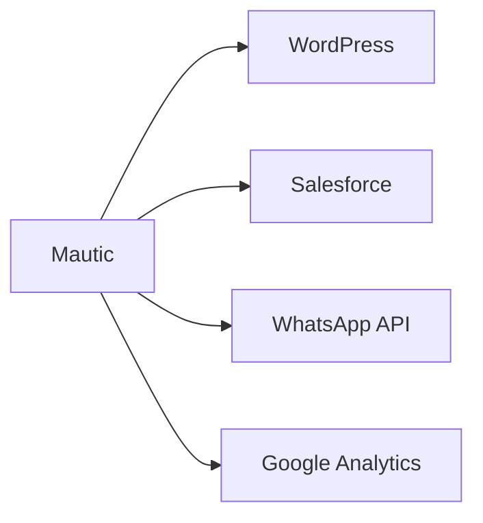

# 🚀 Mautic: Guia Completo de Marketing Automation Open-Source

## 🔍 O que é o Mautic?
Plataforma gratuita e open-source para automação de marketing que rivaliza com HubSpot e Marketo. Permite:
- 📧 Automação de e-mails
- 🎯 Segmentação avançada de leads
- 📊 Análise de campanhas
- 🔄 Integração com CRMs e outras ferramentas

## 🛠️ Principais Funcionalidades

### 1. **Automação de Workflows**
```markdown
- Crie regras do tipo: "Se lead visitar página X, enviar e-mail Y após 2 dias"
- Exemplo prático:
  1. Lead preenche formulário de ebook
  2. Recebe série de e-mails educativos
  3. É direcionado para página de oferta
```

### 2. **Gestão de E-mails**
| Recurso | Detalhe |
|---------|---------|
| Templates | +50 modelos prontos |
| A/B Test | Teste assuntos e conteúdos |
| Relatórios | Taxas de abertura, cliques e conversões |

### 3. **Segmentação Inteligente**
```markdown
Critérios de segmentação:
- Comportamento no site
- Interações com e-mails
- Dados demográficos
- Fonte de captação (ex: Google Ads)
```

## 💻 Instalação Passo a Passo

### Requisitos Técnicos
- PHP 7.3+
- MySQL/MariaDB
- Apache/Nginx

### Processo de Instalação
```bash
wget https://mautic.org/latest.zip
unzip latest.zip
mv mautic /var/www/html/
chown -R www-data:www-data /var/www/html/mautic
```
Acesse `http://seudominio.com` e complete o setup via interface web.

## 🌐 Casos de Uso Reais

### Exemplo 1: Nutrição de Leads
```markdown
1. Lead baixa guia no site
2. Recebe e-mail com conteúdo relacionado
3. Se não converter, recebe oferta especial
4. Score aumenta a cada interação
```

### Exemplo 2: Eventos Automatizados
```markdown
- Webinar:
  1. Inscrição → Confirmação
  2. Lembrete 1h antes
  3. Follow-up com gravação
```

## ⚖️ Vantagens vs Limitações

**✅ Prós:**
- Custo zero de licença
- Comunidade ativa (45k+ devs)
- 100+ plugins disponíveis
- Auto-hospedagem (controle total)

**⚠️ Contras:**
- Curva de aprendizado acentuada
- Requer servidor dedicado
- Suporte pago apenas via terceiros

## 🔗 Integrações Populares


## 📈 Métricas Chave para Monitorar
1. Taxa de abertura (>20% ideal)
2. CTR (Click-Through Rate)
3. Conversão por segmento
4. Custo por lead adquirido

## 🏆 Quando Escolher o Mautic?
- Startups com orçamento limitado
- Empresas que precisam de customização extrema
- Times técnicos que preferem auto-hospedagem

**Alternativas Pagas:**
- HubSpot (melhor UX)
- ActiveCampaign (melhor para e-commerce)

**Links Úteis:**
- [Documentação Oficial](https://docs.mautic.org)
- [Fórum da Comunidade](https://mautic.org/community)

> 💡 **Dica Pro:** Use Docker para instalação rápida:
> `docker run -d --name mautic -p 80:80 mautic/mautic`
