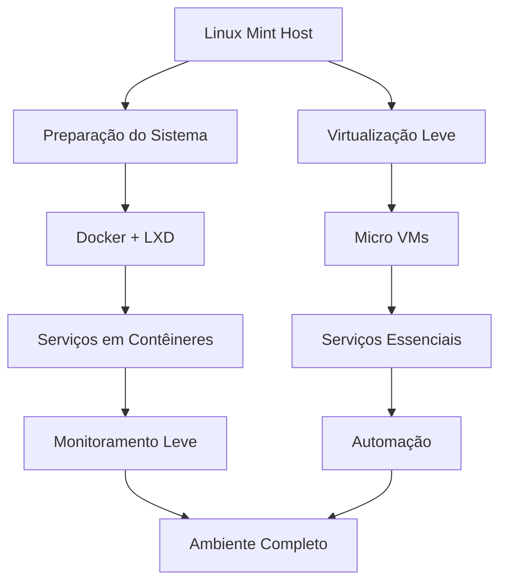

# 🖥️ Ambiente Completo de TI no Linux Mint com 8GB RAM

## 📊 Fluxograma Otimizado para 8GB RAM


```mermaid
graph TD
    A[Linux Mint Host] --> B[Preparação do Sistema]
    A --> C[Virtualização Leve]
    B --> D[Docker + LXD]
    C --> E[Micro VMs]
    D --> F[Serviços em Contêineres]
    E --> G[Serviços Essenciais]
    F --> H[Monitoramento Leve]
    G --> I[Automação]
    H --> J[Ambiente Completo]
    I --> J
```

## 🎯 Estratégia para 8GB RAM

Vou adaptar o projeto para funcionar perfeitamente com 8GB de RAM, usando tecnologias mais leves e otimizadas.

## 🛠️ Fase 1: Preparação do Sistema Host

### 1.1. Otimização do Linux Mint para Virtualização

```bash
# Atualização do sistema
sudo apt update && sudo apt upgrade -y

# Instalação de dependências essenciais
sudo apt install -y curl wget git vim net-tools htop

# Limpeza de pacotes desnecessários
sudo apt autoremove -y

# Configuração de swap para melhor performance
sudo swapoff /swapfile
sudo dd if=/dev/zero of=/swapfile bs=1M count=4096
sudo mkswap /swapfile
sudo swapon /swapfile

# Ajuste de parâmetros do kernel
echo 'vm.swappiness=10' | sudo tee -a /etc/sysctl.conf
echo 'vm.vfs_cache_pressure=50' | sudo tee -a /etc/sysctl.conf
sudo sysctl -p
```

### 1.2. Instalação do Docker e LXD (Mais Leve que Virtualização Completa)

```bash
# Instalar Docker
sudo apt install -y docker.io docker-compose
sudo systemctl enable docker
sudo usermod -aG docker $USER

# Instalar LXD para virtualização leve
sudo snap install lxd
lxd init --auto

# Instalar Portainer para gerenciamento Docker
docker volume create portainer_data
docker run -d -p 8000:8000 -p 9443:9443 --name portainer \
    --restart=always \
    -v /var/run/docker.sock:/var/run/docker.sock \
    -v portainer_data:/data \
    portainer/portainer-ce:latest
```

## 🐋 Fase 2: Infraestrutura em Contêineres

### 2.1. Rede com OPNSense (Alternativa mais leve ao pfSense)

```bash
# Criar contêiner LXD para OPNSense
lxc launch images:freebsd/13.2/amd64 opnsense -c limits.cpu=1 -c limits.memory=512MB

# Ou usar uma solução ainda mais leve:
docker run -d --name=router \
    --net=host \
    --cap-add=NET_ADMIN \
    -v /lib/modules:/lib/modules:ro \
    linuxserver/docker-opnsense
```

### 2.2. Servidores em Contêineres Docker

Crie um docker-compose.yml:

```yaml
version: "3.8"
services:
  webserver:
    image: nginx:alpine
    container_name: web-server
    ports:
      - "80:80"
      - "443:443"
    volumes:
      - ./web-data:/usr/share/nginx/html
    restart: unless-stopped
    mem_limit: 256m

  dbserver:
    image: postgres:13-alpine
    container_name: db-server
    environment:
      POSTGRES_DB: sampledb
      POSTGRES_USER: admin
      POSTGRES_PASSWORD: securepassword
    volumes:
      - ./db-data:/var/lib/postgresql/data
    restart: unless-stopped
    mem_limit: 512m

  fileserver:
    image: linuxserver/samba
    container_name: file-server
    environment:
      - PUID=1000
      - PGID=1000
      - TZ=Europe/London
    volumes:
      - ./share-data:/share
    ports:
      - "139:139"
      - "445:445"
    restart: unless-stopped
    mem_limit: 128m

  dns-server:
    image: sameersbn/bind:latest
    container_name: dns-server
    environment:
      - ROOT_PASSWORD=password
    volumes:
      - ./bind-data:/data
    ports:
      - "53:53/udp"
      - "53:53/tcp"
    cap_add:
      - NET_BIND_SERVICE
    restart: unless-stopped
    mem_limit: 128m
```

Execute com:

```bash
docker-compose up -d
```

## 📊 Fase 3: Monitoramento Leve

### 3.1. NetData para Monitoramento em Tempo Real

```bash
# Instalar NetData
bash <(curl -Ss https://my-netdata.io/kickstart.sh)

# Ou via Docker para isolamento
docker run -d --name=netdata \
  -p 19999:19999 \
  -v netdataconfig:/etc/netdata \
  -v netdatalib:/var/lib/netdata \
  -v netdatacache:/var/cache/netdata \
  -v /etc/passwd:/host/etc/passwd:ro \
  -v /etc/group:/host/etc/group:ro \
  -v /proc:/host/proc:ro \
  -v /sys:/host/sys:ro \
  -v /etc/os-release:/host/etc/os-release:ro \
  --restart unless-stopped \
  --cap-add SYS_PTRACE \
  --security-opt apparmor=unconfined \
  netdata/netdata
```

### 3.2. Monitoramento com Grafana e Prometheus

```bash
# Criar diretório para configurações
mkdir monitoring && cd monitoring

# docker-compose para monitoramento
cat > docker-compose.yml << EOF
version: '3.8'
services:
  prometheus:
    image: prom/prometheus:latest
    container_name: prometheus
    volumes:
      - ./prometheus.yml:/etc/prometheus/prometheus.yml
      - prometheus_data:/prometheus
    command:
      - '--config.file=/etc/prometheus/prometheus.yml'
      - '--storage.tsdb.path=/prometheus'
      - '--web.console.libraries=/etc/prometheus/console_libraries'
      - '--web.console.templates=/etc/prometheus/consoles'
      - '--storage.tsdb.retention.time=200h'
      - '--web.enable-lifecycle'
    restart: unless-stopped
    ports:
      - "9090:9090"
    mem_limit: 512m

  grafana:
    image: grafana/grafana:latest
    container_name: grafana
    volumes:
      - grafana_data:/var/lib/grafana
    environment:
      - GF_SECURITY_ADMIN_PASSWORD=admin
    restart: unless-stopped
    ports:
      - "3000:3000"
    mem_limit: 256m

  node-exporter:
    image: prom/node-exporter:latest
    container_name: node-exporter
    volumes:
      - /proc:/host/proc:ro
      - /sys:/host/sys:ro
      - /:/rootfs:ro
    command:
      - '--path.procfs=/host/proc'
      - '--path.sysfs=/host/sys'
      - '--collector.filesystem.ignored-mount-points=^/(sys|proc|dev|host|etc|rootfs/var/lib/docker/containers|rootfs/var/lib/docker/overlay2|rootfs/run/docker/netns|rootfs/var/lib/docker/aufs)($$|/)'
    restart: unless-stopped
    ports:
      - "9100:9100"
    mem_limit: 64m

volumes:
  prometheus_data:
  grafana_data:
EOF

# Configuração do Prometheus
cat > prometheus.yml << EOF
global:
  scrape_interval: 15s

scrape_configs:
  - job_name: 'node'
    static_configs:
      - targets: ['node-exporter:9100']
  - job_name: 'prometheus'
    static_configs:
      - targets: ['prometheus:9090']
EOF

docker-compose up -d
```

## 🤖 Fase 4: Automação com Ansible

### 4.1. Instalação e Configuração

```bash
# Instalar Ansible
sudo apt install -y ansible

# Criar estrutura de diretórios
mkdir -p ~/ansible/{inventory,playbooks,roles}

# Configurar inventário
cat > ~/ansible/inventory/hosts << EOF
[local]
localhost ansible_connection=local

[containers]
web-server ansible_host=172.17.0.1 ansible_user=root
db-server ansible_host=172.17.0.1 ansible_user=root

[all:vars]
ansible_python_interpreter=/usr/bin/python3
EOF

# Configurar ansible.cfg
cat > ~/ansible/ansible.cfg << EOF
[defaults]
inventory = ./inventory/hosts
host_key_checking = False
retry_files_enabled = False
EOF
```

### 4.2. Playbook de Exemplo para Hardening

```yaml
# ~/ansible/playbooks/harden-containers.yml
- name: Harden Docker containers
  hosts: all
  become: yes
  tasks:
    - name: Ensure security updates are installed
      apt:
        upgrade: dist
        update_cache: yes
      when: ansible_os_family == "Debian"

    - name: Install and enable UFW firewall
      apt:
        name: ufw
        state: present
      when: ansible_os_family == "Debian"

    - name: Configure UFW
      ufw:
        rule: "{{ item.rule }}"
        port: "{{ item.port }}"
        proto: "{{ item.proto }}"
      with_items:
        - { rule: "allow", port: "22", proto: "tcp" }
        - { rule: "allow", port: "80", proto: "tcp" }
        - { rule: "allow", port: "443", proto: "tcp" }
      when: ansible_os_family == "Debian"

    - name: Enable UFW
      ufw:
        state: enabled
      when: ansible_os_family == "Debian"
```

## 🔐 Fase 5: Segurança

### 5.1. Hardening do Sistema

```bash
# Instalar e configurar ferramentas de segurança
sudo apt install -y fail2ban ufw

# Configurar UFW
sudo ufw allow ssh
sudo ufw allow http
sudo ufw allow https
sudo ufw enable

# Configurar Fail2Ban
sudo cp /etc/fail2ban/jail.conf /etc/fail2ban/jail.local
sudo systemctl enable fail2ban
sudo systemctl start fail2ban

# Configurar auditoria de segurança
sudo apt install -y lynis
sudo lynis audit system
```

### 5.2. Script de Monitoramento de Segurança

```bash
#!/bin/bash
# security-monitor.sh

echo "=== SECURITY MONITOR ==="
echo "Data: $(date)"
echo ""

# Verificar portas abertas
echo "Portas abertas:"
ss -tuln | grep LISTEN

# Verificar logins recentes
echo ""
echo "Últimos logins:"
last -10

# Verificar processos suspeitos
echo ""
echo "Processos em execução:"
ps aux --sort=-%cpu | head -10

# Verificar uso de disco
echo ""
echo "Uso de disco:"
df -h

# Verificar atualizações de segurança
echo ""
echo "Atualizações de segurança disponíveis:"
apt list --upgradable | grep -i security
```

## 📋 Fase 6: Gestão e Monitoramento

### 6.1. Cockpit para Gestão Web

```bash
# Instalar Cockpit e módulos
sudo apt install -y cockpit cockpit-docker cockpit-machines cockpit-networkmanager

# Habilitar e iniciar serviço
sudo systemctl enable cockpit
sudo systemctl start cockpit

# Acessar via: https://localhost:9090
```

### 6.2. Script de Saúde do Sistema

```bash
#!/bin/bash
# system-health.sh

echo "=== SYSTEM HEALTH CHECK ==="
echo "Data: $(date)"
echo ""

# Uso de CPU
echo "Uso de CPU:"
mpstat | awk '$12 ~ /[0-9.]+/ { print "CPU Livre: " 100 - $12 "%" }'

# Uso de Memória
echo ""
echo "Uso de Memória:"
free -h

# Uso de Disco
echo ""
echo "Uso de Disco:"
df -h | grep -v tmpfs

# Contêineres ativos
echo ""
echo "Contêineres ativos:"
docker ps --format "table {{.Names}}\t{{.Status}}\t{{.Ports}}"

# Serviços críticos
echo ""
echo "Serviços críticos:"
systemctl status docker cockpit cockpit.socket | grep Active
```

## 🚀 Script de Inicialização Automática

```bash
#!/bin/bash
# start-lab.sh

echo "Iniciando ambiente de TI..."
echo ""

# Iniciar serviços do sistema
sudo systemctl start docker
sudo systemctl start cockpit

# Iniciar contêineres
cd ~/docker-compose
docker-compose up -d

cd ~/monitoring
docker-compose up -d

# Iniciar monitoramento de segurança
nohup ~/security-monitor.sh > security.log 2>&1 &

echo "Ambiente pronto!"
echo "Acessos:"
echo "Cockpit: https://localhost:9090"
echo "Portainer: https://localhost:9443"
echo "Grafana: http://localhost:3000"
echo "NetData: http://localhost:19999"
```

## 📊 Otimização de Memória para 8GB

### Estratégias de Economia de RAM:

1. **Use imagens Alpine Linux** para contêineres (50-100MB vs 500MB+)
2. **Limite de memória** por contêiner com `mem_limit`
3. **Priorize serviços** - inicie apenas o necessário
4. **Use swap eficientemente** com zram (compressed RAM)
5. **Monitore constantemente** com scripts de saúde

### Configuração zram para melhor performance:

```bash
# Instalar e configurar zram
sudo apt install -y zram-config

# Verificar configuração
cat /proc/swaps

# Ajustar prioridade do swap
echo 'vm.swappiness=10' | sudo tee -a /etc/sysctl.conf
sudo sysctl -p
```

## 🔍 Monitoramento de Performance com Recursos Limitados

```bash
# Script para verificar uso de recursos
#!/bin/bash
# resource-monitor.sh

echo "=== RESOURCE USAGE ==="
echo "Timestamp: $(date)"
echo ""

# Memória
echo "Memória:"
free -h

# Contêineres
echo ""
echo "Top containers por memória:"
docker stats --no-stream --format "table {{.Name}}\t{{.CPUPerc}}\t{{.MemUsage}}" | head -10

# Processos
echo ""
echo "Top processos por CPU:"
ps aux --sort=-%cpu | head -5

echo ""
echo "Top processos por Memória:"
ps aux --sort=-%mem | head -5
```

## 📝 Checklist de Verificação para 8GB RAM

1. [ ] Todos os contêineres com limites de memória configurados
2. [ ] Swap configurado e otimizado com zram
3. [ ] Serviços prioritários identificados e configurados
4. [ ] Monitoramento ativo para detectar vazamentos de memória
5. [ ] Scripts de saúde em execução regular
6. [ ] Backups configurados para configurações críticas
7. [ ] Documentação atualizada com alocação de recursos

## ⚠️ Dicas Críticas para 8GB RAM

1. **Não execute todos os serviços simultaneamente** - inicie apenas os necessários
2. **Use `docker stop`** para serviços não utilizados
3. **Monitore com `htop` e `docker stats`** regularmente
4. **Priorize serviços leves** (Nginx vs Apache, PostgreSQL vs MySQL)
5. **Considere serviços externos** para funções pesadas (DNS externo, etc.)

Este ambiente otimizado proporcionará uma experiência completa de infraestrutura de TI enquanto mantém o consumo de memória dentro dos limites de 8GB, usando tecnologias modernas de contêineres e monitoramento leve.
