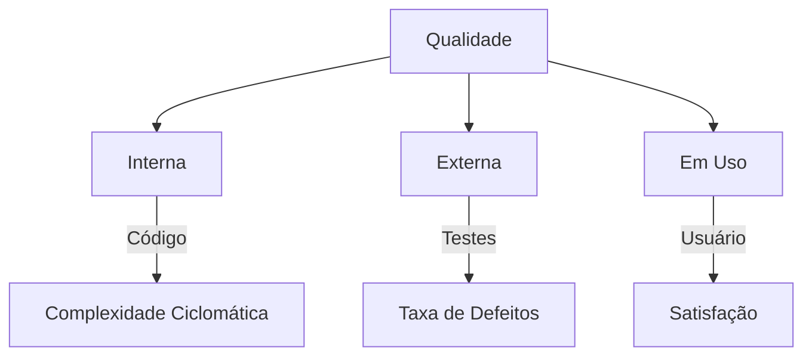

# Fundamentos de Qualidade de Software

## 📌 Definições-Chave de Qualidade

| Fonte             | Definição                                                                     |
| ----------------- | ----------------------------------------------------------------------------- |
| **ISO 9000:2005** | Grau de satisfação de requisitos por características do produto               |
| **Pressman**      | Conformidade com requisitos funcionais + padrões + características implícitas |
| **ISO/IEC 25010** | Capacidade de satisfazer necessidades explícitas e implícitas                 |

> "Qualidade é fazer certo quando ninguém está olhando." - Henry Ford

## 🏗️ Pilares da Qualidade de Software

### 1. **Normas e Padrões**

- **ISO 9000/9001**: Gestão da qualidade
- **ISO/IEC 29119**: Padrões para teste de software
- **SQuaRE**: Requisitos e avaliação (ISO 25000)

### 2. **Dimensões de Medição**



## 🐞 Gerenciamento de Defeitos

### Ciclo de Vida de um Bug

```java
public enum BugStatus {
    NEW, ASSIGNED, OPEN, FIXED,
    VERIFIED, REOPENED, CLOSED
}
```

**Ferramentas Populares:**

- 🐛 Bugzilla
- 🎯 Jira
- 📌 Trello

## 🔍 Técnicas de Teste (Exemplos)

### Caixa Preta vs Caixa Branca

| Técnica         | Tipo         | Exemplo                                   |
| --------------- | ------------ | ----------------------------------------- |
| Particionamento | Caixa Preta  | Testar faixas de idade (0-17, 18-65, 66+) |
| Cobertura       | Caixa Branca | Garantir 100% dos branches testados       |

### Pirâmide de Testes Ideal

```
       UI Tests (10%)
      /         \
   API (20%)   Integration (30%)
     /
Unit (40%)
```

## 📊 Métricas Essenciais

| Métrica               | Fórmula                      | Meta Ideal |
| --------------------- | ---------------------------- | ---------- |
| Densidade de Defeitos | Defeitos/KLOC                | < 1.0      |
| Cobertura de Código   | (Linhas Testadas/Total)\*100 | ≥ 80%      |
| MTBF                  | Tempo Operacional/Falhas     | Maximizar  |

## 🛠️ Processo de Garantia de Qualidade

1. **Planejamento**: Definir padrões e métricas
2. **Prevenção**: Revisões de código e pair programming
3. **Verificação**: Testes automatizados
4. **Controle**: Monitoramento contínuo
5. **Melhoria**: Retrospectivas e PDCA

**por Daniel Gehlen**

> 📚 **Recursos Recomendados**:
>
> - [ISTQB Syllabus](https://www.istqb.org/)
> - [ISO 25010 Standard](https://iso25000.com/)
> - [Jira Test Management](https://www.atlassian.com/software/jira)
