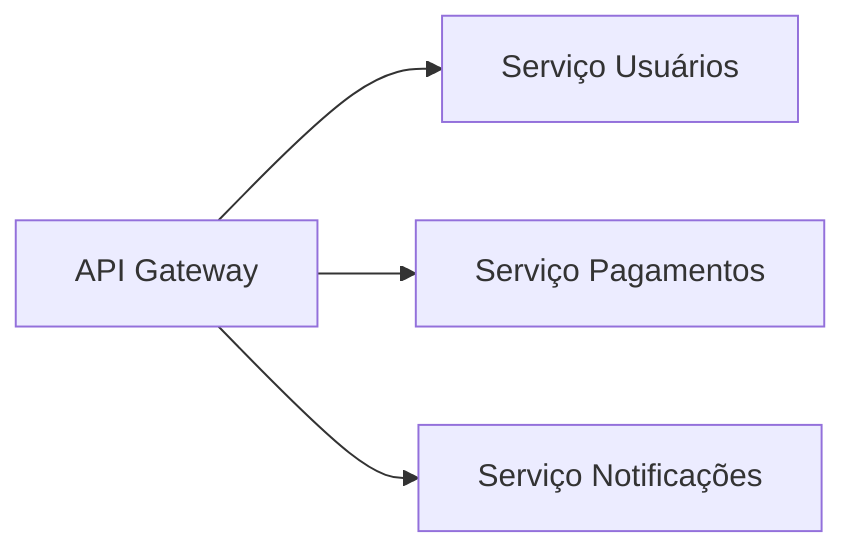

# Java: Desenvolvimento de Soluções Simples a Complexas

## Roteiro de Aprendizado Estruturado

### 1. Fundamentos da Linguagem

**Conteúdo Essencial**:

- Sintaxe básica e tipos primitivos
- Estruturas de controle (`if`, `for`, `while`)
- Manipulação de Strings e Arrays

**Projeto Prático**: Calculadora CLI

```java
public class Calculadora {
    public static void main(String[] args) {
        Scanner sc = new Scanner(System.in);
        System.out.print("Digite dois números: ");
        double a = sc.nextDouble();
        double b = sc.nextDouble();
        System.out.println("Soma: " + (a+b));
    }
}
```

### 2. Programação Orientada a Objetos

**4 Pilares**:

1. **Encapsulamento**: Getters/Setters
2. **Herança**: `extends`
3. **Polimorfismo**: `@Override`
4. **Abstração**: Classes/Interfaces abstratas

**Projeto**: Sistema de Biblioteca

```java
class Livro {
    private String titulo; // Encapsulamento
    // ...
}
```

### 3. Tratamento de Exceções

**Hierarquia**:

```
Throwable
 ├─ Error
 └─ Exception
     ├─ IOException
     └─ RuntimeException
```

**Boas Práticas**:

- Usar `try-with-resources`
- Criar exceções customizadas
- Logar erros adequadamente

### 4. Coleções e Streams

**Comparativo**:
| Interface | Implementação | Ordenação | Thread-safe |
|-----------|---------------|-----------|-------------|
| List | ArrayList | Não | Não |
| Set | HashSet | Não | Não |
| Map | HashMap | Não | Não |

**Stream API**:

```java
lista.stream()
    .filter(p -> p.getPreco() > 100)
    .map(Produto::getNome)
    .collect(Collectors.toList());
```

### 5. Persistência de Dados

**JDBC Fluxo**:

1. Registrar Driver
2. Obter Connection
3. Criar Statement
4. Executar Query
5. Processar ResultSet
6. Fechar Recursos

**Padrão DAO**:

```java
public interface ClienteDAO {
    void inserir(Cliente c);
    List<Cliente> buscarTodos();
}
```

### 6. Desenvolvimento Web

**Evolução**:

```
Servlets/JSP → JSF → Spring Boot
```

**Spring Boot Essentials**:

```java
@RestController
public class TodoController {
    @GetMapping("/todos")
    public List<Todo> listar() {
        return service.listarTodos();
    }
}
```

### 7. Segurança

**Spring Security**:

```java
@Configuration
@EnableWebSecurity
public class SecurityConfig extends WebSecurityConfigurerAdapter {
    @Override
    protected void configure(HttpSecurity http) throws Exception {
        http.authorizeRequests()
            .antMatchers("/admin").hasRole("ADMIN")
            .anyRequest().authenticated();
    }
}
```

### 8. Testes Automatizados

**Pirâmide de Testes**:

```
  UI Tests
   ↑
 Service Tests
   ↑
Unit Tests
```

**JUnit 5**:

```java
@Test
@DisplayName("Deve somar dois números")
void testSoma() {
    assertEquals(4, Calculadora.somar(2, 2));
}
```

### 9. Arquitetura Avançada

**Padrões Comuns**:

- MVC
- Clean Architecture
- CQRS
- Event Sourcing

**Microsserviços**:



## Roadmap de Carreira Java

| **Nível** | **Habilidades**                 | **Salário Médio (BR)** |
| --------- | ------------------------------- | ---------------------- |
| Júnior    | Core Java, Spring, SQL          | R$ 3.500 - R$ 5.000    |
| Pleno     | Design Patterns, Cloud Basics   | R$ 6.000 - R$ 9.000    |
| Sênior    | Arquitetura, Kubernetes, DevOps | R$ 10.000+             |

**Recursos Recomendados**:

- [Oracle Java Docs](https://docs.oracle.com/en/java/)
- [Spring Initializr](https://start.spring.io/)
- [Java Design Patterns](https://java-design-patterns.com/)
- [Baeldung Tutorials](https://www.baeldung.com/)

> **Dica**: Mantenha-se atualizado com as novas features do Java (Records, Pattern Matching, Virtual Threads no Java 21+).
