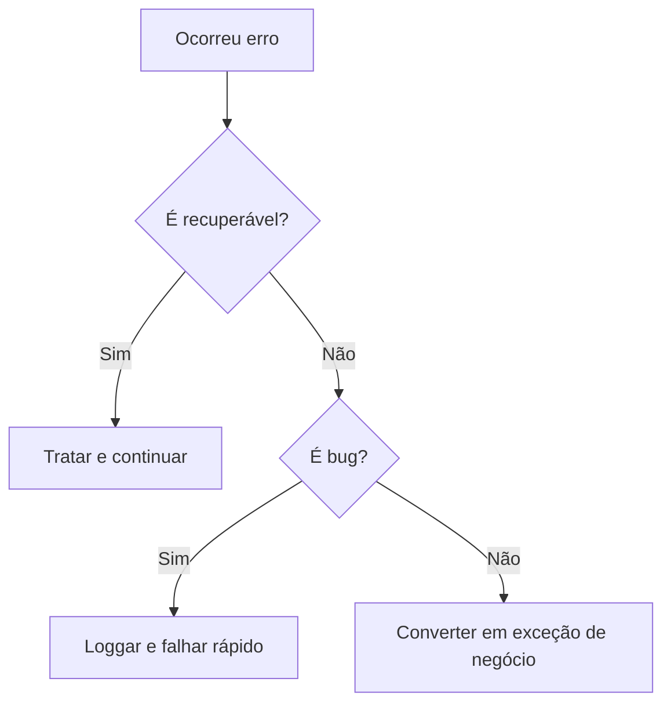

# Exceções Comuns em Java: Guia Completo

## Exceções Mais Frequentes

### 1. NullPointerException

**Causa**: Tentativa de acessar método/atributo de objeto `null`
**Exemplo**:

```java
String text = null;
int length = text.length(); // NullPointerException
```

### 2. IndexOutOfBoundsException

**Subclasses**:

- `ArrayIndexOutOfBoundsException` (arrays)
- `StringIndexOutOfBoundsException` (Strings)
  **Prevenção**:

```java
if (index >= 0 && index < list.size()) {
    list.get(index);
}
```

### 3. ClassCastException

**Cenário típico**:

```java
Object obj = "String";
Integer num = (Integer) obj; // ClassCastException
```

**Solução**: Usar `instanceof` antes do cast

---

## Exceções de Fluxo de Controle

### 4. ConcurrentModificationException

**Ocorre quando**:

```java
for (String item : list) {
    list.remove(item); // Modificação durante iteração
}
```

**Alternativa**:

- Usar `Iterator.remove()`
- Criar cópia da coleção

### 5. InterruptedException

**Threads**:

```java
try {
    Thread.sleep(1000);
} catch (InterruptedException e) {
    Thread.currentThread().interrupt(); // Boa prática
}
```

---

## Exceções de Sistema

### 6. StackOverflowError

**Causa comum**: Recursão infinita
**Exemplo**:

```java
void recursiveMethod() {
    recursiveMethod(); // StackOverflowError
}
```

### 7. OutOfMemoryError

**Tipos**:

- `Java heap space` (objetos)
- `PermGen space` (metadados)
  **Solução**: Ajustar JVM args (`-Xmx`, `-XX:MaxMetaspaceSize`)

---

## Tabela de Exceções por Categoria

| **Categoria**   | **Exceções Típicas**               | **Quando Ocorre**             |
| --------------- | ---------------------------------- | ----------------------------- |
| Acesso Inválido | NullPointer, IndexOutOfBounds      | Referências/índices inválidos |
| Conversão       | ClassCast, NumberFormat            | Tipos incompatíveis           |
| Estado          | IllegalState, UnsupportedOperation | Chamada em contexto errado    |
| Recursos        | FileNotFound, IOException          | Problemas com arquivos/IO     |
| Sistema         | OutOfMemory, StackOverflow         | Limites da JVM excedidos      |

---

## Boas Práticas de Tratamento

### Padrão Try-With-Resources

```java
try (FileReader fr = new FileReader("file.txt")) {
    // Usar recurso
} catch (IOException e) {
    e.printStackTrace();
}
```

### Logging Adequado

```java
catch (SQLException e) {
    logger.log(Level.SEVERE, "Erro no banco: " + e.getMessage(), e);
    throw new BusinessException("Falha na operação", e);
}
```

### Exceções Customizadas

```java
public class SaldoInsuficienteException extends RuntimeException {
    public SaldoInsuficienteException(String message) {
        super(message);
    }
}
```

---

## Fluxograma de Decisão para Tratamento



**Links Oficiais**:

- [Documentação Java SE 17 (Oracle)](https://docs.oracle.com/en/java/javase/17/docs/api/index.html)
- [Java Error Hierarchy](https://docs.oracle.com/javase/8/docs/api/java/lang/Throwable.html)

> **Dica Profissional**: Sempre inclua mensagens descritivas nas exceções (`new IllegalArgumentException("Valor não pode ser negativo: " + value)`).
