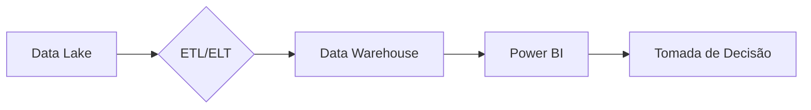

# Fundamentos de Inteligência de Dados

## Objetivo Geral

Desenvolver competências essenciais para transformar dados brutos em **insights estratégicos**, dominando:

- **Pensamento analítico**
- **SQL Analytics**
- **Processos ETL/ELT**
- **Visualização com Power BI**

---

## Ecossistema de Dados Moderno

### Principais Atores

| Perfil                  | Função                              | Ferramentas Típicas         |
| ----------------------- | ----------------------------------- | --------------------------- |
| **Engenheiro de Dados** | Construi pipelines e infraestrutura | Airflow, Spark, Kafka       |
| **Cientista de Dados**  | Desenvolve modelos preditivos       | Python, TensorFlow, Jupyter |
| **Analista de BI**      | Cria dashboards e relatórios        | Power BI, Tableau, SQL      |

**Exemplo de Fluxo**:



---

## Hierarquia do Valor em Dados

1. **Dados Brutos**
   - Ex: Logs de vendas não processados
2. **Informação**
   - Ex: "Vendas totais em Q1: R$ 1.2M"
3. **Conhecimento**
   - Ex: "Campanha X aumentou vendas em 15% no segmento Y"

**Transformação**:

> _"BI converte dados em conhecimento acionável através de modelos visuais e analíticos."_

---

## Tipos de Análise em BI

| Tipo            | Pergunta-Chave        | Técnica                | Exemplo Power BI                              |
| --------------- | --------------------- | ---------------------- | --------------------------------------------- |
| **Descritiva**  | O que aconteceu?      | Agregações, KPIs       | Gráfico de barras de vendas mensais           |
| **Diagnóstica** | Por que aconteceu?    | Drill-down, correlação | Matriz de correlação entre promoções e vendas |
| **Preditiva**   | O que pode acontecer? | Machine Learning       | Previsão de demanda com Azure ML              |
| **Prescritiva** | O que fazer?          | Simulações             | Análise de cenário com parâmetros ajustáveis  |

---

## Big Data vs Dados Tradicionais

| Característica  | Dados Estruturados | Não Estruturados             |
| --------------- | ------------------ | ---------------------------- |
| **Formato**     | Tabelas SQL        | Textos, imagens, vídeos      |
| **Ferramentas** | Power BI, Tableau  | Spark, NLP tools             |
| **Exemplo**     | Vendas em CRM      | Comentários em redes sociais |

**Desafio**:
_"Integrar fontes estruturadas (ERP) e não estruturadas (social media) em um único dashboard."_

---

## Power BI na Prática

### Etapas do Fluxo Analítico

1. **Extração**: Conectar a bancos SQL, APIs, Excel
2. **Transformação**: Limpeza no Power Query
   ```powerquery
   // Exemplo: Filtrar vendas inválidas
   = Table.SelectRows(#"Passo Anterior", each [Valor] > 0)
   ```
3. **Modelagem**: Criar relacionamentos (1:N, N:N)
4. **Visualização**:
   - Gráficos interativos
   - Segmentadores dinâmicos

**Dica**: Use o [Databricks Connector](https://learn.microsoft.com/power-bi/connect-data/databricks-overview) para Big Data.

---

## Futuro do BI

- **Tendências**:
  - BI Embedded em aplicações
  - IA generativa para criação de relatórios
  - Análise em tempo real com streaming

**Recursos**:

- [Microsoft Learn: Fundamentos de BI](https://learn.microsoft.com/power-bi/fundamentals/)
- [Comunidade Power BI](https://community.powerbi.com)

> _"Dados são o novo petróleo, mas só geram valor quando refinados e aplicados."_ 🛢️💡
