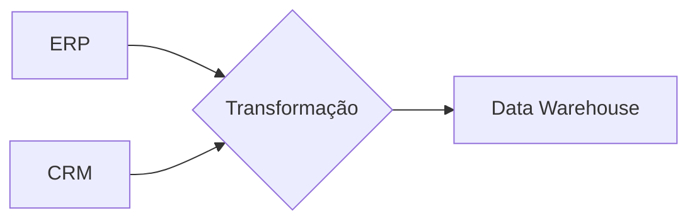

# Fundamentos de Processamento de Dados: ETL vs ELT

## Pipeline de Dados: Conceitos-Chave

### ETL (Extract, Transform, Load)

**Fluxo Tradicional**:

1. **Extração**:
   - Fontes: CRM, SGBD, Cloud, Arquivos
2. **Transformação**:
   - Limpeza, Enriquecimento, Modelagem
3. **Carregamento**:
   - Destino: Data Warehouse

**Vantagens**:
✔ Dados prontos para análise no destino
✔ Ideal para transformações complexas

**Cenário Típico**:



---

### ELT (Extract, Load, Transform)

**Fluxo Moderno**:

1. **Extração**: Dados brutos coletados
2. **Carregamento**: Armazenamento direto no DW
3. **Transformação**: Processada no próprio repositório

**Vantagens**:
⚡ **Velocidade**: Carregamento imediato
💡 **Flexibilidade**: Transformação sob demanda
💰 **Custo**: Menor dependência de TI

**Exemplo Prático**:

```sql
-- Transformação diretamente no Snowflake
CREATE TABLE sales_clean AS
SELECT
    product_id,
    SUM(quantity) as total_volume,
    AVG(price) as avg_price
FROM raw_sales
GROUP BY product_id;
```

---

## Comparação Detalhada

| Critério           | ETL                          | ELT                          |
| ------------------ | ---------------------------- | ---------------------------- |
| **Ordem**          | Transforma antes de carregar | Carrega antes de transformar |
| **Complexidade**   | Alta (pré-processamento)     | Baixa (pós-processamento)    |
| **Infraestrutura** | Requer servidores ETL        | Usa poder do DW              |
| **Melhor Caso**    | Dados sensíveis/históricos   | Big Data/Cloud               |

---

## Quando Usar Cada Abordagem?

### Escolha ETL Quando:

- Dados exigem **limpeza pesada** antes do uso
- Restrições de **compliance** exigem transformação prévia
- Sistemas legados com **capacidade limitada**

### Escolha ELT Quando:

- Trabalhando com **Big Data** (ex: Hadoop, Snowflake)
- Necessidade de **agilidade** na ingestão
- Uso de **ferramentas modernas** (ex: Databricks, BigQuery)

---

## Tendências do Mercado

1. **ELT Dominante**: 72% das novas implementações (Fonte: Gartner 2023)
2. **Ferramentas Híbridas**:
   - Airflow (orquestração)
   - dbt (transformação pós-carga)

**Dica**:

> "Comece com ELT para prototipagem rápida e migre para ETL apenas se necessário."

[Documentação ETL/ELT](https://learn.microsoft.com/data-integration) | [Guia dbt](https://www.getdbt.com)

> O fluxo ideal depende dos seus dados, não da moda. Escolha com sabedoria! 🔄🔍
