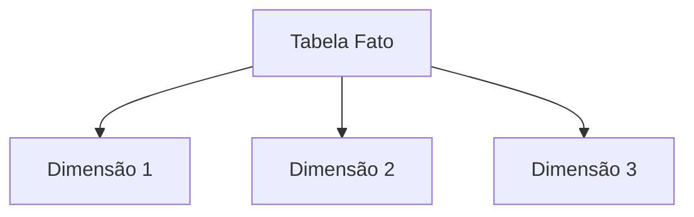
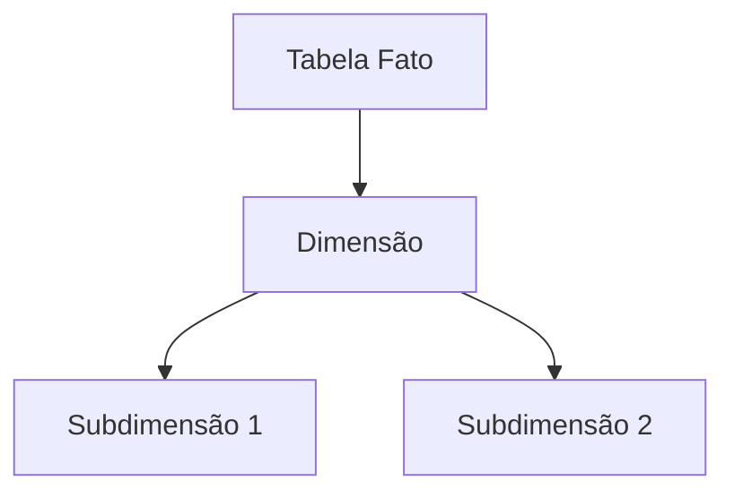

# Introdução à Modelagem Dimensional

## Objetivo Geral

- Dominar os fundamentos da modelagem dimensional
- Compreender o conceito de **Cubo Multifacetado**
- Diferenciar sistemas **Transacionais (OLTP)** vs **Analíticos (OLAP)**
- Implementar esquemas estrela, floco de neve e constelação

---

## Etapa 1: Modelagem Dimensional vs Transacional

### Comparação Chave

| Característica  | Modelo Transacional (OLTP)      | Modelo Dimensional (OLAP)        |
| --------------- | ------------------------------- | -------------------------------- |
| **Foco**        | Operações diárias (CRUD)        | Análise histórica e tendências   |
| **Estrutura**   | Altamente normalizada           | Desnormalizada controladamente   |
| **Performance** | Otimizado para escrita          | Otimizado para leitura           |
| **Exemplo**     | Sistema de vendas em tempo real | Data Warehouse de vendas mensais |

**Cubo Multifacetado**:

- **Eixos**: Dimensões (ex: Tempo, Localização)
- **Interseções**: Métricas (ex: Vendas, Quantidade)
- **Vantagem**: Análise multidirecional ("fatiar" dados)

---

## Etapa 2: Modelos Dimensionais

### 1. Esquema Estrela (Star Schema)



- **Prós**: Simplicidade, performance em consultas
- **Contras**: Redundância em dimensões

### 2. Esquema Floco de Neve (Snowflake)



- **Prós**: Normalização reduz redundância
- **Contras**: Consultas mais complexas

### 3. Constelação/Galáxia

- Múltiplas tabelas fato compartilhando dimensões
- Ideal para **Data Marts** integrados

---

## Etapa 3: Granularidade de Dados

### Definição

- **Nível de detalhe** nas tabelas fato (ex: transação diária vs mensal)

### Trade-off

- **Alta granularidade**: Mais detalhes ↔ Maior custo de processamento
- **Baixa granularidade**: Menos detalhes ↔ Performance otimizada

**Exemplo Prático**:

```sql
-- Tabela com granularidade diária (mais pesada)
CREATE TABLE fato_vendas_diario (
    data_id DATE,
    produto_id INT,
    quantidade INT
);

-- Tabela com granularidade mensal (mais leve)
CREATE TABLE fato_vendas_mensal (
    ano INT,
    mes INT,
    produto_id INT,
    quantidade INT
);
```

---

## Etapa 4: Chaves e Dimensões

### Chave Artificial (Surrogate Key)

- **Função**: Substitui chaves naturais (ex: CPF) por IDs numéricos
- **Vantagens**:
  - Evita conflitos em históricos
  - Desacopla sistemas operacionais

### Slowly Changing Dimensions (SCD)

| Tipo | Descrição                     | Uso Típico                       |
| ---- | ----------------------------- | -------------------------------- |
| SCD1 | Sobrescreve dados antigos     | Dados corretivos (ex: telefone)  |
| SCD2 | Cria nova versão do registro  | Histórico de cargos              |
| SCD3 | Adiciona colunas para versões | Mudanças pontuais (ex: endereço) |

**Exemplo SCD2**:

```sql
CREATE TABLE dim_cliente (
    sk_cliente INT PRIMARY KEY,
    id_natural VARCHAR(50),
    nome VARCHAR(100),
    estado_civil VARCHAR(20),
    data_inicio DATE,
    data_fim DATE,
    versao_atual BOOLEAN
);
```

---

## Links Úteis

- [Guia Avançado de Esquema Estrela](https://www.databricks.com)
- [Slowly Changing Dimensions na Prática](https://www.sqlshack.com)
- [Fundamentos de Cubos OLAP](https://www.javatpoint.com)

**Próximos Passos**:
_"Aplique modelos estrela em seu próximo projeto Power BI para unir simplicidade e performance!"_

> Modelagem dimensional transforma dados brutos em insights acionáveis. 📊🔍
