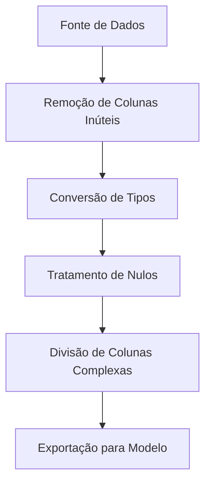

# Limpeza e Transformação de Dados com Power BI

## Objetivo Geral

- Dominar técnicas de limpeza e transformação de dados no Power Query
- Preparar dados brutos para análise confiável
- **Observação**: Tópicos avançados (DAX) serão abordados em módulos posteriores

---

## Etapa 1: Desafios com Fontes Heterogêneas

### Problemas Comuns

| Tipo de Problema  | Exemplo             | Consequência           |
| ----------------- | ------------------- | ---------------------- |
| Tipos incorretos  | Status como número  | Agregações distorcidas |
| Valores nulos     | Dados faltantes     | Relatórios incompletos |
| IDs duplicados    | Registros repetidos | Métricas infladas      |
| Colunas complexas | Endereço único      | Dificuldade de análise |

**Impacto Direto**:
❌ Resultados analíticos incorretos
❌ Tomadas de decisão equivocadas

---

## Fluxo de Trabalho no Power BI

1. **Coleta** → 2. **Transformação (Power Query)** → 3. **Modelagem** → 4. **Visualização**

---

## Etapa 2: Técnicas de Limpeza

### Checklist de Transformações Essenciais

1. **Correção de Tipos de Dados**

   - Converter números como texto para tipo `Inteiro/Decimal`
   - Padronizar datas (`Date.ToText` + cultura específica)

2. **Tratamento de Valores Problemáticos**

   ```powerquery
   // Substituir nulos por valores padrão
   = Table.ReplaceValue(#"Passo Anterior", null, 0, Replacer.ReplaceValue, {"Coluna"})
   ```

3. **Eliminação de Duplicatas**

   - Identificar chaves únicas → `Remover Duplicatas`

4. **Desmembramento de Colunas Complexas**

   ```powerquery
   // Dividir endereço em colunas (Rua, Número, Cidade)
   = Table.SplitColumn(#"Passo Anterior", "Endereço", Splitter.SplitTextByDelimiter(",", QuoteStyle.Csv), {"Rua", "Número", "Cidade"})
   ```

5. **Humanização de Dados**
   - Criar colunas descritivas (ex: converter código 1/0 para "Ativo"/"Inativo")

---

## Etapa 3: Boas Práticas no Power Query

### Regras de Ouro

- **Documentação**: Renomear cada passo aplicado
- **Modularização**: Dividir transformações complexas em consultas separadas
- **Performance**:
  - Filtrar dados **antes** de transformações pesadas
  - Preferir `Tipos de Dados Nativos` (ex: `Int64` em vez de `Texto`)

### Exemplo de Fluxo Otimizado



---

## Links Úteis

- [Documentação Oficial do Power Query](https://learn.microsoft.com/en-us/power-query/)
- [Guia de Tratamento de Nulos](https://powerbi.microsoft.com/pt-br/blog/handling-null-values-in-power-query/)
- [Dataset de Prática Power BI](https://github.com/MicrosoftLearning/PL-300-Microsoft-Power-BI-Data-Analyst)

**Dica Final**:
_"Teste cada transformação com amostras de dados antes de aplicar ao dataset completo"_

> Dados limpos são a base para análises confiáveis! 🧹📊
