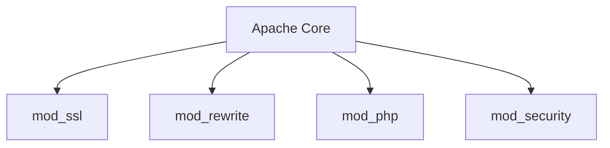

# Apache HTTP Server

## Visão Geral
Servidor web open-source líder de mercado, mantido pela Apache Software Foundation. Lançado em 1995, continua sendo uma das soluções mais utilizadas para hospedagem web.

## Principais Características

### Arquitetura Modular

- **Módulos essenciais**:
  - `mod_ssl`: Suporte a HTTPS
  - `mod_rewrite`: URL rewriting
  - `mod_headers`: Manipulação de cabeçalhos HTTP

### Configuração
Arquivos principais:
- `/etc/apache2/apache2.conf` (Linux)
- `httpd.conf` (Windows)
- `.htaccess` (por diretório)

Exemplo básico:
```apache
<VirtualHost *:80>
    ServerName example.com
    DocumentRoot /var/www/html
    <Directory /var/www/html>
        Options -Indexes +FollowSymLinks
        AllowOverride All
    </Directory>
</VirtualHost>
```

## Performance
- **Modelo MPM (Multi-Processing Module)**:
  - `prefork`: Processos separados (legado)
  - `worker`: Threads + processos
  - `event`: Assíncrono (melhor para conexões persistentes)

```bash
# Ver módulo ativo
apachectl -V | grep -i mpm
```

## Segurança
Boas práticas:
```apache
# Desativar assinatura do servidor
ServerTokens Prod
ServerSignature Off

# Proteger contra clickjacking
Header always append X-Frame-Options SAMEORIGIN
```

## Comparação com Nginx
| Característica       | Apache                      | Nginx                     |
|----------------------|----------------------------|---------------------------|
| Arquitetura          | Baseada em processos        | Event-driven              |
| .htaccess           | Suportado                  | Não suportado            |
| Recursos dinâmicos  | Melhor integração          | Requer configuração extra |
| Performance estática| Adequado                   | Superior                 |

## Curiosidade sobre o Nome
- **Teoria 1**: Homenagem à tribo Apache (resiliência)
- **Teoria 2**: "A patchy server" (servidor remendado)

> **Dica**: Para melhorar performance em alto tráfego:
> ```apache
> KeepAlive On
> KeepAliveTimeout 2
> MaxKeepAliveRequests 100
> ```
