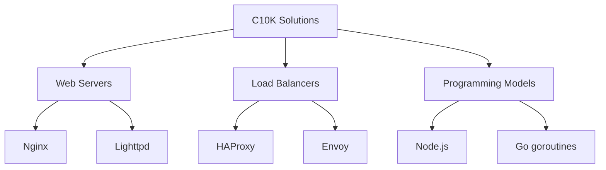

# C10K: O Desafio das 10,000 Conexões Simultâneas

## Contexto Histórico

- **Origem**: Termo cunhado nos anos 2000 para descrever o desafio de servidores lidarem com 10k conexões concorrentes
- **Problema Central**: Limitações de modelos tradicionais (thread-per-connection) em:
  - Consumo excessivo de memória (~1MB por thread)
  - Overhead de context switching
  - Limites de descritores de arquivo

## Soluções Revolucionárias

### 1. Modelos de Programação

| Modelo           | Tecnologias Exemplo | Vantagens                            |
| ---------------- | ------------------- | ------------------------------------ |
| **Event-driven** | Nginx, Node.js      | 1 thread gerencia múltiplas conexões |
| **Non-blocking** | epoll/kqueue        | Evita espera ociosa por I/O          |

### 2. Otimizações de Sistema

- **Aumento de limites**:
  ```bash
  ulimit -n 100000  # Aumenta limite de descritores
  sysctl fs.file-max=100000  # Limite global
  ```
- **Melhorias no kernel**:
  - Scalable event notification (epoll)
  - TCP stack optimizations (fast open, zero-copy)

### 3. Arquitetura de Hardware

- **Balanceamento de carga**: HAProxy, Nginx
- **Horizontal scaling**: Kubernetes, Docker Swarm
- **Hardware moderno**: CPUs multi-core, NVMe storage

## Tecnologias Pioneiras



## Evolução Pós-C10K

- **C100K**: Técnicas similares com otimizações extras
  - Kernel bypass (DPDK)
  - User-space networking
- **Cloud Native**:
  - Service meshes (Istio)
  - Serverless architectures

## Lições Aprendidas

1. **Eficiência > Brute force**: Menos threads, mais eventos
2. **Async-first**: Programação assíncrona como padrão
3. **Vertical limits**: Escalabilidade horizontal é essencial

> **Impacto Moderno**: As soluções do C10K fundamentaram arquiteturas de:
>
> - CDNs globais
> - Plataformas de streaming
> - Sistemas IoT massivos
