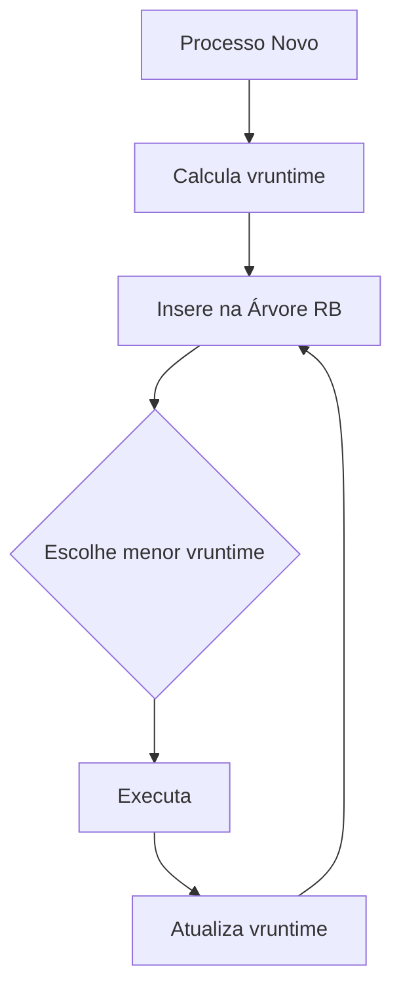

# CFS (Completely Fair Scheduler)

## Visão Geral

Escalonador padrão do kernel Linux desde 2007 (v2.6.23), substituindo o escalonador O(1). Desenvolvido por Ingo Molnár para garantir justiça na alocação de tempo de CPU.

## Princípios Fundamentais

### 1. Justiça Completa

- Distribui tempo de CPU proporcionalmente à prioridade dos processos
- Processos com mesma prioridade recebem tempo igual de CPU
- Prioridades ajustáveis via valores nice (de -20 a +19)

### 2. Mecanismo de Escalonamento



### 3. Estruturas de Dados

- **Árvore Red-Black**: Mantém processos ordenados por vruntime
  - Inserção/Remoção: O(log N)
  - Busca do próximo processo: O(1)
- **Tempo Virtual (vruntime)**:
  ```
  vruntime = tempo_real_executado * (1024 / peso_do_processo)
  ```

## Comparação com O(1) Scheduler

| Característica | CFS                         | O(1) Scheduler             |
| -------------- | --------------------------- | -------------------------- |
| Algoritmo      | Árvore Red-Black (O(log N)) | Filas de prioridade (O(1)) |
| Justiça        | Alta (vruntime-based)       | Média (time slices fixos)  |
| Prioridades    | Contínuas (valores nice)    | Discretas (40 níveis)      |
| Overhead       | Moderado                    | Baixo                      |

## Parâmetros de Configuração

```bash
# Ajustes típicos (em /proc/sys/kernel)
sched_min_granularity_ns = 1000000  # 1ms
sched_latency_ns = 6000000         # 6ms
sched_wakeup_granularity_ns = 2000000 # 2ms
```

## Exemplo Prático

**Cenário**: 3 processos (A,B,C) com mesma prioridade

1. Todos começam com vruntime=0
2. CFS seleciona o processo com menor vruntime
3. Após executar:
   - Atualiza vruntime do processo
   - Reinsere na árvore
4. Repete o ciclo garantindo distribuição equitativa

## Vantagens

✅ Alta justiça na alocação de CPU
✅ Escalabilidade (milhares de processos)
✅ Suporte a múltiplas políticas de escalonamento
✅ Baixa latência para tarefas interativas

> **Otimização**: Para cargas mistas (CPU-bound + I/O-bound), o CFS automaticamente prioriza processos interativos (I/O-bound) através do mecanismo de vruntime.
