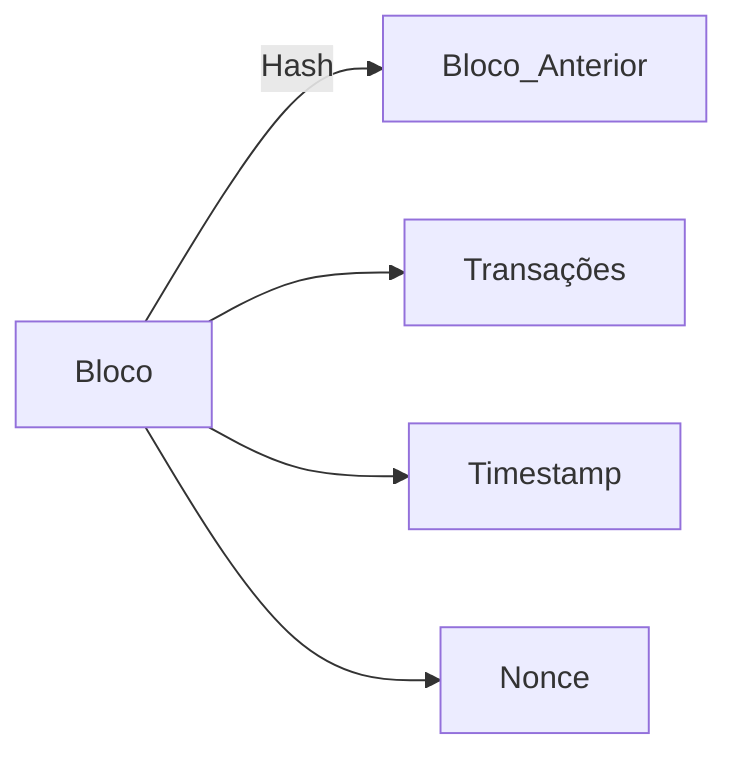

# Fundamentos da Blockchain

## Objetivo Geral

Compreender o funcionamento operacional da Blockchain, abrangendo:

- Estrutura básica
- Validação de transações e blocos
- Sistemas distribuídos
- Mecanismos de consenso

---

## Percurso do Curso

### Etapa 1: Arcabouço Tecnológico

**Definição**:

- Banco de dados distribuído (livro-razão público)
- **Comparativo**:
  - Tradicional: Centralizado
  - Blockchain: Distribuído

**Características-chave**:
✓ Imutabilidade
✓ Irrefutabilidade
✓ Disponibilidade permanente
✓ Integridade criptográfica

### Etapa 2: Ledgers Imutáveis

**Evolução histórica**:

1. Registros físicos → Digitais centralizados → Blockchain
2. **Problemas resolvidos**:
   - Ponto único de falha
   - Manipulação de dados

### Etapa 3: Estrutura de Blocos

**Componentes**:

### Etapa 4: Mecanismos de Segurança

**Prevenção de fraudes**:

- Assinaturas digitais
- Algoritmos de consenso:
  - **PoW** (Prova de Trabalho)
  - **PoS** (Prova de Participação)

### Etapa 5: Bifurcações (Forks)

**Tipos**:
| Hard Fork | Soft Fork |
|-----------|-----------|
| Mudança irreversível | Compatível com versões anteriores |
| Ex: Bitcoin Cash | Ex: SegWit |

### Etapa 6: Categorias de Blockchain

**Classificação**:

1. Públicas (Bitcoin, Ethereum)
2. Permissionadas (Hyperledger)
3. Híbridas

### Etapa 7: Desafios Atuais

**Tecnológicos**:

- Ataque 51%
- Consumo energético (PoW)

**Regulatórios**:

- Reconhecimento legal
- Volatilidade de criptoativos

---

## Recursos Adicionais

- [AWS: O que é Blockchain?](https://aws.amazon.com/pt/blockchain/)
- [Análise de segurança (Acervo Lima)](https://acervolima.com/)
- [Guia técnico (TechTarget)](https://www.techtarget.com/)
