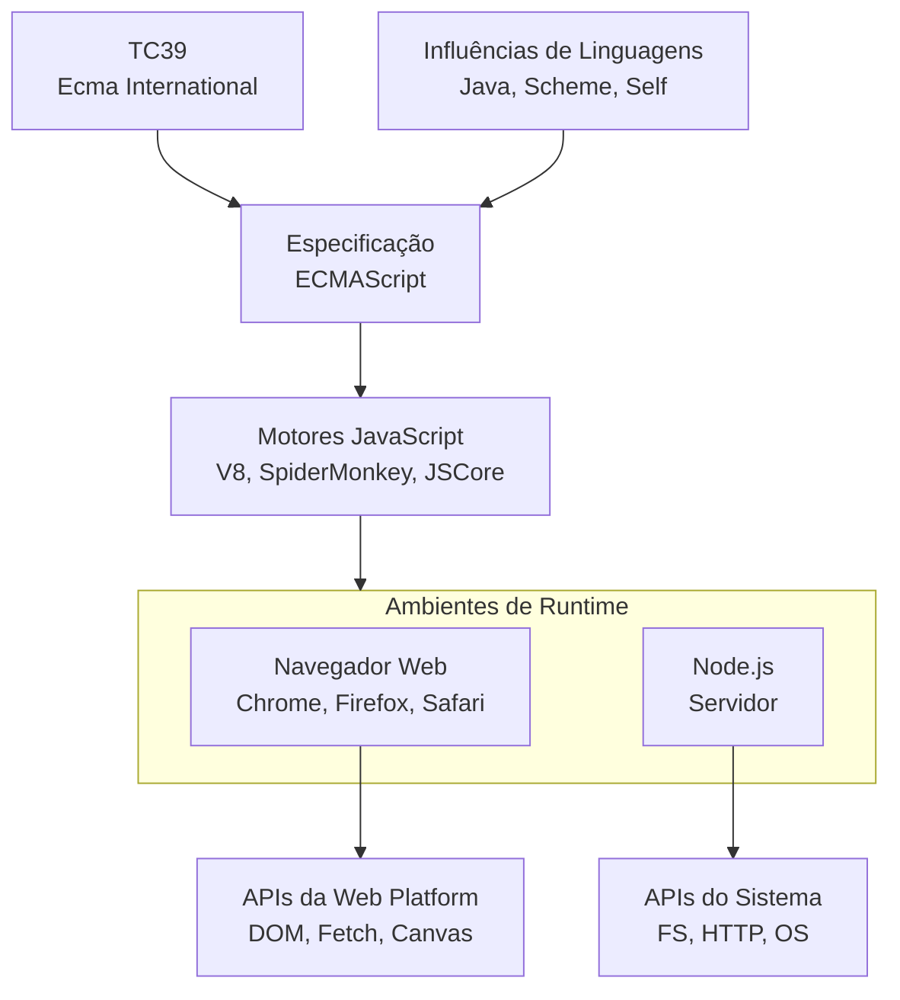

# A arquitetura e os recursos do JavaScript

### 1. O Núcleo da Linguagem: ECMAScript (ES)

Esta é a **fonte mais importante**. JavaScript é a implementação mais popular da especificação **ECMAScript**.

- **O que é?** ECMAScript é um padrão de linguagem de script definido pela organização **Ecma International** (especificamente, o comitê técnico TC39).
- **Como funciona?** O TC39 é formado por especialistas de empresas como Google, Microsoft, Mozilla, Apple, Intel, etc. Eles propõem, discutem e aprovam novas funcionalidades para a linguagem.
- **O processo:** Uma nova ideia (como `async/await` ou `Optional Chaining`) passa por um processo de estágios (de 0 a 4). Quando atinge o estágio 4, significa que a funcionalidade está finalizada e pronta para ser incluída na próxima versão oficial do padrão.
- **Versões:** Você já deve ter ouvido falar de ES5 (2009), ES6/ES2015 (um marco enorme), ES2017, etc. Cada versão adiciona novos recursos sintáticos e funcionais (como `let/const`, `Promises`, `Arrow Functions`, `Classes`, `Módulos`).

**Resumindo: A sintaxe, os tipos de dados, os operadores, as estruturas de controle (`if`, `for`) e os objetos fundamentais (`Array`, `String`, `Number`) são definidos pela especificação ECMAScript.**

---

### 2. O Ambiente de Execução: O _Runtime_

O JavaScript precisa ser executado em um ambiente. Esse ambiente fornece APIs adicionais que não são parte do núcleo da linguagem ECMAScript, mas são essenciais para a programação prática. Os dois ambientes principais são:

#### A. Navegadores Web (e a Web Platform)

O JavaScript foi criado para a web. Os navegadores fornecem um conjunto enorme de APIs através do **objeto global `window`** (ou simplesmente `this` no escopo global):

- **DOM (Document Object Model):** `document.getElementById`, `element.addEventListener`, etc. Permite manipular HTML e CSS.
- **BOM (Browser Object Model):** `window.location`, `window.history`, `navigator`, `screen`. Permite interagir com o próprio navegador.
- **APIs Modernas:**
  - `fetch()`: Para fazer requisições HTTP.
  - `setTimeout()` e `setInterval()`: Para temporização.
  - `Canvas`, `WebGL`: Para gráficos.
  - `WebAudio`, `WebRTC`: Para áudio e comunicação.
  - `LocalStorage`, `IndexedDB`: Para armazenamento no cliente.

**Estas APIs são padronizadas por organismos como o W3C (World Wide Web Consortium) e o WHATWG (Web Hypertext Application Technology Working Group).**

#### B. Node.js

O Node.js trouxe o JavaScript para o lado do servidor. Ele é construído sobre o motor V8 do Chrome, mas fornece um ambiente de _runtime_ diferente do navegador.

- **APIs do Sistema:** Ele oferece módulos para interagir com o sistema de arquivos (`fs`), o sistema operacional (`os`), a rede (`net`, `http`), e processos (`child_process`).
- **Console e Timers:** Fornece suas próprias implementações de `console.log`, `setTimeout`, etc.
- **Característica Principal:** Não tem DOM ou BOM, pois não está rodando em um navegador.

---

### 3. Os Motores JavaScript (_Engines_)

Os motores são os "corações" que interpretam ou compilam o código JavaScript em código de máquina. Eles são quem implementam a especificação ECMAScript.

- **V8:** Desenvolvido pelo Google, usado no **Chrome** e no **Node.js**.
- **SpiderMonkey:** O primeiro motor, desenvolvido para o **Mozilla Firefox**.
- **JavaScriptCore (Nitro):** Desenvolvido pela Apple para o **Safari**.

Cada motor é uma implementação independente da especificação ECMAScript. A competição entre eles para melhorar a performance é um dos motivos pelo qual o JavaScript se tornou tão rápido.

---

### 4. Influências de Outras Linguagens

A sintaxe e a filosofia do JavaScript foram influenciadas por outras linguagens no seu design inicial por Brendan Eich:

- **Sintaxe:** Veio principalmente do **Java** e do **C** (chaves `{}`, estruturas de controle, operadores).
- **Funções de Primeira Classe e Tipagem Fraca:** Influência do **Scheme** (um dialeto de Lisp).
- **Sistema de Protótipos para Herança:** Influência da linguagem **Self**.

---

### Resumo Visual do Fluxo



### Conclusão

A arquitetura e os recursos do JavaScript vêm de uma **combinação complexa e colaborativa**:

1.  **ECMAScript** define o núcleo da linguagem.
2.  **Os ambientes de _runtime_** (navegadores e Node.js) fornecem APIs específicas para suas finalidades (web ou servidor).
3.  **Os motores JavaScript** implementam o núcleo e as APIs de forma eficiente.
4.  **Organismos de padrões** (W3C, WHATWG) e **grandes empresas** (Google, Mozilla, Apple, Microsoft) trabalham juntos para evoluir a linguagem e a plataforma.

É essa ecologia rica e competitiva que torna o JavaScript uma linguagem tão dinâmica e onipresente.

# Recursos abrangentes para diferentes tipos de aplicação

## 📚 **ECMAScript - Núcleo da Linguagem**

### 🔤 **SINTAXE FUNDAMENTAL**

```javascript
// Declarações
var, let, const
function, class, import, export

// Estruturas de controle
if...else, switch, for, while, do...while
try...catch...finally, throw

// Operadores
=, +, -, *, /, %, **, ++, --
==, ===, !=, !==, >, <, >=, <=
&&, ||, !, ??
??=, ||=, &&=  // Operadores de atribuição lógica
..., ?.  // Spread e Optional Chaining
```

### 🏗️ **CONSTRUTORES E TIPOS PRIMITIVOS**

```javascript
// Construtores embutidos
Object, Array, Function, String, Number;
Boolean, Symbol, BigInt, Date, RegExp;
Error, EvalError, RangeError, ReferenceError;
SyntaxError, TypeError, URIError;

// Tipos primitivos
undefined, null, boolean, number, string;
symbol, bigint;
```

### 📦 **OBJETO GLOBAL E SEUS MÉTODOS**

```javascript
// Funções globais
isNaN(), isFinite(), parseFloat(), parseInt();
eval(), encodeURI(), decodeURI();
encodeURIComponent(), decodeURIComponent();

// Propriedades globais
Infinity, NaN, undefined, globalThis;
```

## 🎯 **OBJETO OBJECT**

```javascript
// Métodos estáticos
Object.keys(), Object.values(), Object.entries()
Object.assign(), Object.create(), Object.defineProperty()
Object.freeze(), Object.seal(), Object.preventExtensions()
Object.is(), Object.hasOwn(), Object.getPrototypeOf()

// Métodos de instância
.toString(), .valueOf(), .hasOwnProperty()
.isPrototypeOf(), .propertyIsEnumerable()
```

## 🔢 **OBJETO ARRAY**

```javascript
// Métodos de instância
.push(), .pop(), .shift(), .unshift()
.slice(), .splice(), .concat(), .join()
.indexOf(), .lastIndexOf(), .includes()
.find(), .findIndex(), .filter(), .map()
.reduce(), .reduceRight(), .some(), .every()
.sort(), .reverse(), .flat(), .flatMap()
.forEach(), .entries(), .keys(), .values()

// Métodos estáticos
Array.from(), Array.of(), Array.isArray()
```

## 📝 **OBJETO STRING**

```javascript
// Métodos de instância
.charAt(), .charCodeAt(), .codePointAt()
.indexOf(), .lastIndexOf(), .includes()
.startsWith(), .endsWith()
.slice(), .substring(), .substr()
.toUpperCase(), .toLowerCase(), .trim()
.replace(), .replaceAll(), .split()
.concat(), .repeat(), .padStart(), .padEnd()
.match(), .search()

// Métodos estáticos
String.fromCharCode(), String.fromCodePoint()
```

## 🔢 **OBJETO NUMBER**

```javascript
// Métodos estáticos
Number.isNaN(), Number.isFinite(), Number.isInteger()
Number.parseFloat(), Number.parseInt()
Number.EPSILON, Number.MAX_VALUE, Number.MIN_VALUE

// Métodos de instância
.toFixed(), .toExponential(), .toPrecision()
.toString()
```

## ⏰ **OBJETO DATE**

```javascript
// Métodos de instância
.getFullYear(), .getMonth(), .getDate(), .getDay()
.getHours(), .getMinutes(), .getSeconds(), .getMilliseconds()
.getTime(), .getTimezoneOffset()
.setFullYear(), .setMonth(), .setDate()
.toString(), .toISOString(), .toLocaleString()

// Métodos estáticos
Date.now(), Date.parse()
```

## 🔍 **OBJETO REGEXP**

```javascript
// Métodos de instância
.test(), .exec()
.toString()

// Métodos estáticos
RegExp.prototype
```

## 💰 **OBJETO MATH**

```javascript
// Propriedades
Math.PI, Math.E, Math.SQRT2;

// Métodos
Math.abs(), Math.round(), Math.floor(), Math.ceil();
Math.max(), Math.min(), Math.random(), Math.pow();
Math.sqrt(), Math.log(), Math.sin(), Math.cos(), Math.tan();
```

## 🎭 **OBJETO JSON**

```javascript
JSON.parse(), JSON.stringify();
```

## 🔄 **OBJETO PROMISE**

```javascript
// Métodos estáticos
Promise.all(), Promise.race(), Promise.allSettled()
Promise.any(), Promise.resolve(), Promise.reject()

// Métodos de instância
.then(), .catch(), .finally()
```

## 📚 **OBJETO MAP**

```javascript
// Métodos de instância
.set(), .get(), .has(), .delete(), .clear()
.keys(), .values(), .entries(), .forEach()
.size
```

## 📚 **OBJETO SET**

```javascript
// Métodos de instância
.add(), .has(), .delete(), .clear()
.values(), .entries(), .forEach()
.size
```

## 🧮 **OBJETO BIGINT**

```javascript
// Não tem métodos de instância, mas opera como número
// Construtor: BigInt()
```

## ✨ **OBJETO SYMBOL**

```javascript
// Métodos estáticos
Symbol.for(), Symbol.keyFor();

// Propriedades bem conhecidas
Symbol.iterator, Symbol.asyncIterator;
Symbol.toStringTag, Symbol.hasInstance;
```

## 🔧 **OBJETO FUNCTION**

```javascript
// Métodos de instância
.call(), .apply(), .bind()
.toString()

// Propriedades
.name, .length
```

## 🌐 **OBJETO CONSOLE (ambiente dependente)**

```javascript
console.log(), .error(), .warn(), .info()
console.table(), .dir(), .time(), .timeEnd()
console.trace(), .assert(), .clear()
```

## ⏱️ **FUNÇÕES DE TEMPORIZAÇÃO (ambiente dependente)**

```javascript
setTimeout(), setInterval(), clearTimeout(), clearInterval();
// No Node.js: setImmediate(), clearImmediate()
```

## 📁 **SISTEMA DE MÓDULOS ES6**

```javascript
// Exportação
export, export default, export { name1, name2 }
export * from 'module'

// Importação
import, import(), import.meta
```

## 🎨 **ITERADORES E GERADORES**

```javascript
// Sintaxe
function*, yield, yield*

// Protocolos
Symbol.iterator, Symbol.asyncIterator
```

## ⏳ **ASYNCHRONOUS FEATURES**

```javascript
async, await, for await...of
```

## 🏗️ **CLASSES ES6**

```javascript
class, constructor, extends, super
static, get, set, #privateFields
```

## 🔍 **REFLEXÃO E METAPROGRAMAÇÃO**

```javascript
// Proxy
new Proxy(), Proxy.revocable();

// Reflect
Reflect.get(), Reflect.set(), Reflect.has();
Reflect.construct(), Reflect.apply();
```

## 📊 **TYPED ARRAYS (ArrayBuffers)**

```javascript
Int8Array, Uint8Array, Uint8ClampedArray;
Int16Array, Uint16Array, Int32Array, Uint32Array;
Float32Array, Float64Array, BigInt64Array, BigUint64Array;
```

## 🌍 **INTERNACIONALIZAÇÃO (Intl)**

```javascript
Intl.DateTimeFormat(), Intl.NumberFormat();
Intl.Collator(), Intl.ListFormat(), Intl.RelativeTimeFormat();
```

## 💾 **WEB STORAGE APIS (navegador)**

```javascript
localStorage, sessionStorage;
```

## 🌐 **WEB APIs (navegador - não são parte do ECMAScript)**

```javascript
// DOM
document, window, navigator, location, history

// Eventos
addEventListener(), removeEventListener()

// Requisições
fetch(), XMLHttpRequest

// Armazenamento
IndexedDB, Web SQL

// Gráficos
Canvas, WebGL

// Outras
Web Workers, Service Workers, WebSockets, etc.
```

## 🖥️ **NODE.JS APIs (ambiente servidor)**

```javascript
// Módulos principais
fs, path, os, http, https, url, util, events, stream;
child_process,
  cluster,
  crypto,
  zlib,
  // Globais do Node.js
  etc.process,
  Buffer,
  __dirname,
  __filename;
module, require(), exports;
```

## 📋 **RESUMO DA ORGANIZAÇÃO**

1. **Sintaxe da Linguagem**: Palavras-chave e estruturas fundamentais
2. **Objetos Globais**: Construtores embutidos (Object, Array, String, etc.)
3. **Propriedades e Métodos Estáticos**: Funcionalidades nos próprios construtores
4. **Métodos de Protótipo**: Funcionalidades disponíveis nas instâncias
5. **APIs de Ambiente**: Funcionalidades específicas do navegador ou Node.js

Esta lista demonstra como o JavaScript evoluiu de uma linguagem simples para uma plataforma robusta com recursos abrangentes para diferentes tipos de aplicação!
