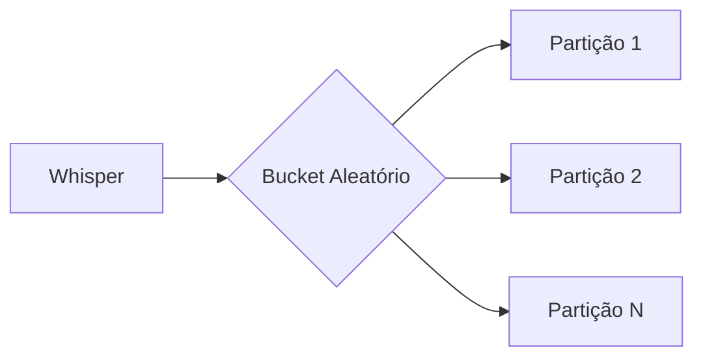

# Escalonamento de Tópicos em Alta com Spring e AWS

## Desafio Inicial

**Contexto**:
Rede social fictícia de posts curtos ("Whispers") com problemas de escalabilidade:

- **Problemas**:

  - 70 invocações simultâneas de Lambda
  - Banco RDS não escalável
  - Necessidade de implementar "Tópicos em Alta"

- **Objetivos**:
  - Substituir RDS por solução escalável
  - Adicionar funcionalidade sem impactar o app principal

---

## Arquitetura da Solução

### Camada de Armazenamento

**Migração para DynamoDB**:

- Escalabilidade horizontal para escritas
- Desempenho previsível
- **Desafio**: Consultas ordenadas por timestamp requerem design específico

**Padrão Write Sharding**:



### Componentes Principais

1. **Spring Boot** com Clean Architecture
2. **Eventos SNS** para publicação de whispers
3. **DynamoDB Accelerator (DAX)** para cache de leitura
4. **Redis** para locks distribuídos

---

## Problemas e Soluções

| Problema              | Solução                       | Impacto                     |
| --------------------- | ----------------------------- | --------------------------- |
| Throttling de escrita | Write Sharding (10 partições) | 250k whispers processados   |
| Throttling de leitura | DAX (3 nós r5.xlarge)         | 1.875M consultas            |
| Condição de corrida   | Locks com Redis               | Contagem precisa de tópicos |
| Lotes pequenos no SQS | Ajuste do @SqsListener        | 12.5k whispers/batch        |

---

## Observabilidade

**Ferramentas AWS**:

- **CloudWatch**:
  - Dashboards customizados
  - Alarmes de métricas
- **Systems Manager**:
  - Gerenciamento de incidentes
  - Rotação de plantão

**Cenário Real**:

```python
# Exemplo de alarme CloudWatch
alarm = cloudwatch.put_metric_alarm(
    AlarmName='High_Write_Throttle',
    MetricName='WriteThrottleEvents',
    Threshold=100,
    ComparisonOperator='GreaterThanThreshold'
)
```

---

## Lições Aprendidas

1. **DynamoDB** requer design específico para padrões de acesso
2. **Clean Architecture** facilita substituições de infra
3. **Escalonamento** é multidimensional (leitura/escrita)
4. **Observabilidade** é crucial para sistemas distribuídos

> **Próximos Passos**: Documentar padrões de design em repositório interno e criar playbook para resposta a incidentes.
