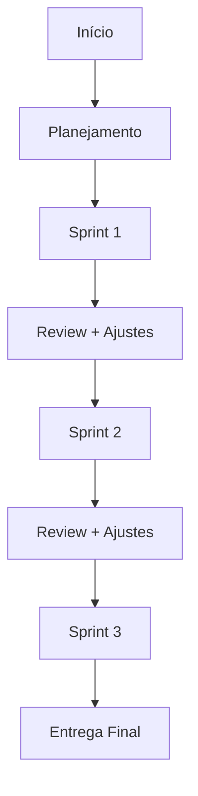

# Gestão de Projetos Eficiente

## Princípios Fundamentais

### 1. Priorização Estratégica

**Problema Comum**:
Tendência a procrastinar tarefas complexas em favor das mais fáceis, causando atrasos.

**Solução**:

- **Avaliar**: Analisar impacto de cada tarefa
- **Decidir**: Ordenar por valor estratégico
- **Comprometer-se**: Executar conforme priorização
- **Gerenciar erros**: Ajustar rota quando necessário
- **Colaborar**: Alinhar equipe nos objetivos

**Exemplo Prático (Python)**:

```python
tasks = [
    {"name": "Implementar Autenticação", "priority": "alta"},
    {"name": "Desenvolver UI Básica", "priority": "média"},
    {"name": "Criar Cadastro", "priority": "alta"},
    {"name": "Relatórios", "priority": "baixa"}
]

def prioritize(tasks):
    priority_order = {"alta": 3, "média": 2, "baixa": 1}
    return sorted(tasks, key=lambda x: priority_order[x["priority"]], reverse=True)

for task in prioritize(tasks):
    print(f"▶ {task['name']} (Prioridade: {task['priority'].upper()})")
```

### 2. Ciclo Iterativo

**Metodologia**:

- Dividir em sprints de 1-4 semanas
- Revisar e ajustar após cada ciclo
- Manter comunicação transparente

**Fluxograma**:



**Exemplo de Implementação**:

```python
def sprint_autenticacao():
    sprints = [
        "1. Configurar infraestrutura",
        "2. Desenvolver API Auth",
        "3. Criar telas login/cadastro",
        "4. Testes de segurança"
    ]
    for i, task in enumerate(sprints, 1):
        print(f"🚀 Sprint {i}: {task}")
        # Código real seria executado aqui
        print(f"✅ Revisão Sprint {i} concluída\n")

sprint_autenticacao()
```

### 3. Gestão de Limites

**Princípios Críticos**:

- ⏱️ Tempo finito → Foco no essencial
- 💰 Orçamento claro → Evitar escopo creep
- 🎯 Objetivos SMART → Específicos e mensuráveis

**Tomada de Decisão**:
| Situação | Ação Recomendada |
|----------|------------------|
| Objetivos inatingíveis | Reavaliar escopo |
| Custo > Benefício | Considerar cancelamento |
| Riscos elevados | Mitigar ou pivotar |

## Casos Práticos em Engenharia de Software

### Priorização de Features

**Exemplo Web App**:

1. 🔐 Autenticação (Crítica)
2. ✨ UI Básica (Fundamental)
3. 📝 Cadastro (Alto Valor)
4. 📊 Relatórios (Postergável)

### Modelo Iterativo

**Sprint de Autenticação**:

```python
class AuthProject:
    def __init__(self):
        self.sprints = {
            1: "Configurar DB + Servidor",
            2: "API Login/Registro",
            3: "Frontend Auth",
            4: "Testes Penetração"
        }

    def run(self):
        for num, task in self.sprints.items():
            print(f"⚡ Sprint {num}: {task}")
            # Implementação real
            print(f"🔍 Revisão: {task}\n")

AuthProject().run()
```

## Conclusão

**Checklist de Sucesso**:

- [ ] Priorizar pelo valor estratégico
- [ ] Trabalhar em ciclos curtos e adaptáveis
- [ ] Definir limites claros de tempo/custo
- [ ] Mancer transparência com stakeholders
- [ ] Ter coragem para cancelar se necessário

**Recursos para Aprofundar**:

- 📚 "Scrum: The Art of Doing Twice the Work" - Jeff Sutherland
- 🎓 Curso: "Gestão Ágil com OKRs" (Coursera)
- 🛠️ Ferramentas: Jira, Trello, Notion

_"Gerenciar projetos é como programar: requer lógica para priorizar, loops para iterar e condicionais para tomar decisões."_
