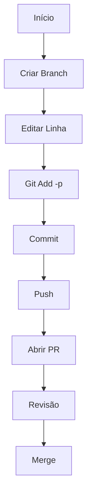

# Fluxo de Trabalho com Git: PRs de Uma Linha e Depuração Eficiente

## 1. Processo para PRs de Linha Única

### Guia Passo a Passo

1. **Criar Branch**

   ```bash
   git checkout -b feature/ajuste-urgente
   ```

2. **Editar Arquivo**

   - Abrir o arquivo no editor
   - Modificar apenas a linha necessária

3. **Adicionar Mudança Específica**

   ```bash
   git add -p caminho/do/arquivo
   ```

   - Usar `y` para a alteração desejada
   - `n` para pular outras alterações
   - `e` para edição manual se necessário

4. **Commit Objetivo**

   ```bash
   git commit -m "corrige: ajusta timeout da API para 3000ms"
   ```

5. **Enviar para Repositório**

   ```bash
   git push origin feature/ajuste-urgente
   ```

6. **Abrir Pull Request**

   - Título claro: "fix: aumenta timeout da API para 3s"
   - Descrição completa:

     ```markdown
     ## Motivação

     Chamadas API estão falhando com timeout curto

     ## Alteração

     - Aumentado timeout de 1000ms para 3000ms
     - Atualizados testes relacionados

     ## Como Testar

     1. Executar suite de testes
     2. Testar manualmente com delays de 2s
     ```

### Diagrama do Fluxo



## 2. Depuração com Git Blame/Bisect

### Investigação de Bugs

1. **Identificar Problema**

   ```bash
   npm test -- UserService.spec.js
   ```

2. **Rastrear Origem**

   ```bash
   git blame src/services/UserService.js -L 15,25
   ```

   Saída:

   ```
   a1b2c3d (João Silva 2023-05-01) const TIMEOUT = 1000;
   ```

3. **Busca Binária**
   ```bash
   git bisect start
   git bisect bad HEAD
   git bisect good v1.2.0
   # Testar commit atual
   npm test
   git bisect good/bad
   ```

### Correção Efetiva

1. **Branch de Correção**

   ```bash
   git checkout -b hotfix/timeout-api
   ```

2. **Implementar Solução**

   ```javascript
   // Antes
   const TIMEOUT = 1000; // ms

   // Depois
   const TIMEOUT = 3000; // ms
   ```

3. **Testar Correção**

   ```bash
   pytest tests/test_api.py -k timeout
   ```

4. **Submeter Correção**
   ```bash
   git commit -m "fix(UserService): ajusta timeout para 3000ms\n\nResolve #1234"
   git push origin hotfix/timeout-api
   ```

## 3. Dicas Avançadas

### Git Blame

```bash
# Mostrar email do autor
git blame -e src/utils.js

# Ignorar espaços em branco
git blame -w src/config.py

# Rastrear movimentação de código
git blame -C -L 50,60 src/models/User.js
```

### Automação com Bisect

1. Criar script de teste (`teste-bisect.sh`):

```bash
#!/bin/bash
npm test UserService.spec.js | grep -q "Todos os testes passaram"
exit $?
```

2. Executar:

```bash
git bisect run ./teste-bisect.sh
```

## Tabela Comparativa

| Ferramenta   | Melhor Uso           | Complexidade | Saída                  |
| ------------ | -------------------- | ------------ | ---------------------- |
| `git blame`  | Histórico por linha  | O(1)         | Autor/commit por linha |
| `git bisect` | Encontrar regressões | O(log n)     | Commit problemático    |

## Boas Práticas

1. **Commits Granulares**:

   - Alterações pequenas e focadas
   - Mensagens claras no presente

2. **PRs Eficientes**:

   - Referenciar issues relacionadas
   - Incluir dados de teste
   - Screenshots para mudanças visuais

3. **Fluxo Seguro**:
   ```bash
   # Antes de enviar
   git pull --rebase origin main
   ```

_"Código limpo começa com histórico limpo"_
