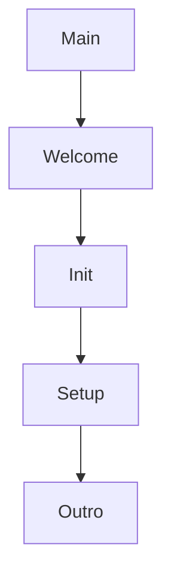

# Introdução em Java: Prelúdio Musical

## Código de Exemplo
```java
public class Prelude {
    public static void main(String[] args) {
        displayWelcomeMessage();
        initializeComponents();
        setupEnvironment();
        displayOutroMessage();
    }

    private static void displayWelcomeMessage() {
        System.out.println("\n🎶 Bem-vindo à Introdução da Aplicação! 🎶");
        System.out.println("\n🎵 Preparando o ambiente para o grande concerto... 🎵");
    }

    private static void initializeComponents() {
        System.out.println("\n🔧 Inicializando componentes...");
        // Lógica real de inicialização aqui
    }

    private static void setupEnvironment() {
        System.out.println("\n⚙️ Configurando o ambiente...");
        // Lógica real de configuração aqui
    }

    private static void displayOutroMessage() {
        System.out.println("\n🎉 Introdução concluída! Preparando para a próxima fase... 🎉");
    }
}
```

## Conceitos de POO Aplicados

### 1. Encapsulamento
- **Classe `Prelude`** agrupa métodos relacionados
- Modificadores `private` para ocultação de implementação

### 2. Modularidade
| Método                  | Responsabilidade Única                  |
|-------------------------|----------------------------------------|
| `displayWelcomeMessage` | Exibição mensagem inicial              |
| `initializeComponents`  | Preparação dos recursos                |
| `setupEnvironment`      | Configuração do sistema                |

### 3. Método Main
- Ponto único de entrada (JVM)
- Orquestra o fluxo do programa:


## Analogia Musical
- `displayWelcomeMessage()` → Abertura da sinfonia
- `initializeComponents()` → Afinação dos instrumentos
- `setupEnvironment()` → Preparação do palco
- `displayOutroMessage()` → Transição para o 1º movimento

## Boas Práticas Demonstradas
✓ Nomes descritivos de métodos
✓ Separação de preocupações
✓ Comentários para áreas de implementação futura
✓ Saída formatada para melhor legibilidade

> **Próximos Passos**: Este padrão pode ser estendido para:
> - Injeção de dependências
> - Tratamento de erros
> - Configurações externas via arquivos
